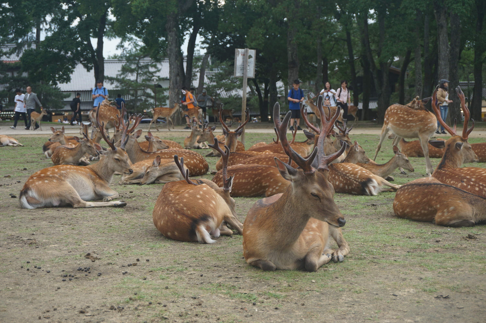

# 霓虹15日游游记 (一)

### 写在开头

今天是2019年8月6日，距离这次的霓虹之旅结束已经有两个星期多一天了。之所以这么晚才开始写这篇文章，是因为中间零零总总出了不少乱起八糟的事情，在此就先不表。这篇文章我想用带点流水账的方式记录一下我在霓虹的点点滴滴，为的是日后能尽量回忆出其中的细枝末节的趣事，估计写完得花不少时间，因此，每一章节我都会加一个写的日期来做记录。

零零总总写了四天的内容之后我发现，因为是流水账式的游记，字数实在是太多了。。写了四天的流程就2w字了，再加上各种图片，文章就显得特别长。想了一下，还是把内容分成几篇，这样版面看起来也会短一些。这里就先按照旅行所在的地区大致分一下，分成大阪/奈良/神户篇、京都篇、东京周边（上）篇和东京周边（下）篇四个部分，当然我看了一下光第四天就写了7000+，所以之后如果太长了可能还要再细分。。。

作为我可能是人生中最后一个暑假，我当然想过的精彩一点，去一些我自己之前没有去过、非常想去的地方，玩的开心，玩的尽兴。在从美国回来之前我选择了黄石公园+盐湖城，和尼亚加拉瀑布+大峡谷作为自己美国生活的结束，可以说是把美国自然风光中最有名的地方玩过了，心里对美国也没有太多遗憾了。而从美国回来之后，剩下还有两三个月的时光到底该如何消磨呢？我既觉得天天打游戏相当无聊，又觉得这最后剩下的长假用来学习又太亏了，想来想去还是再出去玩一趟最为合适。既然是出去玩，那自然是要考虑去哪里+怎么玩+和谁去这三个问题了。我从本科开始入宅，对于霓虹这个宅文化的圣地自然是无比的向往，想想以后要再找一个比较长的空闲时间去好好体验一下霓虹风光貌似很难了，再加上霓虹签证办起来也简单，去霓虹便是不二的选择。跟团去霓虹玩虽然方便，但旅行社肯定不会安排行程去那些宅们想去的边边角角的地方，稍微查了一下我发现貌似去霓虹自由行只会英语貌似问题也不大，那么自由行的方式便定了下来。至于和谁去，我要去宅文化的地方，那自然得找一个同好，然而我认识的人里面涉及宅圈的，要么还在美帝，要么在国内还没毕业，因此考虑再三，我决定独自出发。事后来看，这些决定还蛮正确的，至于原因嘛之后再说。

我大概是6月初决定去霓虹并且开始做攻略的，预期的出发时间大约在7月初，因而做攻略的时间还算充裕。在查阅了相当多的资料+考虑了自己想去的地方（主要是各种圣地巡礼+秋叶原）之后，我最终做好了一份为期15天的霓虹行程安排，大致行程是关西+关东，排除了一些有名但是自己不想去的地方（例如大阪的各种购物点、游乐场，东京的一些古建筑神社什么的），添加了自己想去的一些特别的地方（例如丰乡町，大洗町，当然大洗町这个行程也因为机缘巧合买了从茨城回来的机票），同时各个景点的优先度我大致在心里有个数，便于根据情况随时调整行程。7月8日，我终于启程出发，向着心中念叨许久的“圣地”进发了。

### 7月8日 南京——合肥——大阪 2019.08.06

由于还是想在机票上多省点钱，我最终选择了从合肥出发飞往大阪的飞机。飞机时间是下午3点20，因而我上午8点多就从家出发，先坐一个小时的高铁到达合肥，再坐机场大巴前往合肥机场。合肥火车站的机场大巴挺好找，班次也挺多，半个小时一班。原本我是计划从高铁无缝转接机场大巴，赶着11点的班次到了机场大巴发车处，然而工作人员告诉我这一趟已经满员，请买下一趟。合肥机场人也这么多的吗？我带着疑问买了11点半的票。不过时间还很充裕，因此这也就算是个小插曲。

合肥机场并不大，外面的大厅从一头走到另外一头也就分分钟，算是个中等偏小的规模。然而标识标的并不好，我为了找托运行李换登机牌的地方还找了十几分钟。当然这里面也有我习惯了美国和国内大型机场找航空公司自助打登机牌的方式的原因，我一头冲到了春秋航空的柜台排了好几分钟的对，没想到国际航班统一安排在机场的另外一头233。找到了对应的柜台后发现很多人在排队然而并没有工作人员，我一问才知道，春秋的国际航班安排登机前两个小时才开始办理手续，而我提前了三个小时到的机场。没办法只好先吃个午饭慢慢等了——这里吐槽一下合肥机场国际航班柜台边上的那家米线又贵又难吃。

排队的时候和后面的两家人聊了聊天，其中一家是和我差不多大的、外语专业第二外语是日语的女生带着她妈妈去日本玩，而另外一家则是因为有了假期女主人带着孩子和老人去日本玩的，一问都是自由行，会日语的那一家主要是去找美食吃，而另一家则是临时决定去日本，还不知道要去玩啥。说实话出发之前我还有一点点担心我一个人去日本玩会不会有什么问题，而这担心在和这两家人聊天之后便烟消云散——我一个大老爷们，安全性肯定是比女生带妈妈好的，而另外一家也是全都不会日语就出来了，还没有做好攻略，而我的攻略应该是做的很完备的，那肯定不会有什么大问题，唯一要担心的估计只有天气了。这么想着，办了托运领了登机牌，从只有一个口的海关顺利出关，我的霓虹行才算是正式启动。

因为就提前了两个小时才放行，等待登机的时间并不长。合肥机场的国际航班候机厅也很小，也就两三个教室那么大，一共只有一家小小的百货店。我因为中午吃的很烂，实在忍不住买了包奥利奥，里面两个小包，吃了一包想想剩下的刚好可以做应急干粮，便放在包里，没想到这一放就是15天，最后还带回来了233。没过多久便开始登机。春秋的航班还不错，空间挺大，设备挺新，准点率据说挺好，而且飞的很快。当然舒适度嘛因为是廉航，你懂的。不过要吐槽的是春秋会在行程中间安排乘务员带着个扬声器卖东西，搞得和电视购物一样，吵得要死。

两个半小时后，飞机顺利降落在关西国际机场。换上日本上网卡连上网，走下飞机看到满眼的日语标识，我确认我正式到达了霓虹的领土，心中不免激动——我终于来了！日本相比国内要快一个小时，因此落地的时候已经快要7点了。入关的过程还算顺利，也没有要我开箱检查——我看我前面那个老哥开箱检查了以为是必检项目，便费力地把箱子提到台子上，没想到安检员和我摆摆手让我直接过关emmm。。飞机降落在T2航站楼（貌似），而关西机场的公共交通主要集中在T1，因此要坐接驳车去另一个航站楼，同时那里也有我要去取后面行程要用的六甲山周游券和去买岚山小火车车票的地方。关西机场T1和电车车站是连在一起的，这样弄得机场稍微有点大和乱，我只好抱着要使用翻译老师的心里准备去服务台，没想到机场工作人员的英语还不错233后面买岚山小火车的时候工作人员也能说英语，虽然带着霓虹口音但能听懂，交流的也很顺利。现在想想这大概是我在霓虹碰到的英语的最高水准了2333。

等票据啥的都搞定了，时间也已经逼近8点半了，而我那时还没有吃晚饭。幸好霓虹的便利店真的是到处都是，在便利店买了一个三明治一个饭团，用饭团填了个肚子之后，我便开始了在这之后贯穿整个行程的战斗——坐公共交通。霓虹的交通很发达，电车可以到达绝大部分地方，剩下的地方也有公交可以坐。然而因为日本的公共交通是私营的，在同一个站会有不同公司的不同电车检票口和站台，它们之间并不联通，因而在一个站里找一条线路同时不能做反有时候还是挺麻烦的。我先为事先买好的suica卡充好值，然后掏出google map，查看预定的路线，却发现google map上显示的路线名在站台这边并不能找到对应的，只有一个站台入口写着一个有点像的名字——我不认识日语哇！本来我还想找人问问，一个是不知道怎么开口，也不会日语，一个是在我努力尝试弄明白的时候有个老哥过来问我xxx线是哪条。。。这让我打消了去问的这个念头。思考片刻+使用排除法之后，我大概确认那条有点像的线路是我要坐的线。我怀着忐忑的心情刷卡进站，走上站台。因为还是很慌，所以犹豫了片刻还是开口问了旁边一个大叔。用英语确认了是这一班之后，我正在奇怪这个人的英语没什么口音哎，一聊才知道原来他来自香港。因为这段时间的敏感问题，我总感觉他对大陆好像不是那么友好，不过他对我还是挺友好的，帮我确认的要去哪个站，结果发现我们要去同一个站，巧了。虽然他后来有点冷淡，我也找不到话题，坐在一块有点尴尬，不过我还是挺感谢他的。

从我下车的大正站走到宾馆大概需要12、3分钟，当我到达大正站的时候已经10点半了。路上人很少，很安静。我一路按着google map的指引，走过两座桥，穿行在窄窄的小路之间。

因为太安静了，而我的箱子在粗糙的地面上发出了挺大的声响，我还一度有点不太好意思。终于，在11点前，我成功抵达了我后面三天的落脚点，位于堀江区一家叫做ROOM. in Horie的“自助式”公寓宾馆——之所以说是自助式，是因为虽然我被告知前台平时工作时间有人，但我出入的时间完全不是工作时间所以一直没见到人，而入住是用密码锁进出的所以全程自助；而公寓宾馆，则是因为这个宾馆虽然房价不大，却是按照套房的标准布局的，有独卫有阳台还有灶台，冰箱电视微波炉都有，还有一个小小的坐式浴缸，而这个浴缸，成了我后面几天缓解疲劳的好朋友。

### 7月9日 天守阁、蟹道乐、奈良 2019.08.10

这几天因为去做检查，再加上之前锻炼有点过量了。。。回来基本都在休息然后打游戏emm

跑题了。说实话，第一天到达的时间比我预期的晚了一些，因此我还稍稍有些担心第二天是否能按照计划早起。不过这一天还是顺利地起床了。可能也是第一天到的太晚又很累的原因，之前一直没什么实感，直到第二天早上起来，心中才逐渐被已经到达霓虹即将开始行程的兴奋劲填满。今天的行程上午是去大阪城天守阁，中午去蟹道乐吃饭，然后下午看看吃完饭的时间安排后续的行程。一大早七点多起来，吃了昨天晚上剩下的三明治和咖啡，我便出门前往大阪城公园了。

大阪这个城市在各种攻略上都是必去之地，然而它的存在不是作为一个纯粹的旅游观光地点，更多地是作为人们买买买+吃吃吃的地方。推荐的景点也多偏现代：环球影城啦，购物中心啦，道顿堀啦，然而我对这些不是很感冒。唯一想去的日本桥（因为是大阪的御宅文化中心），因为时间安排加上必然要去的秋叶原所以就放弃了，所以真正在大阪玩的时间寥寥无几。不过最为著名的大阪城不管怎么说也是要去一下的，毕竟这是大阪的标志，在诸多的动漫里提到大版就会出现，再加上“天守阁”这个名字。。。一苦嗦，sekiro！九郎sama我来啦！

大阪城最早是丰臣秀吉所建，作为大阪的据点，是一个城堡式的建筑，外有城郭，而当中标志性的建筑，则是绿瓦白墙、金碧辉煌的天守阁。我从住处走到西长堀站坐长堀鹤见绿地线即可直达大阪城公园东南角。从地铁站出来，就可以远远地看到坐落在树荫深处的天守阁了。穿过外围的绿地广场，就可以看到城郭和护城河。我正准备从侧边的楼梯向上爬的时候，发现楼梯边有十几个霓虹学生，正在上上下下爬楼梯锻炼——貌似是学校运动社团的晨练？还真早啊。走上楼梯，正巧碰到一个国人旅游团，那我要做的自然是混入其中蹭导游解说啦！听导游说天守阁外的树林是一片樱花林，想必樱花季时的天守阁必然是更加好看，不过可惜我来的是夏季。跟着旅行团穿过樱门，转过貌似是其他时代旧天守阁遗址的地基似的巨大岩石，眼前是一片开阔的广场，而天守阁就屹立在广场的尽头。

因为去的时候貌似还是霓虹的雨季，还受到台风影响，基本都是阴天，但天守阁还是很气派的。广场的东面是一个咖啡馆+小博物馆，不过显然这个地方不是我要去的。我要去的自然是攀登天守阁啦。现在的天守阁当然不会再做为大名的住处或是政治场所，二十作为了介绍丰臣秀吉的博物馆。虽然广场上人不少，但大概因为我到的还算早，登天守阁的人寥寥无几。天守阁已经进行了现代化的改造，内部是有电梯的，为了限制流量都必须是电梯登5楼，爬上楼顶，再从上往下玩，我到的时候电梯都没人，因而变成了我的独享，等我下楼的时候电梯口已经全是人在排队了。

天守阁里藏有各种日本战国时期的盔甲、兵器、服饰、屏风刺绣，然而有文物的楼层不能照相，因此留不下照片。不过总结一下，由于霓虹强大的文化输出，战国时期那些保存完好的盔甲、长弓、日本刀，看上去真的很帅；日本的战国规模当然比不上我大中华的战国的规模，但是也不像网上传的村长打架那么寒酸，还是能有几万人的战役的；还有就是霓虹古人真的很矮小。。那全身盔甲看上去大多很迷你，真怀疑那么高的长弓到底是怎么拉的。除了文物，天守阁里面还大致描述了丰臣秀吉的一生，真的很传奇，从一个贱民出身，到抓住机遇登上历史舞台，到借织田信长的名义夺取织田家业，到出征统一日本，成为日本实际的最高统治者，可以说是小人物的奇迹了。还有丰臣秀吉的手下有贱岳七本枪emm。。。

天守阁的楼顶是可以出去到外面走廊的观景平台，当然这里并没有苇名弦一郎等着我。。不过由于地基的加成，天守阁还是挺高的，在上面可以俯瞰大阪城。日本多山，大阪城上也可以远眺到周围的山脉。然后其中这个“金刚山”引起了我的些许注意emmmm。。。

另一个引起我注意的是这个建筑。。服部平藏是你吗服部平藏？

因为要11点半赶到蟹道乐东店，玩了大阪城之后，没剩下多少时间了，我也只好放弃了西之丸庭院，直接坐电车前往日本桥。因为道顿堀总店订不到位子，我便来到了人相对较少的日本桥蟹道乐东店，貌似这个店距离大阪城还要更近一些。我到的时候大约11点15，远远地便看见那标志性的大螃蟹：

然而到了以后我才发现，貌似这家店压根不需要预约。。11点半蟹道乐才开门，人少的可怜，再加上是比较偏僻的东店，我可能是当天的第一位客人。。不过人少当然是好事，我坐到了窗边比较好的位置，外面就是道顿堀川。蟹道乐是主打吃皇帝蟹的料理店，价格自然是不便宜，不过来了日本还是要破费个一两次的，不然不亏嘛。我点的应该是午间套餐里面最便宜的那一个，穷学生真的舍不得吃贵的，不过还是很好吃。生螃蟹腿是甜的，蘸着霓虹的味道偏淡的粗真的酸甜鲜美，很赞！还有好几道菜，炸蟹腿，蟹肉炖蛋，蟹肉汤，蟹黄寿司等等，反正很好吃。性价比嘛，我就不懂了，不过我觉得来一次也不亏，而且价格还可以接受，比上神户牛肉这种好太多了。神户牛肉嘛。。1w日元吃个200克，告辞！

吃完饭一看才12点多，我一合计，那就去奈良走马观花吧！这样后面可以剩下时间来在京都多玩玩。我这么想着，坐上了去奈良的电车。

奈良的景点多集中在奈良公园一带。说是公园，我觉得更像是个开放式的大旅游区，因为实在是有点大。从日本桥坐电车去奈良大概一个小时左右，一出站就能看到各种鹿的卡通形象。鹿是奈良的标志，据说奈良公园里有一千多只鹿，都是野生的，而多年来的与人相处让这些鹿变得很精。。不怕人会主动找你要吃的，会抢你手里的鹿饼，还会咬你的衣服和包。。从奈良站出来最近的一站是兴福寺，还没到就闻到一股难以言表的味道。。走在路上就可以发现时不时就能看到鹿屎，味道自然是不太好闻。然而当我真的看到鹿的时候，就把味道的难闻忘得干净了。奈良公园真的是到处都是鹿，它们大多悠闲地散步吃草，或是在树下或者草坪上坐下打盹。成年的鹿大多都不怕人，你可以走上前去尽情地撸毛撸到爽。我没怎么撸过猫，但我觉得撸猫不一定有撸鹿爽哈哈。

兴福寺主要是看它的五重塔和国宝殿，然而我大致了解了一下觉得没太大兴趣，而且国宝殿进去真的很贵。。因此在五重塔前面照了相，就前往春日大社了。路上买了鹿饼，150块，不算贵，用鹿可食用的纸包着。我闻了闻真的很香，长得有点像旺旺煎饼的颜色，不过是圆的，闻起来也很像煎饼或者米饼的那种味道。据说有人吃了一口发现没啥味道，不过我没敢吃。喂鹿还是很有趣的，聪明的小鹿会向你鞠躬要食，你为了它之后它也会鞠躬感谢，很有趣也很可爱。不过要注意的是在鹿多的地方你一开始喂鹿肯可能会引来一大堆鹿。。有凶的鹿真的会咬你的衣服和包，我看到好几个女的衣服被咬了，还看到一个小男孩的衣服被咬破了，所以还是要悠着点的。据说下午的鹿会好一点，因为过了一个上午鹿都吃的相对饱一点，然而我并没有感觉出来，还是疯狂围上来要吃的。

走到春日大社还是挺花时间的，听说奈良也有周游券可以免费坐公交，不过因为我只是走马观花所以就木有买。不过就算有公交，也得穿过长长的神道，走过鸟居，再爬一段楼梯才能到达春日大社。大社的门不大，但里面还是很大的。本社参拜要500的参拜费，里面供奉着武瓮槌命、经津主命、天儿屋根命和比卖神，反正我都不认识。。不过是神嘛，还是要参拜下许个愿什么的。还可以花钱买个绘马。我想了想也求了一个。在社里碰到了一大家外国人，因为看到我戴着duke的帽子，和我聊了两句，我还帮他们拍了照。貌似那位女士还在duke访学过，再加上我因为进一个景点之前看那位女士好像在排队所以问了她一下，因而多聊了几句。他们问我专业啥的我一开始还没反应过来。。。。真丢duke的脸啊。。。。深感自己英语又退步了。

春日大社后面是一处庭院，穿过庭院十几个小小的神社，不过正在装修，所以看不到全貌。走到尽头再往上走，就是若草山了。若草山麓是一片巨大的草地，上面也全是鹿和嬉戏的友人。进若草山还有几百块的门票，我因为走的累了，再加上时间很紧，觉得不值，于是便就此掉头，前往东大寺。

本来，作为一个东大学子，对于东大寺这个名字自然有一种别样的好感，我也想好好游览一下东大寺。然而，半路的鹿让我分了神，再加上我没注意东大寺内殿只开放到5点半（当然这里有google map的锅，它写的内殿开放到6点的！虽然有写不同月份可能时间不同。。）等我到了东大寺，工作人员告诉我进去只能看十几二十分钟了，我便只好作罢，出来又和鹿玩了很久233这里上张鹿的照片，真的是到处都是鹿。

时近六点，天色渐暗，我便离开东大寺返程了。奈良其实是个小城，它的购物饮食啥的也基本集中在奈良站前，我便正好在奈良站前解决了一下晚饭：

简单的天下一品拉面一碗！哈哈没想到这里能找到天下一品。天下一品的汤头好像是鸡汤？反正很浓很厚很有质感，甚至感觉能吃出点沙沙的沉淀物，感觉比之后我吃的一兰还要浓。口味当然确实相对重一点，不过还是挺好吃的。作为我在霓虹吃的第一碗拉面，还是值得庆贺的。

顺便想起来，我是走到这里才发现我相机取景框外面的橡胶罩子掉了。。不过查了下也不怎么值钱，就当一个小插曲啦。

之后便是坐电车返回住所。等抵达住所大概也快晚上九点了，回到住所比到日本桥远一点中间又绕路去便利店买了点饮料和早饭。日本的饮食里面蔬菜真的有点少，因此每天晚上我都会买一杯蔬菜汁喝。

第一天的行程到这里就结束啦。我一看居然走了两万多步，真的是累炸了，只有好好泡了个热水澡才能缓解疲劳。然而我没想到的是，这仅仅是我疯狂暴走的开始。。。

### 7月10日 神户一日游 2019.8.11

说实话，刚来日本的这两天其实休息的并不是特别好，然而兴奋劲盖过了疲惫，让我这几天早上还能够在8点之前起床准备出门。因为今天的计划是去神户，而神户对于宅来说，最重要的自然是Fate的圣地巡礼了。按照我在网上找的攻略来看，似乎除了六甲山外，景点之间都很近，步行都可以到达，因此似乎这将会是相对轻松的一天，然而现实嘛。。。

因为想去看看传说中价值1000w的夜景，我安排了下午去六甲山的行程，因此圣地巡礼的部分我选择了主要是去看神户大桥和远坂宅间桐宅所在的北野异人馆。从大阪去神户坐电车（阪神线）也是一个多小时的时间。我到达神户三宫站的时间大概是上午九点多，虽然各种攻略说神户大桥因为方向的问题，下午时去会更好看，因为下午的太阳能照亮大桥的正面，然而因为日本这段时间连绵的阴雨天气，让我不想错过今天难得出太阳的时间。万一下午天阴了不就得不偿失了？因此我选择第一站前往“冬木大桥”的原型神户大桥。

神户大桥就在著名的神户港对面，连接着神户的主要市区和神户港人工岛，桥下的公园也是观赏神户港夜景的好去处。因为种种原因，我没能挤出晚上的时间来看神户大桥的夜景以及大阪城的夜景，这是我这趟行程中少数的几个遗憾之一。从阪神线的神户三宫站出来稍微走两步就是JR三之宫站和阪急线的神户三宫站，这几个站连在一起，让我找新交通港湾人工岛线的时候稍微有点凌乱——霓虹的大电车站都有这个毛病，因为不同公司的电车都会经过大站，而google地图上也不会显示你要坐的线路是哪个公司的，所以找站台的时候就很难受——不过还是顺利赶上了电车。用不了几分钟，周围的景色就变得开阔起来，前方就能远远地看到那座红色的大桥了。

我是坐电车做到大桥的北端，然后步行过大桥到桥南端的公园的，而冬木大桥是车、行人、电车三用的大桥，也可以多坐一站坐到南端。大桥的设计很有趣，正反向的汽车其实是分成上下两层行驶的，而电车则使用侧面铁路桥的部分。人行道建在下层桥的两侧，走在上面可以清楚地感受到车辆穿行时大桥的震动。大桥是单跨，跨度也不错，红色的桥体在蓝天下确实显得很有气魄。桥下两侧都连着港口，可能因为南侧是公园的缘故，有不少钓鱼的人，而岸边不远处也贴心地放置了自动售货机。因为是难得的晴天，我走到这里时也是 有点渴了，买了一瓶看上去很好看的乳酸菌饮料，味道意外地好。这里放张图，也刚好可以看到另外一侧的铁路桥。

为了圣地巡礼，我特意挑了一些动漫、游戏的截图，打印出来用来拍照，不过由于自己比较抠门，打印的效果不是太好，不过大部分还是能凑合着用。这里感慨一下型月不愧是型月，还原度真的挺高的，连栅栏、岸边的石柱还、桥上的路牌和路灯都还原的很好。为了拍这个照片我前前后后拍了几十张，浪费了不少时间，可能也是感觉难得效果不错而且天气也很好吧。。当然这里浪费的时间也为之后的小麻烦带来了伏笔。

从冬木大桥回到神户三宫时候是11点不到，我看了下地图，传说中的麻婆教会的原型——蒙特利尔酒店离车站只有几分钟的步行时间。我想那就先去看看麻婆教会，再顺路找个店吃饭吧。然而按着google map走到指示位置找了半天，并没有找到酒店。查了下原来蒙特利尔酒店从今年2月份开始封闭装修。。好气啊！听说还原的很赞呢。。失望之余，发现酒店背后就是还算有名的生田神社，便进去参拜了下，算是弥补了下看不到麻婆教会的遗憾。神社建的还挺有特色，很秀气，背后的稻荷神社前还有块巨大的楠木，貌似有五百年历史了。

走出神社，我准备在去北野异人馆的路上随便打发一下中饭。说实话刚来的时候我还真没太想过在霓虹玩要吃点什么——除了一开始的蟹道乐和在大洗要吃点鮟鱇鱼刺身啥的，其他都觉得到时候随意好了，然而真到了要吃饭的时候，就有点发愁了：到底吃点啥才比较经济实惠呢？总不能吃什么烤肉日料之类的东西吧，那也太贵了。纠结之中抬头一看，欸，这不是一兰吗？不知道吃啥的时候就吃拉面好啦~一兰还挺有特色的，先在门口用自动售货机点单拿票，然后填一个单子来决定自己的口味：汤头要背脂浓的还是淡的，面条硬度要如何，是否要加面。加的面条还有“替玉”这样一个名字，不知道翻译成中文到底叫啥。然后服务员会指定一个小隔间一样的座位，两边都有像考试时候那样的挡板，面前则是一道竹帘，竹帘后就是制作面条的地方，边上则有饮用水的水龙头。把填好的单子和票递进去，几分钟之后竹帘里就会伸出一只手把你点的食物递出来，可以说是很有霓虹人注重隐私、避免打扰的感觉了。我点的是个套餐，有加量的叉烧肉和羊栖菜，以及一个温泉咸蛋，1k+，说实话还有点小贵，不过感觉挺值的。加量的叉烧和羊栖菜用一个小盘子装着，温泉蛋则用单独的一个小碟子，还提供了擦手的湿巾和一张小卡片，意思大概是如果蛋难剥可以免费换一个。。这个服务的细节真的有点令我汗颜。。。一兰的拉面和天下一品味道不太一样，它的汤头口味偏脂肪的那种滑的感觉，没有那么厚重，不过也挺够了，相较天下一品的浓烈，一兰显得更醇厚一点，口感没有那么强烈。温泉蛋则意外地好吃，很嫩，蛋黄程半熟的那种半流质，带着淡淡的咸味。因为有加量的肉和菜，我考虑再三没有再要一份面（其实之后吃了好几次拉面也没有勇气加面，怕吃不掉浪费哈哈），然而就这样也已经吃的很满足了。

吃完了面，接下来的行程便是北野异人馆了。从地图上看，从我所在的地方走到北野异人馆也就是十多分钟的步行距离，然而我忽视了一个很重要的问题。众所周知（然而并没有众所周知），神户港背靠着山区，神户三宫站位于地势较低的地方，而北野异人馆则建在山上，因此从车站走到景区一路上全是上坡。。而到了中午时候虽然云层开始变厚，但还是有太阳的，天气也逐渐变得闷热起来，走到北野异人馆街的时候真的是要死了。。

北野异人馆是早年间居住在日本的外国人建的公馆群，所谓的“异人”就是指外国人。异人馆由各种国家风情的公馆和一些介绍特定主题的公馆组成，主要是展现异国人的生活场景，介绍异国风情，以及展览一些历史文物。除了风见鸡公馆（远坂宅），其他的主要馆可以买套票，我则选择买了包含间桐宅的鱼鳞之家的半片套票——主要是走过来花了很多时间，想想下午还要去六甲山，还是不要全玩了吧。。

说实话，异人馆可以看作是劣化的博物馆，一开始还有点新奇，看看就觉得无趣了，多是欧式的建筑装潢，展出的多是家具，服饰，旧时的工具等等。对于我来说，主要的乐趣还是看一看远坂宅和间桐宅 。远坂宅原型的风见鸡馆可以说还原的不错，不过攻略上说的皮质座椅貌似并未展出，可能是因为二楼的中庭改成了一个临时的表演场所？倒是在鱼鳞之家看到了类似的座椅。远坂宅展示的好像是英式的房屋装饰，还有一些旧主人的介绍。馆里播放这音乐，我能听出有fate相关音乐THIS ILLUSION的变奏，提供拍照的地方也有画着圣杯和写着”优雅“的牌子，不过这之外就没有什么fate相关的元素了。。楼下的纪念品商店也是几乎一点fate的元素都没有，差评！风见鸡馆的背后的山上是神户北野天满宫，爬上鸟居后的台阶可以回头俯瞰风见鸡馆，感觉从这个角度看，挺像动画里的远坂宅的。

鱼鳞之家说实话只是有一点像间桐宅，有说法说间桐宅的原型是鱼鳞之家和另外一个欧洲的洋馆结合成的。鱼鳞之家是我参观的几个馆里最大、位置最高的，有左右两间馆，同时三楼的观景台可以俯瞰神户市。

总的来说，乱七八糟地转了五六个馆，大多都是走马观花，除了圣地巡礼之外，更适合小姑娘网红什么的来拍照。。。

从北野异人馆街下山回到神户三宫，大概已经是两点往三点钟走的样子了。从神户三宫坐电车前往六甲道站，接下来的行程就可以使用之前买好的六甲山套票了。坐公交车抵达六甲山登山缆车站的时间大概是下午3点20这样，正好可以赶上3点35分的缆车。说是缆车，其实是一个造型奇特的轨道电车，乘坐的体验十分有趣，车速不快，但行程不短，大概要开个十几分钟，开放式的车窗外吹来的山峰，吹得车里悬挂的风铃叮当作响，铁道两边还时不时能看到紫阳花，有一种绝妙的悠闲感。

电车下车的地方旁边的天台就是号称1000w的夜景的观看地天览台了，太阳还没落山，那我自然准备去其他景点游览一番。山上的主要公交线也是包含在套票里的，可以随意乘坐。我大概研究了一下山上的景点，却发现了一个尴尬的事实——除了山顶另外一个看夜景的观景点，几乎所有的景点都要在5点关门，而当天日落的时间要到晚上七点。。。因为公交车的车次有限，4点才从缆车站出发，这也就意味着我在5点之前基本就只能看一个景点，然后就得去山顶的观景台等到7点多天黑。。。然而为了着1000w，总不能不等吧？斟酌再三，我决定去看一看六甲山高山植物园，然后就前往山顶的观景台了。

六甲山高山植物园在7月初这个时间段其实开的花并不多，但还是有成片的紫阳花以及日本原产的粗齿绣球（日语牌子标着“深山八重紫”，貌似也是一种紫阳花）。紫阳花盛开的片区还特意提供了一小片供人歇息的座位，坐在团花簇拥之间还是挺令人心情舒畅的。还有颇具特色的肉食植物区，我第一次实际看到猪笼草居然是在日本六甲山。。。

从植物园出来到达山顶的观景台，也不过区区5点半。我稍微看了下山上餐厅的价格，真的是肉疼，起步价就是两三千，只能告辞了。然而不点东西有没有地方可以坐。。随着时间的推移，山上的气温渐渐冷了下来，同时天气也转阴，开始时不时飘一点毛毛细雨。我尽管准备了长袖外套，但还是有点扛不住寒冷的山风，再加上逐渐有点饿，就觉得更冷了。我甚至有点想在边上的纪念品商店买小瓶当地产的酒来暖暖身子，但是考虑到我那两瓶啤酒就能晕的酒量，还是作罢。这时候我发现了一瓶写着酒字的乳酸菌（还是米发酵？反正搞不太明白）饮料，不过并不含酒精，罐子上特意注明了不含酒精，同时有一定的固体物含量。既然喝不了酒，就只好弄点“假酒”聊以慰藉了，同时有点固体物也算是可以稍稍补充一点能量。我这么想着，便拿了这饮料到柜台付钱。收银员小哥看了看饮料，又看了看我，犹豫了片刻，然后拿出一卷胶带，撕下来一块把罐子上的“酒”字给贴起来了，然后和我巴拉巴拉了一通霓虹语。我：？？？黑人问号——这是觉得我未成年所以贴一下防止出争议吗？我虽然之前刮了胡子，这时候胡子还没长出来，不过也不至于看起来像未成年吧。。我不由得想杠一下，掏出护照，指了指年龄，又指了指罐子上写着的酒精含量为0，比划了半天。收银员小哥一开始也蒙了，不明白我想表达啥，毕竟霓虹人的英语。。。不过他研究了一下我的护照，又看了看罐子，终于明白这个不是酒，我也是个老逼，赶紧给我鞠躬，说着斯米马赛，然后我们的都笑了，店里充斥着快活的空气。

假酒毕竟不是酒，并不能真正暖身子。想了想，我选择花了500块买了张边上富有科技感但貌似没啥意思的垂枝天文台的票，在里面的号称利用了自然原理调节气温的内部空间呆坐着等天黑。一开始确实觉得好了很多，因为毕竟阻挡了山风，然而这里面是利用气压啊风啊什么的原理设计的半开放式结构，是用于让内部冬暖夏凉的。。里面还特意放了温度计来让大家比较内外的温度差，所以在这样比较冷但又没有冬天那么冷的气温下依然不能抵挡寒气，所以最后我还是迫不得已出来单点了一杯红茶。。前台的服务人员完全不会英语，当我问他有没有热饮的时候场面一度极其尴尬，而山上糟糕的信号又让我没法呼叫翻译老师。最终当我手舞足蹈解释出了热饮的意思点上了一杯热乎乎的红茶，并把它送进腹中的时候，我真的感觉谢天谢地，不是这杯红茶真的是要生病了。。

这里说一个插曲，在我在外面等候的时候，碰到一个从芬兰来的学法律留学生。我因为看到他也在外面傻站着，忍不住搭了两句话，结果聊了半天，从留学聊到专业前景，聊到在异国工作，聊到坐飞机啥的，聊的还挺开心的。毕竟霓虹人的英语大多没法这样聊得这么开心2333

终于，在漫长的等候之后，夜幕降临了，神户港湾亮起了灯光，照亮了近海，也照亮了灰白色的天空。从山上望去，神户的灯光沿着弧形的海岸线延伸出去，一直延伸到极其遥远的地方，成了细细的一条亮线，竟显得有些失真。可能夜景这种东西，就是这么的虚幻而又美好吧。说实话我的摄影技术不咋地，拍夜景的方法也是从网上现学现卖，再加上手上的设备也不是什么好设备，三脚架不是那么稳定，也没有快门线，因此拍摄的很烂，拍不出夜景的美。不过这次的拍摄经历倒是为我后面拍东京夜景和烟花大会提供了一点经验，后面拍的效果嘛再怎么说也算是差强人意了吧！

本来我以为今天六甲山的行程到这里算是大功告成了，接下来就是回到缆车站，顺便再去天览台看看夜景有什么不同，然后时间早的话下山还能去看下神户大桥的夜景或者回大阪看看天守阁的夜景——毕竟这个时候才七点多，我估么着回到神户三宫站也就8点多，也就是一个小时的行程。然而——等死不来公交车啊！google map和霓虹这边的換乘案内软件要么显示的是要等到8点之后，要么就已经没车了！？山上的信号又时断时续，我也不好做进一步的调查。我晚饭没吃，山上的餐厅也都快关门了，真的是又冷又饿，心中闪过一丝绝望：难道我要被滞留在山上了？？沿途问了几个霓虹游客，他们要不也不清楚情况，要不就是自驾游上山的，完全不担心。我心中急得要死，来来回回问也问不出结果，况且霓虹人的英语真的一言难尽，沟通真的比较困难。车站前站着两个韩国妹子，之前在观景台拍照的时候就见到过，一口思密达，问了下英语ok不ok，她说ok，一问才发现她们也在为公交的问题着急。我们交流了下信息，又看了看站台上的时刻表，感觉貌似是在这边等车，大概7点半这样会有一班车。这个时候我之前问的一对霓虹小情侣看到我跑过来和我说，他们查了下他们用的交通软件，显示的也是这个信息，我自然是万分感谢，没想到霓虹友人对一个小小的问路还这么上心，查到有车可以下山了也连连和我说“yogada”（太好了）。霓虹人真的和网上说的那样，大多都非常非常友好，所以那些对霓虹的成见我真的希望能仅停留在对右派军国主义上面。

因为这一出，等真正下得山来到缆车车站已经要八点了。离出发还有个20分钟，我便准备前往天览台看看着号称1000w的夜景和摩耶山顶有啥不同。正想着，耳边传来熟悉的中文，发现又是俩妹子，也在说着天览台的事情，说1000w的夜景应该是往有马那边的一个收费的观景台，我便忍不住搭了话，说号称1000w的夜景不是山顶是这边，现在还有时间还可以上去看看，于是就搭上了话。这两位是在日本留学的，也是从大阪过来，差点赶不上公交车。不过她们和我行程不同，她们应该是上午从有马温泉那边就上山开始玩六甲山的，也没有买我这样的套票，回去的时候要当场买缆车票。我们便一起去天览台看了看，拍了拍照片。说实话，天览台也就是角度稍许不同吧我感觉，胜在一个地点方便，距离近一些，但没有山顶开阔，景色我感觉应该还是不如摩耶山的。

下山缆车体验还是十分有趣的，不过太黑了看不到什么东西，但是听着叮当的风铃，感受着气温一点点上升——真的能感觉到，毕竟山上真的太冷了——还是很有意思的。等下得山来回到六甲道站，已经是8点半了，只得放弃看大阪城或是神户大桥的夜景，在车站旁边找了个M记吃了个晚饭。霓虹的M记果然也是有本地特色的——传说中的teriyaki汉堡！不过感觉这里的teriyaki sauce的味道并不像熟悉的Panda Express里的味道，果然美帝的也是冒牌的吗？

接下来就是从六甲道坐电车直接回大阪了。六甲道我印象中可以直接坐阪急线或者山阳线回去，所以路上还算顺利，很方便地在大阪又转车回到大正站再走回宾馆，今天的行程便结束了。到达宾馆的时间又到了晚上11点，真的是疲惫的不行，应该是关西之行中最为疲惫的一天了。不过，回想起来还是相当有趣的，这点疲惫还是很值的。

