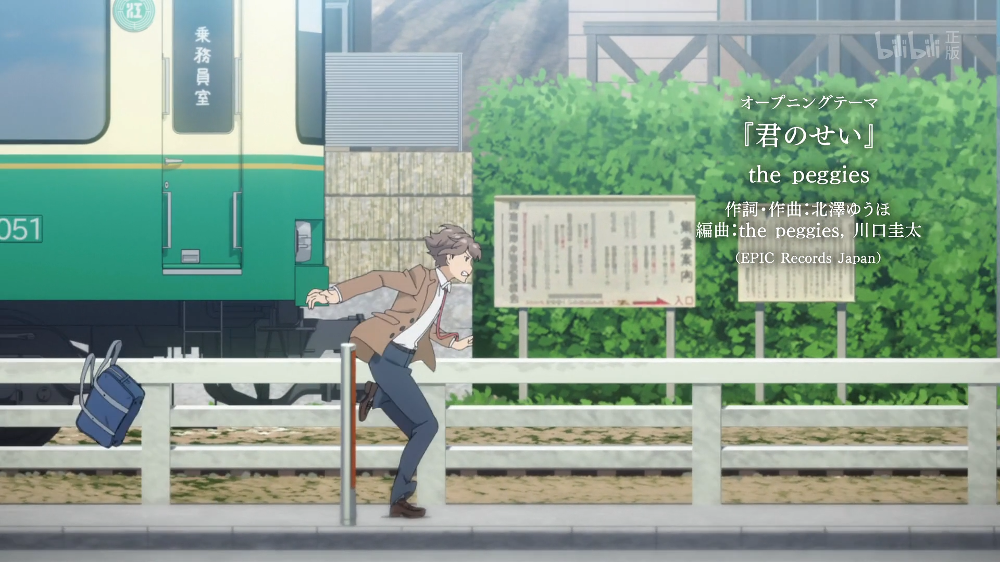
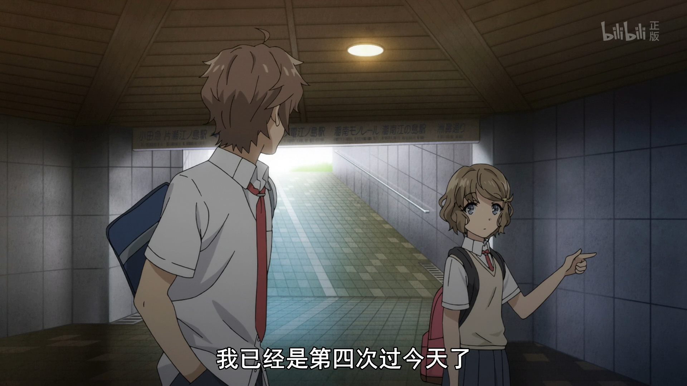
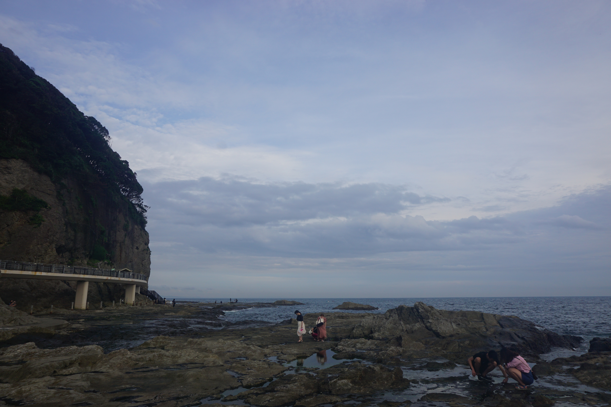

# 霓虹15日游游记 (七)

### 7月18日  新宿—藤泽—镰仓一日游 2019.12.18

在写下标题纠结着如何开头的时候，突然想起大老师在修学旅行时候提到的“早安的啾”——通俗一点说就是早上用啵嘴的方式来叫醒。大老师想到这个的时候是在自己因为疲劳睡过头了然后户冢小天使喊他起床而联想到的，而户冢是可爱的男孩子。。嘛我的性取向自然是正常的，但如果真的有像小说里描绘的户冢那样比女生还可爱的男生出现，真的能保证自己心中不会产生什么yoooooo的念头吗？不过现实中不可能会有就是了。

“早安的啾”什么的自然是不存在的，叫醒我的只有熟悉的手机闹钟。据说无论多喜欢一首歌，只要把它设成闹钟铃声，就会变得令人讨厌。我的手机铃声射程βios应该时间不短了吧，不过好像也不怎么讨厌这首歌，当然本来对这首歌也不算喜欢就是了。总之，伴着βios的铃声，新的一天又开始了。按照计划，今天的行程将是镰仓一日游，而镰仓地区在东京都市圈外，需要先抵达新宿换乘小田急电铁。从这里开始东京地铁券肯定是不能用的了，而我的第一张券——48小时券——的寿命也刚好在今天中午结束，因此可以充分利用地铁券的时间。

之前的攻略我依稀记得有说小田急电铁要在八点之后才有班次，我也就不那么急着出门了——其实还是因为懒，太早了起不来2333。不过其实因为镰仓不少景点都是古迹类，所以弹性很大，不少地方都是可去也可不去，因此时间安排也是相对自由一些的。不过，相对于最近的其他日子，今天的起床时间还是大大提前了的，毕竟去镰仓还是要2个钟头左右的时间的。看样子得和霓虹上班族一起挤地铁了。。。

非常尴尬的是，因为浅草到新宿的路线很多，我现在回忆起来竟然有点记不清如何去新宿的了。。。只能记得我应该是9点多到达的新宿，坐的9点11分的小田急电铁，10点09到达藤泽——这还是通过计算我乘坐江之岛电铁，耗时约20分钟，在10点45左右到达镰仓高校前的时间节点逆推出来的。。从新宿开始，记忆就变得清晰了起来，然而之前是一片混沌。。。难道是因为我这几天休息的不好吗。。目前感觉最靠谱的路线是乘坐私营电铁筑波快线到新御徒町转大江户线直达新宿，因为这趟行程筑波快线的站数很少，开销在100来块，而相较于其他线路可以节省十几分钟，同时步行距离也比较短，因此感觉我权衡之后还是能舍得着100来块的。哎，为啥就这一天早上我没有怎么拍照呢？

嘛这段行程先放着不说，就先从到达新宿之后的开始说起吧。和品川一样，新宿站也是东京地区相当重要的一个交通枢纽，站很大，也有相当多旅游相关的办事处。之所以要先到达新宿，就是为了在这里的小田急旅游服务中心出售的镰仓-江之岛周游券了——1500日元左右的价格，可以提供一日内一次往返乘坐新宿-藤泽之间的小田急线，以及一日内不限次数乘坐著名的海景电车——江ノ電，也就是江之岛电铁，而这也是镰仓一日游的最实惠的做法了。因为到达的时间还算蛮早，9点多属于早高峰刚结束，游客人流还未多起来的时间，偌大的新宿车站略显空荡，而小田急旅游服务中心的柜台前也没什么人排队。简单地用英文交流了一下来意，对方便很熟练地掏出一张时刻表，和我讲解了一下券的使用方式与注意事项。说实话听多了霓虹味的英语，竟感觉有一种蜜汁韵味。。想想自己之后有想法学霓虹语来着，会不会自己的英语口语也要被带跑偏了？😂

买完了一日券时间差不多来到了9点，刚好可以赶上9点11分的列车。因为有在车站很长时间找不到站台的经历（笑），我还是先和服务中心的人确认了一下站台的位置。新宿站的结构感觉还是比品川简单――当然也可能只是小田急线的站台，总之找起来很方便。由于是始发站，这里的站台和其它的造型不太一样：不像南京的地铁，终点站之后还有额外的铁路用来停车、调头，这里的始发站台就是铁路的终点，列车进站之后就直接原地调头出去，乘客也是总一面下车另外一面上车。

因为还有10分钟左右的时间，我便先到站台旁边的便利店买了杯听装饮料喝。便利店里还能看到几位上班族男士在买早饭。站台上就有便利店可真的是方便。话说国内像站台啊、车站啊、机场啊这种地方里的店铺，价格都会比外面要高不少，但无论是在霓虹还是在美帝，感觉好像价格都和外面的差不多哎。。是因为本来物价就相对高一点还是怎么回事呢？

列车是在我进站的时候就已经停在了站台上的，不过不到点车门并不会打开。一早上乘客并不多，因此也不用担心没有座位。随着发车时间的临近，车门开启，我便乘上列车。我所在的车厢正好是车尾，本意是刚好车位视野开阔点刚好看看风景，结果一上车就忘了一干二净，找了个位置坐下，一想嘛还有一个钟头呢，先来两把游戏王！然后就默默地打了半个多小时的牌。。。突然想到这两天（2019/12/21）的新消息，2020年4月大师规则4修订，xyz、同调、融合又可以直接在主要怪兽区召唤，不依赖link箭头了，k社为了卖卡真就吃了又吐啊。。。不愧是你啊Konami！

打了一会儿牌，又稍微眯了一会儿，一个钟头的路程很快就过去了。下了车就能看到写着转乘江之电的路标指示，我便跟着路标一路走下站台，走到了车站的一端，然而这里只有一个出去就是马路的出口，并没有看到江之电的站台或者入口。嗯？我稍微有点发愣，不过这么些天的旅程让我对这种情况还是有一些心理准备的，愣了一会儿就意识到江之电肯定和小田急不在一个区域。在小田急的出口处四处张望了一下我就发现，在街对面的二楼里面似乎藏着一趟电车，这么看如果之前的路标没错的话就是它了，结果自然是机智的我判断正确啦~小田急线就在对面二楼的商场里面。这里其实也是一处巡礼的地点，不过这时的我还不知道，因此也就很普通地上了对面的二楼，检票进站，等待江之电的到来。

江之电是镰仓地区最为著名的交通工具，拥有相当悠久的历史。整条线路连接了镰仓地区绝大地区著名的景点，沿途还能看到风景秀丽的湘南海岸。站台很大，但不像新式的电车有安全门，悬在铁轨上方的电路显示出这趟电车还使用着旧式的“天线”作为动力的来源。而当电车缓缓驶入站台的时候，年代的气息更是扑面而来：黄绿色的车厢，两盏泛黄的车灯，微微带着锈迹的车窗和车门，无不显示出这趟列车经历的漫长的岁月。江之电连接了镰仓与藤泽两个重要的站点，因此除了供游人旅行外，也是两地间重要的交通线路。不知在这电车缓缓驶过的一百多年间，见证了多少欢笑，多少别离呢？

从藤泽到腰越间的江之电缓缓地穿行在镰仓的大街小巷，时而穿梭于低矮而细瘦的建筑区，时而行驶在狭窄而悠长的道路中央。而经过腰越，列车转过一个大弯，湘南海岸的景色立即伴着海潮的气息涌进眼帘，远处是江之岛上高耸的灯塔，而近处则是狭长的沿海公路。电车因为上了年纪，速度很慢，常常被经过的汽车甩在身后，被飞鸟甩在身后，但也就是因为这样，才能让人更好地享受湘南海岸的美景。公路，铁路，汽车，电车，海鸟，游人，海浪，沙滩，海岛，灯塔，不知道世间还会有其他地方能见到这样的组合吗？至少我是不知道的。

我的第一站镰仓高校前，就是腰越的下一站。虽然这里并没有什么著名的景点，却会有大量游人驻足于此，因为这里便是一代人的童年记忆——灌篮高手的片尾曲里，樱木花道驻足的那个电车经过的十字路口。我对灌篮高手并没有那么重的情结，因为小时候真的很少看动漫，大部分时间还是在村子里和小盆友们到处乱跑，但这个场景依然令人印象深刻。绿色的电车，黄色的路牌，蓝色的大海与天空，与樱木红色的头发，实在是过于经典。因此借着一日通行券之便，自然还是致敬一下的，而像我这样来巡礼的人不在少数，毕竟灌篮高手的影响力是远远超出了二次元范围的，巡礼的人数也远不是二次元小众动画能比的，虽然我觉得很多人就是因为这里有名打个卡，把这里当成网红拍照地，根本没有情怀可言。。。据说有传言镰仓高校前站旁的十字路口因为拍照游人太多影响交通，地方政府曾不得不禁止在这里逗留拍照。。虽然似乎这传言不是真的，但拍照的人也太多了吧😂

电车的速度虽然慢，但还是比我的快门快一点。。也可能是我忘记调速度了，拍出来的电车还是有些糊。不过因为天气原因，本来效果就不是那么好，因此也就随便拍拍了。

看着江之电，我突然想起来，镰仓这里也是最近热播的作品《青春猪头少年不会梦见兔女郎学姐》故事发生的场景，而我对这部作品也挺有好感的，还去补了轻小说。鸭志田一也是文笔相当细腻的作者，小说也很精彩，那么既然来了，为何不顺路巡礼一下呢？我的镰仓之旅就这样出现了第一个变数。

镰仓高校前往腰越的方向就有两处取景——op里的梓川咲太跑步的场景：

这两处取景距离镰仓高校前都是几分钟的步行路程，唯一要花点时间的就是要等电车了。比较难以完全还原的地方在于，op里的取景角度都在马路上，而沿海公路还是挺繁忙的，车来车往，实在是没法站到马路上拍照。。

时间来到了11点，此时由于巡礼取景已经快要走到腰越站附近了。由于早饭吃的早，加上接下来的行程似乎要一直到鹤冈八幡宫附近才有吃的，我便决定在腰越这里把午饭解决掉。至于吃啥，那自然还是传统艺能——牛肉盖饭了。其实沿途我有看到周围的住户在晒鱼干啥的，毕竟是个沿海城市，我原本有期待一下有没有什么水产可以尝尝，但腰越附近似乎并没有，随后就找到了吉野家。既然有了牛肉盖饭，那还是别那么麻烦地去找其他吃的了吧——其实就是懒，以及被附近不少打着两三个$的店劝退了。。

腰越附近由于并没有太多的景点，并不怎么繁华，再加上是工作日，除了沿海公路上不时来往的车辆外，基本看不到什么行人。而这家松屋，也是孤零零地伫立在沿海公路旁的一处路口，大概也是因为还没完全到饭点，店里几乎没有食客。我把雨伞插在门口的伞架上——自从三折伞坏了只好带着这把两折伞之后，感觉两折伞越来越麻烦了。。但因为连日的阴雨天气，出门又不得不带着它——走进店里找了个位置坐下开始点单。说起来，上一次在吉野家点的是鱼子盖饭，这还是我第一次吃他们家的牛肉盖饭。从口味上来说，感觉吉野家的味道相比sukiya要更甜一点，似乎还是sukiya更和我的口味。

三口两口解决了午餐，我一边玩着手机，一边连着喝了好几杯水——每次我到了吃饭的时候，都会喝店里好多杯水，主要是往往游玩途中在兴头上就忘了喝水，而我去的这些类快餐的小店里白水都是自助式的，我自然是抓住机会一顿猛喝。就是不知道我这样一下喝好几杯，一个人顶两三个，是不是有些不礼貌呢。。

吃完了午饭，便前往腰越站继续乘坐江之电前往下一个景点。从江之岛站到腰越站间，江之电都行驶在普通行车道中央，而腰越站更是紧临平交道，建站空间不足导致月台特别短，只有三节车厢的长度。当四节车厢编组的列车进站时，最后一节车厢会无法停靠月台并开启车门，末节车厢会直接停在平交道中央——以上内容来自于度娘，什么平交道啊月台啊这种词汇是我平时肯定写不出来的。。不过腰越车站的确相当特别，没见过这种设在十字路口的车站，也没见过这么短的站台，更没见过这样几乎可以从路旁随意翻上翻下的站台——唔这话说的不对，之前在去丰乡町的路上坐的近江铁道也时常能见到这样的站台。我不禁感慨，一是霓虹的铁道历史真的相当悠久，这样不完善的站台相必是有相当久远的历史了，二则是这里很少会有贪小便宜套票的人，不知是霓虹人的整体素质高，还是这里的管理好、法制完善呢？我想二者兼有之。

欣赏完了站台，下一站要去的地方是位于两站之外的七里滨——其实就在镰仓高校前下一站，走路的话也不算太远，但有了一日券就是任性！

前往七里滨的目的自然是和青春笨蛋有关——峰之原高中现实原型是“神奈川县立 七里滨高中”，从七里滨站出来就能看到，相当地近；同时附近还有著名的七里滨海滩，这里也是青春笨蛋里不少故事发生的场所。七里滨车站动画里是相当地还原，无论是站台还是入口，甚至站台上的一些细节都还原得相当好。

七里滨高中距离车站非常近，出门就能看到立在小山坡上的教学楼。因为下一个景点还要回七里滨车站乘车，我自然是先远后近，先前往一个街区外的七里滨海滩，之后再往回走，临走前再来拍七里滨高中。

这里插一两句题外话：我写下着几行字的时候是2020年1月18日晚，距离农历春节也就只有刚好一周了。过去的两个星期，一个是由于牢厂例行的月末周六加班，一个则是由于春节假期调休，本身也没有太多的时间动笔；再加上我正在经历人生中一个相当重要的抉择——跳槽，实在是对于牢厂没有什么好感，连轴转的工作，没完没了的测试，官僚气息浓厚的部门年会，以及重业务的风气，这些都令我反感，而我以前所习得的种种技能，在这几个月的工作期间消磨殆尽，再也没有使用的机会。我希望能去一个相对有归属感一些的地方，努力学习，因此我决定去学习，去面试。所以这段时间就更没有机会去写这篇文章了。终究我没有完成在阳历新年甚至是农历新年前完成这篇文章。但我之前写下的几万字的文章（尽管只是流水账啦。。）告诉我，一定要继续写下去，不能浪费了那么多日日夜夜，所以，尽管短期之内不会有太多进展，我还是会继续写下去，一定会把这篇游记写完。

七里滨站虽然并不像之前那样紧靠着沿海公路，但到达海边其实也就只有3分钟步行的路程。在车站通往海滩的半路上能看到一家711，这里应该是咲太为了防止自己睡着忘记学姐狂买提神饮品的地方？感觉很多便利店都长这样，不过确实很像。

从便利店这里就已经能看见大海了，七里滨海滩就在几步路之外。天色一直是有些阴沉，是不是还会飘一点水雾似的雨，尽管是夏天，在这样的阴天里海风吹着依然能感受到一丝凉意，我也禁不住穿上了防晒服，以稍稍抵挡一点海风。但海鸟却丝毫不在意，它们成群结队地徘徊在七里滨海滩，在电线杆上，在电缆上，在石栏上，在沙滩上，在台阶上，在海风中，叽叽喳喳，摇头晃脑，甚是悠然。我不禁想起了小时候的课文，把鸟儿在电线上比作音符在五线谱上，可惜的是这种生活用电的电缆一般是不会有五根线那么多的，这里也不例外。

（现在时间是2020年3月1日，真的是很久很久没有写这个游记了。自从一月份开始找工作以来，专心于刷题、准备面试，一直没有找到时间动笔。现在，找工作终于有了些眉目，当然战斗还没结束，我现在动笔写一点也算是忙里偷闲。不过，我说过一定会把这个游记写完的。以前曾经许下过很多类似的诺言，但都没有最终完成，这一次我一定不会重蹈覆辙的。）

《青春笨蛋》里，有不少剧情都发生在七里滨海滩，学姐存在消失的时候咲太与学姐母亲的会面，双叶、咲太和国见佑真一起放烟花等等剧情都发生在这里。不过在动画里，这里给人留下深刻印象的时刻，还是和古贺朋绘假约会时候的剧情。

看到这些照片的时候我想起来，定行程的时候，我还在镰仓和箱根之间纠结了很久，因为还是非常想见富士山一面的。最后决定去镰仓，一部分原因也是因为天气好的时候从镰仓海岸也能看见富士山。不过我去的这段时间这样阴雨连绵的情况下，就算去箱根也看不见富士山。。河口湖都可能有点危险。。而且从结果来看，意外地还做了《青春笨蛋》系列的巡礼，也是不虚此行了。不过不得不说，阴雨天气还是让我错过了相当多的景色的，日后还是一定要找一个晴朗的时候再来霓虹一游，不过考虑到未来的加班生涯，以及现在的病毒疫情，感觉下一次霓虹之行真的是遥遥无期了。。

从七里滨海滩回来，接下来便是要拍峰之原高中的校门了。然而令我相当尴尬的是，这时候正是高中生放学回家的时候——时值中午十二点多，而霓虹虽然是暑假，但是有假期到学校参加社团的传统。看着一群群高中生从校门出来，我就有点不好意思拍照了。。。。总感觉像是偷拍高中生的痴汉啥的。。。而回家的高中生延绵不绝，我大概站在路口等了十几分钟，才找到了个空隙，得以拍下校门的照片。

临走的时候有顺便还原了一下番里七里滨车站的镜头。

拍这张照片的时候，其实我站的这边的人行道只有一个小车车位那么宽，再往后就是墙了，并不是很好拍。我努力找角度的时候，一抬头看见一个老阿姨笑眯眯地看着我，似乎觉得这个小伙这么努力地在做些意义不明的事情很有趣的样子。。。现在想想，当时我的样子一定蠢透了。。

这里顺带再吐槽一下霓虹的校服。。也许是因为我看到的学生都不是番里那种贵族（？）学校的学生，就夏季制服来说，男生大多都是白衬衫配深色西装裤，女生也多是衬衫+深色百褶裙，并没有番里穿得那么好看。夏天不能穿小西装也就算了，那水手服呢？领结呢？都是骗子。。。不过比起国内的运动装还是要好很多的啦。

离开了七里滨，我继续乘上江之电前往下一个景点——高德院，而那里伫立着著名的镰仓大佛。

镰仓大佛是古都镰仓的象征，始建于1252年，早年大佛供奉于室内，但在1498年，由于海水倒灌，建筑被冲垮，由此开始大佛一直露天供奉。镰仓大佛由青铜铸成，内部为空心构造，可以付几十日元入内参观——当然这是我到了高德院之后才知道的，我曾一直天真地以为大佛是个实心的铜疙瘩。。。

从长谷车站前往高德院还要走挺长的一段路。大概是由于中午刚过，路上的游人并不多。高德院也不像伏见稻荷大社、金阁寺、银阁寺那样有很大的规模，虽然颇具名气，沿途也没有那么多的店铺，再加上是这个时间，许多店铺还都没有开门，街上便更显得有些冷清。我本以为11.5米高的镰仓大佛会是个老远就能看到的气派佛像，没想到一直走到寺院门前都见不到它半点身形。寺庙的山门周围树木林立，郁郁葱葱，而这尊承载着几百年历史的佛像则隐于这片绿色深处，丝毫不显山露水。

而就在我前往高德院的途中，我收到了一条让我一下子兴致全无的消息：京阿尼失火了。发消息的是我的一个大学同学，也是一个宅。听到这个消息我第一反应是震惊：几天前我才去过京阿尼本社，怎么就突然着火了？感觉搜一下新闻，发现着火的不是我去的本社，而是第一工作室。我先是欣慰了一下，感叹幸好不是本社，随即便发现事情比我一开始想得更严重：第一工作室为京阿尼的主要制作现场，有大量核心工作人员以及原稿都位于第一工作室。尽管我对新时代的京阿尼作品没有太多地关注，但旧时的几部经典之作还是让我对京阿尼有着挺深的感情的。因此震惊之后，心中便涌起深深地焦虑与痛心，只能祈祷staff们能够平安无事。

我写下上面这段话的时候正好是2020年4月4日凌晨，正是清明时分。此日，全国人民都将祭奠在抗击新冠病毒中牺牲的人们，我自然也不例外。而既然正巧写到了京阿尼，便也为在纵火案中逝去的staff们默哀，希望京阿尼能够在废墟中重新振作。

还有就是，自一月份以来换工作的大计终于有了一个还算不错的结果，尽管开的还是白菜价，但至少也是我想去的公司，是我向往的生活。现在我已经离职在家等待背调结果以及后续的入职，祈祷一下不要节外生枝，希望能入职顺利。

再回到旅途中来。进了高德院院门还要再穿过一片树林，拐过弯来，镰仓大佛就出现在眼前了。就观感来说并没有想象中那么高大雄伟，不知是因为角度的原因还是因为受到失火的新闻冲击太大，总之并没有给我带来多少情绪上的波动。庭院里游人来来王玩，但却依然颇为安静，而青铜的大佛静静地坐落在开阔的庭院中间，平和地俯视着面前的一切，不喜不悲，更为院里注入了一份肃穆之感。几位游人正站在大佛前祭拜，而此时的我也不由得双手合十，向大佛许愿，期望京阿尼能够安好。

因为内心难以平静，我选择在大佛一侧的长椅上坐下以收拾一下心情，也顺便细细地观察一下大佛。大佛的身上有一层层的纹路，可以明显看出大佛是分层铸造的。据说曾经的大佛身上还贴着金箔，不过经早已消失不见。但大佛整体还是保存得相当完好，即便经历的数百年风雨的蚀刻，大佛的面容依然沉静饱满而富有威严，手指间的缦网相依然清晰可辨。有俳句赞大佛曰：“火焚而不毁，雨淋而不朽，镰仓露天大佛，或许是永恒的佛”。漫画《Doctor Stone》里主角一行人在经历了三千七百年石化之后复苏，在前往箱根需要定位位置的时候，就通过找到了镰仓大佛而确定了自己的位置，而经历了三千七百年的沧桑之后，大佛也仅仅残缺了一小部分。尽管有艺术创作中夸张的成分在里面，但望着这青铜的大佛，似乎真的感觉它的存在可以穿越漫长的时光，到达我们难以想象的地方。

尽管依然担心这京阿尼，但旅途还要继续。镰仓大佛体内中空，可以花20日元进入大佛内部游览，既然这么便宜，我自然是不会错过这样的机会。从大佛的内部看去可以更明显地看到大佛层层铸造的痕迹，以及对大佛多次修整的痕迹。就我的感觉而言，大佛的铸造与维护仿佛是将一片片的铜当成瓦片一样砌在一起。大佛内也有文字叙述相关的内容，我自然是看不懂的，加上内部光线昏暗，翻译老师使用困难，因此不知道我这样想靠不靠谱。

我对高德院里其他的景点并不是很感兴趣，因此参观完大佛，我便动身前往下一处景点。不过在这之间还有一件事要办：春物里几位主角的名字好像就来源于镰仓地区的几个地名，而这几处地点就散布于高德院到下一处景点——鹤冈八幡宫的沿途。尽管并没有什么好看的，本着圣地巡礼的心，加上自己的一点恶趣味，我决定不原路返回，而是徒步前往长谷车站的下一站——由比滨海滩站。我对团子还是爱得深沉啊233。

正儿八经的由比滨海滩公园距离江之岛电铁的车站还是太远了，而从高德院往车站的路上也就是看一看街景。街上自然是空空荡荡不见行人，而许久不见的太阳悄悄地从云层间透了出来，带来了些许湿热，我也不由得加快脚步。

由比滨车站和其他江之岛线的车站一样狭长而陈旧。因为一日周游券是纸质票，而江之岛线并没有检纸质票的检票机，而车站又常常见不到工作人员。因此每次进站的时候我都有点虚，怕有人说，咦你怎么没有买票？

再次乘上江之岛电铁，我的目的地则是江之电的终点站——镰仓（Kamakura），而这也是大老师家的猫的名字。我所找到各种版本的春物电子书里对猫名的翻译各不相同，有的翻译成卡玛库拉，有的直接翻译成镰仓，还有的版本翻译成雪屋这样奇奇怪怪的名字。。完全搞不懂从哪里来的，不过Kamakura这个发音还是很确定的。

镰仓这一片其实有相当多的古迹，地图上就可以看到十几个神社或者寺庙。不过我自然时没有时间一一拜访的了，因此出了车站便直奔目标地点——鹤冈八幡宫。

从镰仓站到鹤冈八幡宫要穿过名为小町通的商业步行街，而穿过小町通就到达了雪之下，鹤冈八幡宫就位于雪之下二丁目。嗯，由比滨=>小町通=>雪之下=>鹤冈八幡宫，虽然我不算是个团子党，但我依然能从地名里感受到来自渡航的恶意。。。顺带，一路上我还看到了一些奇奇怪怪的名字，虽然有些是在返程的时候看到的，但图我还是一并放在这里吧。

鹤冈八幡宫，顾名思义，是祭祀八幡三神的神宫，始于1063年，最初由源赖义由京都的石清水八幡宫请至由比滨，1180年由源赖朝将其移至现址并加以扩建（所以团子又输了。。。爱情不讲究先来后到的www）。穿过朱红的鸟居，迎面而来的是长长的神道，神道两侧则分布着不少小景点。但一来我此时兴致不高，二来在京都逛了那么多寺庙神社，对这些次要的景点也是兴趣缺缺。鹤冈八幡宫一行，或许是我整个霓虹游期间最“打卡”、最走马观花的行程了。

鹤冈八幡宫的主殿修建在神道尽头的山坡上，相比我去过的其他神社更为大气。随着太阳出来，气温逐渐升高，走了一路的我也渐渐开始淌汗。而登上了八幡宫的主殿，海风越过了建筑、树木的遮挡，扑面而来，令人精神为之一振。主殿里供奉着八幡三神，而主殿左手边是宝物殿，需要付200块门票钱才能进入。本着既然来了就看看的原则，我在自动售票机上买了票。殿里陈列多是与八幡宫及镰仓幕府相关的历史文物，不熟悉历史又读不懂日文介绍的我自然是看不明白，而主殿里又禁止拍照，我自然是映像不深了，只记得检票的老婆婆和与我同时刻进来参观的一对霓虹小情侣。

从主殿原路返回，我又顺道去看了看荷花池旁的旗上辩财天社。比较奇特的是神社周围插满了白色的旗子，不知与它的名字有什么联系。

离开鹤冈八幡宫，我沿着八幡宫正对着的大道返回镰仓车站。这条路被称为段葛，两边都种着樱花树，在樱花季这里想必是人头攒动，相当不适合雪之下呢www

因为中饭吃得略早，这个时候我稍微有点饿了，便在半路又拐回小町通去找东西吃，巧的是又看到了之前吃过的抹茶蕨饼，便忍不住又买了一份一模一样的冰淇淋+蕨饼组合。看着当时拍下的照片，在国内没有机会再吃到的我流下了心酸的哈喇子。。。

当我走到小町通靠近车站的路口的鸟居时候，发现这里比来时热闹了不少——路口搭起了台子，几位西装革履的人正在台上讲话，而台下聚集了些许身着统一样式的蓝色T恤的人。原来又是有参选人在做演讲拉选票。之前我也讲过正巧碰上了霓虹参议院议员选举，看着台下稀稀拉拉的应援人群，我不禁为这位神奈川县参选人的前途感到担忧。。

时间来到了下午3点半，之前一直散发着热量的阳光随着时间的推移渐渐减弱，而我也动身前往本次镰仓行的最后一个景点——江之岛。

江之岛位于片濑江流入相模海湾的入海口处，方圆不过四公里，有一条窄窄的通路连接着湘南海岸。据说原来只有在退潮时通路才会露出水面，但在1923年关东大地震之后，江之岛隆起并与陆地连接。岛上供奉了日本神话中七福神之一的辩才天，是想胜者口才、音乐与财富的女神。距离江之岛最近的车站是小田急电铁的终点站片濑江之岛站，不过由于我乘坐的是江之电，只能在距离稍远的江之电江之岛站下车，再徒步前往江之岛。

从车站一出来就看到路边的《青春笨蛋》电影的宣传用旗子。尽管此时电影在霓虹已经上映了一个多月了，江之岛这里的宣传广告并没有撤下，一路上找各个人物的旗子也为旅途增添了不少趣味。

从车站前的小路走出来，远远地就能看到江之岛上突起的展望灯塔了。不过要千万江之岛，还需要穿过一个地下通道以跨越沿海的134号公路。《青春笨蛋》动画里，学妹和咲太最后约会就在江之岛，而地下通道这里就是约会开始的地方。

走出地下通道，迎面而来的就是连接海岸和江之岛的通路——江之岛大桥。

桥上来往的除了游人，还有不少本地居民，有提着渔具去海钓的，有跑步锻炼的，还有售卖字画的商贩。据说江之岛上还居住着不少人，人口曾经一度破千，不知道现在还能有多少人住在岛上。

跨过大桥，穿过江之岛入口青铜鸟居与后面的商业街，迎面而来的便是江岛神社门口的鲜红的鸟居。不巧的是鸟居背后的瑞心门又在维护。是不是霓虹的古建筑都喜欢在7月份维护啊。。。之前在鹤冈八幡宫也有一座建筑在维护，还是说就只是我的运气太差。。

从这里开始，要登上江之岛最高处的灯塔，需要走不少台阶。这里可以选择乘坐收费的电梯，这也是日本第一个户外自动扶梯，建于1954年。不过360元乘坐4分钟登上46米的山在我看来并不划算，而且今天的步行量并不算太大（比起暴走京都少多了。。），我也还有余力，便决定徒步前行。

穿过瑞心门拾阶而上，不一会儿便来到了江岛神社的第一座神社——边津宫。江岛神社的主祭神为宗像三女神，因此也分为三座神社：祭祀田寸津比卖命的边津宫，祭祀着市寸岛比卖命的中津宫，以及祭祀三姐妹女神的长女、多纪理比卖命的奥津宫。边津宫的位置最低，就我观感也是最为热闹的地方，拜谒的人们来来往往，周围的架子、树枝上也系满了神签。边津宫附近还有放置这神奈川县重要文化财产的八臂辩才天以及日本三大辩才天之一的裸辩才天妙音辩才天的奉安殿，不过我对造像不感兴趣，同时拜谒奉安殿还需要门票，便就此作罢，仅在边津宫前摸出了我珍藏许久的5元硬币，投下，祈祷京阿尼的工作人员能够平安无事。祈祷京阿尼能够顺利度过危机。

攀登到一半的地方，有一处小小的观景平台，这里应该就是学妹在最后和咲太告白的地方。我在这里暂歇的时候，来了两个欧美游客在这里拍照。不知道为啥，我自从从美帝回来了之后，一碰到欧美人就有一种想和他们用英文交流的冲动，都会想找机会和他们搭话，但要么找不到机会，要么最后又碍于面子不好意思，总之这种感觉挺诡异的。。这次也不例外，我坐在旁边，幻想着两人来找我帮忙拍照，随后和他们稍稍聊几句，但人家不一会儿休息够了就起身跑路了。

观景台上有专门供给游人放置相机的小台子，我便毫不客气地把相机放上去拍了个照。从观景台上可以看到下方的港口，1964年东京奥运会帆船比赛就是在这里举行，而2020年奥运会水上运动赛场也会在这里，不过现在已经是2021年奥运会了。。

顺便说一下，江之岛观光电一共有三段，每一段都可以买票乘坐，其实我是走到了第二段才发现了电梯，差不多就在观景台这一段，而这时候买票并不会减价。。。

从观景台继续向前，右手边就是中津宫。大概还是受到了京阿尼事件的影响，这一路上我有点兴致缺缺，看了眼路牌，中津宫这里只有这座神社，没有什么其他特别的景点，因此我在这里也就是驻足远眺了一下，草草掠过，接着向上攀登。

越过中津宫再转过一个弯来，便登上了江之岛的顶部。面前是片开阔地，右手边是塞缪尔·科金花园，以及江之岛的制高点——江之岛展望灯台。天气晴朗的时候，在展望灯台上远眺湘南海岸和富士山，一定是相当不错的，然而在近期连绵的阴雨之下，能见度实在是不高，而展望灯台的门票着实有点小贵，因此还是告辞了。。我转过头来，登上左手边的江之岛展望台。

与之前面对相模湾的观景平台不同，江之岛这最高处的展望台面对的是一望无际的太平洋。阴云密布的天空下，远处的海面与天空的交界线糊成了一片。些许阳光从云层中透出，却并不能让大地变得明亮，伴随着海风的吹拂，明明是夏天，却仿佛秋日一般，生出了一股萧瑟之感。唯有鸢鸟张开宽大的翅膀，乘着海风上下翻飞，嬉戏鸣叫。对它们来说，没有人类那么多的烦心事，仅仅是乘风飞舞，就已经足够快乐了，真好，而不像我，整天愁这个愁那个。的确应该把很多忧愁放一放，活得更简单更单纯一点。

在展望台这里休息片刻恢复一下体力之后，继续前往江岛神社的最后一个神社奥津宫。在半路上可以看到一处联通着大海的悬崖，因为是一处裂口似的地形，海风从开口处灌进来，变得相当猛烈，一只在山谷起飞的鸟儿刚刚张开翅膀，就仿佛断了线的风筝一样，一下子乘着海风腾空而起。在悬崖的一侧有一座废弃旅馆似的屋子，墙体已经有些许剥落。窗口之下就是悬崖，如果住在这里应该还需要点勇气吧。。有些恐高的我如是想着。。

接下来抵达的奥津宫这里我也并没有到神社前参拜，只是稍稍扫了一眼边上的眼观八方之龟。据说无论从什么角度看这幅画，画里的乌龟的眼睛都想是注释这你的。当时我还奇怪为啥这里会画着这么大一只乌龟，现在查了下资料才发现说的是浦岛太郎的故事。。突然想起了《齐木楠雄的灾难》。。。另外这一段因为没有心情也没有拍照=。=

奥津宫旁边有祭祀龙神的龙宫，当时我奇怪为什么这里会有龙，现在查到江之岛这里有这恶龙钟情仙女改邪归正，造福于民的传说，而龙则是弁天才的化身——虽然不明白弁天才是什么，但是感觉很厉害的样子。

龙宫附近还用于祈福恋情的“龙恋之钟”，我这种单身狗过去自然是自讨没趣，而其本身也不是什么古迹，因此也没有前去参观。

此时时间已经来到了下午的5点一刻。查了一下著名的江之岛岩屋只开到下午5点，很遗憾不能去洞穴探险了。但我看到前方除了岩屋还有其他景点，地图上显示就算走到岩屋那里再返回也就是一个多小时的时间，大不了就是晚点吃饭嘛，反正明天的行程是千叶县巡礼，行程安排的弹性也比较大，因此我决定再拼一枪。

穿过奥津宫之后，道路就一路向下。山路弯弯绕绕，一时半会儿也看不到头，加上原本就灰暗的天色随着太阳的下落变得更加灰暗。恐怕这个点还要往下走的游客是真的不多了，大部分人都准备返程了，路上除了看到一对不想走下去折返的情侣外就没有看到其他的游人了，心里不免产生一种“啊这要走到啥时候啊，没完没完了”、“这么晚了还继续往下走值不值得啊”、“会不会赶不上回去的电车”的想法——尽管小田急电铁一直要运行到晚上8点之后。

随着海拔的逐渐降低（尽管本来就没什么海拔，江之岛也就几十米高），路旁的树木开始变得稀疏起来，渐渐可以从空隙中看到海水。接着转过几个弯来，便到达了此次行程的最后一个景点：稚儿之渊。

相传镰仓名刹建长寺广德院有位自休和尚，一日来江之岛向辩才天女神祈愿，在岛上见到来自镰仓相承院一老一少两个和尚，并对美少年和尚白菊一见钟情。但这段禁忌之恋最终没有结果，两人双双投海自尽，而投海的地方，就被称为“稚儿之渊”，“稚儿”二字则代指少年僧人。

稚儿之渊位于江之岛最西面。站在这里，面前是石滩与大海，背后则是嶙峋的石崖，晴天时分必是个欣赏落日的绝佳去处。我正遗憾着阴天看不到落日，太阳竟又从云层里探出了头，不过并没带来金色的夕阳或五彩的晚霞，而是把天空和海面照得一片惨白，迎着日光看去，天地间仿佛一幅黑白水墨画：白色的日光和波浪，灰色的乌云和海水，黑色的石滩和剪影。

从Google Map上的图片来看，石滩这里也是垂钓的热门地点，不过这个时候已经不见了垂钓者的身影，只有几个游人在石头缝里找螃蟹和贝壳。一个应该是国人的小姐站远处的一块石头上，正招呼着她的闺蜜给她拍照，似乎是要抓拍海浪冲刷石滩溅起浪花的场景。但拍了几次似乎都不太满意。海浪并没有那么猛烈，溅起的水花最多也就是吓一下漫不经心的游人——真的有个老哥站在一块显然是因为退潮而露出来的石头上，结果被突然拍上来的海浪吓到，然后把衣服弄潮了。。。

虽然海浪不大，但海风还是吹得呼呼的，吹得我的手机三脚架都立不稳了。我只好用手里的雨伞把三脚架压住，以给自己拍几张用来装逼的照片。。

在石滩上逗留了许久之后，太阳终于又隐进了云层背后，时间也不早了。尽管没能去到岩屋，也没能看到夕阳，能看到这样一幅如画般的景象，还是不虚此行的。据说岩屋附近有船可以坐回到片濑江之岛站那里，但我这个时间点怕是已经没有船了，因此只好原路返回。 

回程的路上自然是要相对无聊许多了，路上没有碰到多少有趣的事情。只记得返程时江之岛大桥上的小商贩们已经收摊，路上的游人也远不及下午来的时候多，但还是能够看到锻炼的老大爷。走到地下通道处，我犹豫了一下要不要从片濑江之岛站直接坐小田急电铁返回，但一方面我当时在纠结镰仓一日周游券包不包含小田急线从片濑江之岛到藤泽的行程，另一方面还想在藤泽的江之电车站再拍张照片——来的时候并没有想起这里可以做《青春笨蛋》的巡礼，因此车站这里没有注意，好在江之电返程到藤泽再转车也多花不了多少时间。于是，便又拍下来下面这样的照片。

从藤泽返回新宿已经是晚上7点40，此时的我饥肠辘辘，又因为时不时记挂起京阿尼来，又有些浑浑噩噩。随意选了一条看上去速度比较快的线路返程，等坐上电车才发现竟然坐上了大老师常坐的总武线。明天要去的千叶巡礼的行程里都坐不到总武线，没想到在这里误打误撞坐上了。坐总武线返程需要在秋叶原再换乘日比谷线，等到了秋叶原，实在是饿的不行，出了站来在车站旁的麦当劳解决了晚饭。此时天空开始飘起了小雨，而刷到的京阿尼的新闻又着实不容乐观，多为制作骨干行踪不明。我坐在靠窗的位子上望着打在玻璃上的雨滴，又不由得悲从中来。

解决了晚饭，我拖着疲惫的身心返回了位于浅草的酒店。旅行还要继续，我所能做的，唯有祈福，以及整理身心，等待明日继续上路。

拖了整整4个月的第七章终于在今天今（2020/4/18，凌晨1点20）画下了句号，经历了种种还能够继续写完着实不易，我也深感自己的文笔之烂，描写起来力不从心。尽管拖了这么久，有些旅途中的细节已经开始模糊，但我还是尽量通过照片中的细节，通过Google Map的路线，试图去还原旅途中遇到的种种，以及尤其对于这一天十分重要的、我的心路历程。京阿尼纵火事件早已尘埃落定。三十几位从业者不幸遇难，其中还包括我所熟悉的池田晶子、西屋太治、武本康弘以及京阿尼元老级动画人木上益治，真的是对京阿尼乃至业界无比沉重的打击。我所能做的，只有通过京阿尼官方网店购买一些微不足道的商品提供一些支持。希望逝者安息，生者坚强，也希望京阿尼经历了灾难之后能够浴火重生。