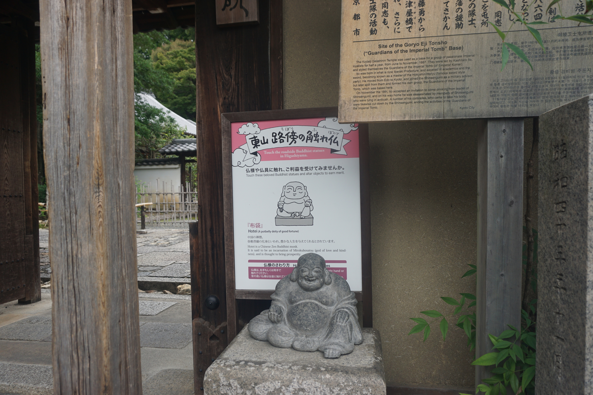
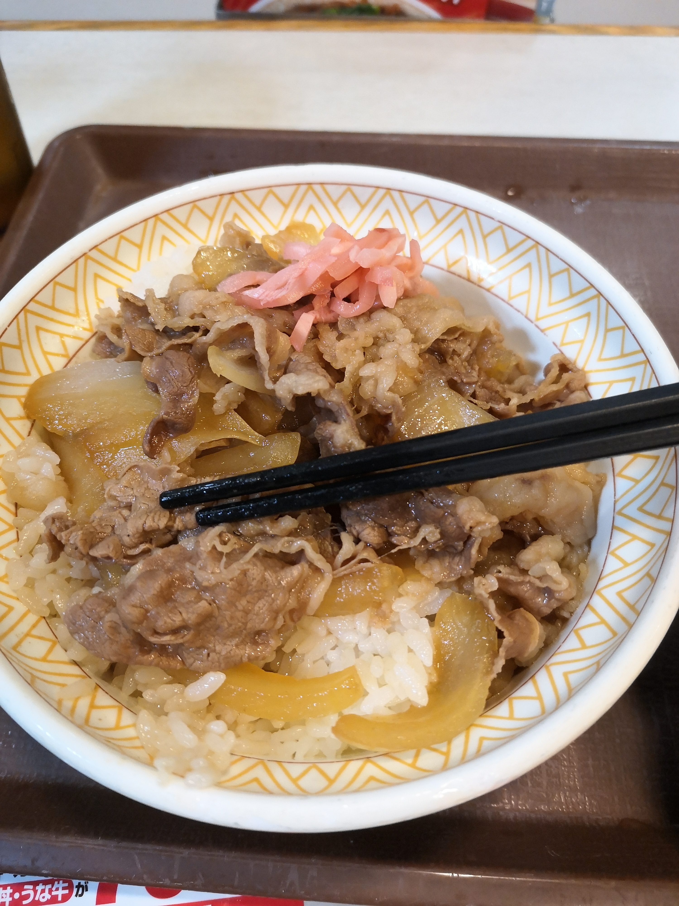
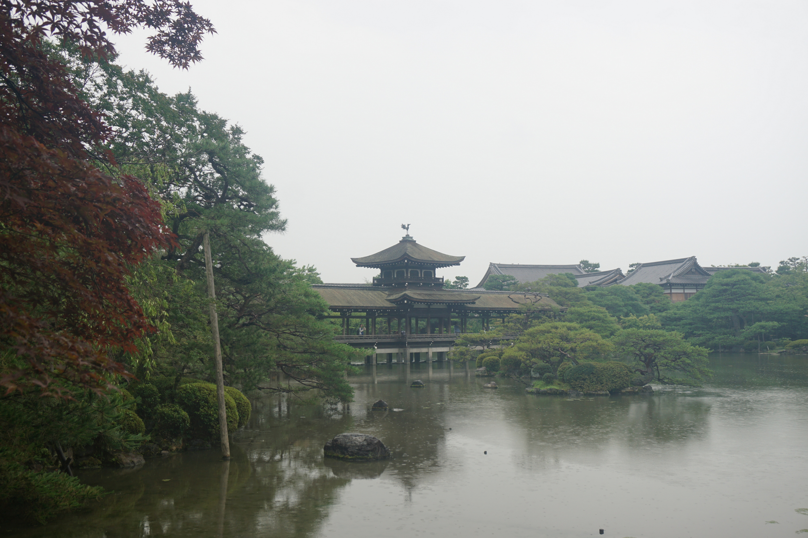

# 霓虹15日游游记 (三)

emm没想到这么快就从二写到了三。。。究其原因还是第二篇里面丰乡町圣地巡礼的部分写的实在是太长、图太多了。。以第一篇来说，除了第一天因为基本是在跑交通所以字数比较少，第二天第三天的字数也就是每篇四千字左右，然而丰乡町这样一个半天的行程就写了快八千字。。这么看来，京都篇就得分成上下两部分，而东京篇嘛。。估计秋叶原就得写很多字，大洗的内容就更多了。。鬼知道要写多久。。

还有就是越写下去越觉得自己的笔力实在是太差了，虽然本意就是以流水账的形式记录这15天里的所见所闻所想，但写到一些对景色的描写也好，自己的心理活动和情绪变化也好，很多时候还是需要一些功力写出的内容才能显得不那么幼稚和尴尬。不得不感叹，从高中毕业之后做理工科生的这几年真的是把作文水平都还给语文老师了，不过我本来作文也就是个及格线上的水平就是了。。

最后一点题外话是，这些天写得相对勤快一点，所以速度稍微上来了一些，但因为前两节的内容过长，进度推进的还是很慢。而因为我白天的效率很低，大多会拖到晚上洗完澡之后才开始写，一不小心就写到一两点，再加上github在国内蛋疼的上传速度，睡得就很晚了。所以之后可能速度会降低一点，当然提高白天的效率才是正道就是了。。。

### 7月13日 京都: 清水寺、三年坂二年坂、八坂神社、南禅寺、银阁寺、平安神宫 2019.8.23

写完这个标题之后要吐槽一下我的相机——我的相机的内部时间设置出了严重的问题，导致所有图片的拍照时间都至少晚了半天，而我在玩一些景点的时候，手机和相机可能只用了其中的一个，如果是手机的话就还好，毕竟手机的时间肯定是对的，如果只有相机的话，在我还原行程的一些细节和时间节点的时候就会出现混乱，比如我会搞不清我呆在某个景点多久，或者弄不明白我从某处出发的时间。而这一天的由于去的景点很多，行程就更为复杂，而偏偏我在中间南禅寺的游玩途中木有用手机拍照。。导致了我在写这个标题的时候为了弄明白先后顺序翻了半天的照片。。

Ok回到正题。正如上一节结尾处所说，我头一个晚上睡得很早，目的就是为了今天早上能起个大早，避开去清水寺和三年坂二年坂的人潮。这一小技巧我是从某篇游记里看来的，清水寺一带距离京都市区很近，又是最为著名的景点之一，游客必然众多，不过很多人不知道的一点是，清水寺早上六点就开门了，同时京都的公交早上也是6点多就开始运行了，而一般旅行团很少有能在八点钟之前到达景点的，所以对于自由行的我来说，只要起的够早，就能体验一趟更为轻松、宁静、祥和的历史之旅——其实就是拍照会更好看。

所以，我六点多就早早地起床、洗漱，用昨晚在便利店买的饭团和咖啡做早饭，为了就是赶六点四十五分左右的的那一班从四条乌丸车站开往清水寺附近的公交。写到这里我突然想起了我在京都的一顿早饭，具体是哪一天的我记不真切了，不过大概率是后一天7月13日或者7月14日。我因为图方便，直接在一楼大厅的自动售货机买了一瓶咖啡和一个巧克力甜甜圈。咖啡倒是一如既往的奶咖没有什么问题，但这个甜甜圈问题很大。。首先它不是我在米国docking donuts吃的那种炸过的面包口感的甜甜圈，它的口感感觉介于面包和曲奇饼干之间，像是奶油过量的曲奇的味道，不脆也不松软，很奇怪；第二，我看袋子上的图片是一半涂着巧克力一半没有，以为只是让你看一下这巧克力外壳下面是啥样的，没想到它真的就是只有一半的一面涂着巧克力。。本来口感就不是很好，没有巧克力味道就更糟了。。

从四条乌丸到清水寺距离不远，不过由于清水寺周围就是三年坂二年坂等一大片古街，公交车并不能直达清水寺。我选择坐到三年坂附近的清水道，步行穿过三年坂到达清水寺。这里我记得我貌似没有坐直达的车，而是坐成了先坐到祇园，再从祇园转车道清水道。不过因为我走的早，没有什么大问题，也就多花了几分钟的时间。从清水道开始，步行道就一路缓缓向上，不过比神户站通往北野异人馆街要平缓的多。道路两边都是日式古风的小建筑，让我想起了西塘古镇、苏州平江路和高淳老街。不过不同于国内古镇老街，三年坂二年坂这样的街巷显得不是那么的古老沧桑，大概也是因为都是各种小店的缘故，这里也没有国内谷镇老街那样有生活气、烟火气，更为精致。一大早没什么人，店家也大多没有开门，只有零星的早起游人和晨练的中年大叔，有时候甚至前前后后都看不到人，只有我一个走在空空荡荡的石板路上，巷子里安静得能听见我自己的脚步。我在想，要是这时候还下着雨，一转弯，前方出现了一位撑着纸伞穿着和服的日本姑娘，是不是真的会让人感觉穿越回了古时候呢？然后 送货物的汽车立马跑出来打了我的脸。

一路爬到上坡的最顶端就可以看到音羽山清水寺的入口了，入口处的仁王门，西门和背后的三重塔都是鲜艳的红色，虽然些许漆有些剥落，但因为都建的很高，而且还在山坡上，还是很气派的。

我在这边拍照的时候，碰到了一帮女生组团出来玩，在这边拼命凹造型。。上面这张就是我一开始没注意拍进去了，我拍完跑路了她们还在那儿凹造型。。等后面我去拍西门和三重塔的时候又看到她们在那边凹造型，还凹了很久。。

霓虹的寺庙神社之类的都有一个进去参拜前洗手的传统，要用长柄勺接洗手台上的流水，先洗左手再洗右手，再用左手接勺里的水漱口，最后接水立起勺子洗勺柄。因为一大清早没有人，我便想用我带三脚架的自拍杆来拍自己洗手的照片，结果拍到一半三脚架倒了。。。。还砸到了我的头，幸好手机没事，而且还抓拍下了自拍杆倒下前的一幕。

西门侧边立着一块牌子，是纪念中国残疾人艺术团来清水寺表演《千手观音》的。清水寺本身就是供奉观音的寺庙，所以在这里跳千手观音也更具意义，这块牌子也见证了两国人民友好往来——所以我国人民和霓虹人民的关系还是挺好的嘛。

从三重塔旁边的台阶走上去，迎面就是随求堂了。随求堂这里可以花100块体验胎内之旅，不过这里要等到8点半才开。。这算是一大早来唯一的坏处吧，不过可以等到转完后边的其它景点再回来看就是了。

从経堂旁边绕过去一路没有什么值得提的点。在门口买了票就可以进最为著名的清水寺本堂了。遗憾的是，我去的时候又碰到了清水寺本堂维护，虽然不影响内部参观，但一是让本堂里面采光变得很差，很暗，二则是施工棚罩住了清水舞台，从外面就看不到清水舞台的全貌了。。

本堂里最著名的国宝是三十三年开放一次的十一面观音佛像，我自然是没有机会看到的了。。只能看到外面供奉的像仁王啊金刚一样的佛陀像。本堂里面佛像这个部分自然是不允许拍照的，所以也没有留下相片。本堂里比较有趣的是一口长得像个大口罐子的钟，允许游客坐下敲钟祈福。我试着敲了一下，真么想到这样一个放在地上的钟声音还能这么响这么悠长。

本堂里也可以求签，200块一次。听说清水寺的签还是挺灵的，便求了一张，吉。然而我感觉我在霓虹运气一直不咋地。。碰到好几处维护，木有看到日落也木有看到日出。。然后回来之后入职还有这么多破事。。。这个吉我是真的不太相信哈。。倒是之前在春日大社就看到，后来在诸多神社也看到的牌子说，95年出生的人今年是厄运年，好像还是本厄，我大概感觉就是厄运的巅峰期，这个我倒是感觉挺靠谱的。。今年运气一直挺烂，不过也有我不努力老摸鱼的因素在就是了（笑）。

清水寺本堂是一半建在山上，另一半从山坡露出来，而露出来的部分就是清水舞台。复制一段网上的话：靠着陡峭的崖壁，由众多稿约12米的木柱并排支撑，采用“悬造式”手法，没用过一个钉子；舞台约4层楼高，面积190平方米，410多块木板铺成。还是因为维护的缘故，不太能看出来清水舞台有那么大，不过还是很高的，想想这是400多年前建成的建筑，还是很赞叹古人的智慧和艺术感的。日本有俗语“从清水寺的舞台上跳下去”，来表达做事不顾一切的决绝，不过从十几米高的地方跳下去emm感觉不死也得半残啊。。。至少我是没有勇气跳下去。据说几百年来还是有200多人真的从清水舞台往下跳，这里面到底是在求神佛保佑，还是纯粹为了死得轰轰烈烈，就不得而知了。

从本堂出来，左手边再往上走就可以上地主神社，而右手边往下走可以直接下到音羽瀑布，不往下走可以到奥の院。站在奥の院前可以从一个比较好的角度来看清水舞台的全貌。由于整个清水舞台上方都被维护用的棚子罩住了，实际看到的景观就有些尴尬，我也就随便拍拍了。然后我意识到了一个更尴尬的事情：我一开始居然木有从本堂出来到清水舞台上一览，等我出来了之后才想起来。。。想了想，虽然再进一次本堂还要多花300块门票钱，但是不从清水舞台上眺望一下，不是很亏吗？再加上原本就要转回去看地主神社，从本堂里面过去还可以少爬点楼梯——当然后面这个是自我安慰就是了。

从奥の宫再往前走，可以转到清水舞台对面的一个小山坡上，那里有一座小小的子安塔。从这个山头上可以从另外一个角度来看清水舞台。

从子安塔那边绕下来，同样可以走到音羽瀑布。说是瀑布，其实是从山上留下的泉水，到了这里被引成了三股水流。我印象中三股水流应该是分别代表了三种福祉，我只从带着的春物里平冢先生的截图知道有一股是爱情，另外两股不知道，也不知道每股对应的是哪个（现在知道了从外面看从左往右分别是学问，爱情，长寿）。。这里提供了长柄的金属勺，还有紫外线消毒设施，来给大家喝泉水。据说不能贪心，每人来一次清水寺只能喝一股泉水。因为到的早，这时音羽瀑布前还没什么人排队，我便能得以安心地拍我的圣地巡礼照片。排队准备喝泉水时，前面有一位中年阿姨也在喝，我看她喝得感觉emm怎么说呢，挺专业的？反正看上去挺懂的，便想问问她每股泉水代表着什么意思，然而一方面是我的英语表达她貌似也听的一知半解，一方面她的日语解释我更是听不明白，感觉她也就是和我说啊这个山泉是巴拉巴拉，喝了泉水能得到神灵的保佑什么的，我只好说声感谢，并赠予她一个尴尬而不失礼貌的微笑。。最后我还是和平冢先生一样喝了中间的爱情泉水2333

音羽瀑布对面有个可以求符的地方，我想了想求了一个厄除符，现在还放在我的钱包里，不求它能帮我避开所有的厄运，但求能来一手峰回路转就够了QwQ

从音羽喷泉出来，走一段石阶，绕过一个小池塘就可以回到入口处了。我看了下时间，才8点10分不到，但等再进一次本堂+看地主神社出来再去随求堂的胎内漫步我又怕人太多，想想就先等到八点半吧。霓虹人也真的挺刻板的，我看准备的僧侣和工作人员8点15这样子就已经打扫完了卫生做完准备了，但最后还是一定要等到8点半准点才放人进去。

在等待的期间，我在随求堂周围转了转。从钟楼的一侧下去可以看到千体石仏群和成就院。千体石仏群是一大片地藏石像，让我想起了只狼里的金刚山仙峰寺；成就院则貌似是限定开放的场所，并没有开门，所以我也就在门口瞟了一眼。成就院前还有一个小池塘，这里我先是碰到了一个晨练的老大爷，晒得贼黑，身上肌肉线条分明，看来平时没少锻炼；又看到一个拿着单反凹造型自拍的lady，她木有带三脚架，只好把单反放在附近的落地灯上、石头上，设定时来自拍，反正感觉拍起来很麻烦，然而她还是拍的不亦乐乎——女人对于拍照这件事真的好执着。。

在随求堂门口徘徊的时候，来了一位看上去是东南亚或者南亚的外国女游客，她估计也是看我站在这儿闲的蛋疼，想让我帮她和三重塔和个影。合影的时候顺便聊了一会儿，她好像是来自斯里兰卡，我帮她拍了一张她挺满意的，不过看了一会儿又很不好意思地问我能不能帮她在背景里没有其他人的时候再拍一张。我说没关系，可以的，反正我是自由行，在这边等这个胎内之旅闲的蛋疼，她说太好了，不过我是跟团所以反而是自己时间不太够。。这时候因为已经过了8点，游客渐渐多了起来，我试了几次都没有抓到时机，都是看到没人准备拍又突然窜出来一批人。她也觉得很无奈，但时间不等人，最后只好帮她换了个角度又拍了一张。

终于等到了随求堂胎内之旅的开放。我虽然没排到第一个，但也是第一批的几个进去的人之一。胎内之旅不能拍照，所以没有图。行程很短，不过非常有趣，我觉得很值得一玩。所谓的胎内应该是指随求堂的地下，这里面不允许打光，设计的路线又挡住了外面的光线，所以进去之后是真的漆黑一片，伸手不见五指——平日里真的很难很难体验到这种完全没有任何光一片漆黑，仿佛失去了视力的情景，只能用手抓着狭窄的走道旁设置的扶手用的粗绳一步步向前摸索。这种体验真的是新奇带着刺激，又有一点点微妙的恐惧感——所以说大老师和团子在这里玩的时候“吊桥效应”生效真的挺正常的233。在缓缓向前摸索的时候，拐过一道弯，眼前突然出现一处幽幽的灯光，照亮了一块小小的圆石。据说把手放在石头上许愿很灵，不过我当时好像因为新奇感完全忘了这个事情——一片漆黑之中突然出现一处幽幽的光点，真的感觉挺奇妙的，心里有种微微一震的感觉。

从随求堂出来，为了上清水舞台眺望一番，我只好又花钱买了一次门票，重新进了本堂，不过说实话有点小失望——因为天气不好+维护的脚手架遮挡了视线，并不能像攻略一样远眺京都，天空也是一篇泛白，只能看到近处的奥之宫和对面山上的子安塔。

离开清水舞台，接下来的就要去地主神社了。地主神社它日本唯一一所祈求恋爱、结缘的神社，历史比清水寺还早，也是之前有说过幸运星里面小镜她们抽恋爱签的地方。这个时候游客数量渐渐已经上来了，地主神社人更是多，看来无论从哪来，大家都对恋爱的东西很有兴趣啊233

来地主神社自然是要求恋爱签的。我走到这里百元档的硬币用完了，稍微有点不好意思让负责抽签的巫女来找大面额的钞票。结果正巧有个霓虹游客要巫女化开1000块纸币，结果巫女很平常地从抽屉里掏出一大卷100块零钱就帮人家换了。soga，原来这在霓虹很正常的，不像我们这边找个小店换零钱有时候都很难。这里不由得要吐槽一下霓虹这个硬币的问题。霓虹的纸币面额基本都是1w和1k的，极少的时候能见到2k的（魔禁里面教主的2k纸币被自动售货机吞了还被炮姐嘲笑了半天），比1k小的就只有各种硬币：500，100，50，10，5，1都有——这个硬币的种类就比国内常用的多了不少（主要现在不用分了）。再加上霓虹消费的时候大多还是用现金，在霓虹玩的时候硬币就会非常非常多，而且大多都是小额的10块和一块的硬币——当你有100元硬币的时候真的是懒得从口袋里摸一把10块硬币慢慢数，所以10块和1块硬币就会大量地剩了下来。。。幸亏我早有耳闻，出发之前特意带了一个小袋子装硬币，不然口袋里每天要放大把的硬币是真的要死了。。

我的签运貌似不错，抽了几次签都没有见过凶，这次也不例外。不过还是那句话，不懂霓虹语，签上的内容看不明白，自然也就没法解签了。

地主神社还有一个很有意思的东西。在神社里有两块被称为“恋占いの石”的石头，据说如果能从一块石头出发，闭着眼睛走到到对面的石头，就能找到爱情；如果失败了，那么实现爱情就会需要一些时日。我记得春物里面大佬是他们来清水寺的时候班上人就玩了这个（对，说的就是你，户部！）。现实情况也是好多人在玩，说实话真的挺难的，闭上眼睛之后真的很难保持走直线，我在旁边看了半天，大部分人都是半路上就开始偏离航线，部分人靠亲友提醒成功了，只有一个白人小哥独自成功了一次，后来他不知什么原因又玩了一次，结果就失败了。小哥明明已经偏到不知道那里去了，和他一起的几个损友也不告诉他，结果他还以为偏差不大，很正经地到处摸索抱空气，把大家都逗乐了。什么？你问我？我么老哥一个自然是凉凉，所以我也不知道是这个石头占卜靠谱，还是抽签占卜靠谱。难道对冲了？

清水寺的行程到此告一段落。从清水寺出来，穿过三年坂和二年坂一路走到底，再穿过ねねの道（宁宁之道），便可以到达八坂神社。这一路上其实还有不少小的景点，ねねの道和石塀小路也是很有霓虹传统气息的道路，附近的高台寺也是挺有名的寺庙，不过因为我今天要去的景点众多，在京都留下的时间也不是很足，只好放弃一些小的景点，直奔八坂神社了。

因为前两天在宇治喝的抹茶实在是不太好喝（废话瓶装饮料能有多好喝。。），在我心里有点掉价（。。。这就掉价了？），我看到周围的抹茶甜品店忍不住想再去尝试一下（其实就是看到现在查到叫“蕨饼”的抹茶和果子很诱人。。）。我也没有事先查过哪家比较有名，早上九点钟各个店里的人也都不多，看不出来哪家比较热门，就随便进了一家店。除了蕨饼之外，店里自然还有卖各种我们熟悉的抹茶点心，什么大福啦，冰淇淋啦，当然还有正儿八经的抹茶（不过图片上面看总感觉做成了类似奶茶那样的饮料）。我点了一份600块的蕨饼+抹茶冰淇淋的组合杯，虽然性价比感觉比单点蕨饼或冰淇淋低了一点，不过胜在两种都能尝到。味道真的很不错！相比在国内迟到的抹茶甜点（说的就是你，M记！），茶味会更浓，甜度感觉也恰到好处，不是那么甜，但又能很好地中和茶的苦味。果子相比大福没有那么黏软，更有弹性，但也很软糯。总之是好吃到足够让我想买一份带回去给大家尝尝的那种程度，我吃完了之后就稍微有点后悔没有多买一些蕨饼做纪念品带回去，不过又想了想现在买了带着玩还是太麻烦，等到撤退的时候再买也不迟。然而最终我并没能把蕨饼带回去，至于原因嘛，后面再说（肯定会提到的，只要我能把这整篇游记写完。。）。

玩的时候我和szy聊天时候还把下面这张照片发给他看，结果他第一反应居然是为什么你一个人却有两个勺子。。。这什么奇怪的关注点。。。同时我也不知道为什么会有两个勺子。。怕一个坏了或者掉了还能有备用吗？还别说我吃到最后还真的不小心咬坏了一个勺子2333

关于这杯甜点还有一个小插曲：霓虹是严格执行垃圾分类的，而路上常常走很久找不到垃圾桶，然后找到了发现木有对应的分类。。最常见的垃圾桶是可燃垃圾和塑料瓶、易拉罐的垃圾桶，而我这吃甜品剩下来的塑料杯和勺子到底算什么分类？可燃？好像这种沾了食物残渣的又不能算。我拿着吃剩下的杯子走了一路，一直走到二年坂拐出来去宁宁之径的地方，发现了一个写着类似于“其他垃圾”的谜之垃圾桶。边上正巧有一个警察（城管？反正是穿制服的大叔），我便指了指杯子，又指了指垃圾桶，问“OK？”警察笑了，“OK！”算是解决了这个小麻烦。不过还是建议随身要带一个垃圾带，至少酒店房间里的垃圾桶不用分类，少量垃圾带回酒店处理也比较省心。这里我想把杯子丢掉还是怕装垃圾袋放在包里，杯子里面剩下的冰淇淋残渣可能会把包弄脏。

半路上能看到不少租和服的店，有一家好像很有名的和服连锁店居然叫岡本（嗯？）。租和服并不便宜，随便看了几家的价格都是一两千块，好像还是按小时租的。我肯定是没这个钱租，不过街上还是能看到不少穿和服的游客的。

说是放弃，但半路上看到有意思的东西还是会忍不住去看一眼。高台寺前的小径绿意盎然，我忍不住上去看了一眼，过了第一道院门就能看到寺庙的入口，还能远远地看到寺里有一尊很大的佛像，不过貌似不在寺庙的院子里。我问了一个从寺院里出来的白人老哥里面能不能看到这个佛像，他说并不能，他也不知道怎么去看这个佛像。我稍微在周围转了一下，发现这个佛像好像在另外一个院子里，进去看个佛像还要交门票钱。。我便就此撤退了。

路边经常能看到在小南极第三集开头出现的那个长相丑萌的谜之小动物的雕像，我一直不知道这是啥，好像这在关西很流行。现在查到这是日本的“狸”的形象，实际是貉，一种犬科动物，日本文化里用来祈求生意兴隆的，和国内的招财猫有点像。

宁宁小道上还能看到一个很有意思的小石雕：来自中国的布袋和尚的雕像。旁边立着的牌子上写着，摸摸布袋和尚祈祷能带来好运，所以石雕被摸得十分光滑。话说我知道的布袋和尚只有倚天里的说不得。。看来是我才疏学浅了。

穿过宁宁之道就能看到八坂神社的鸟居了。这里应该是八坂神社的南楼门，但感觉没有西楼门那么气派。西楼门其实之前我也见过了，就在祇园车站下来的地方，正对着十字路口。走到门口，我发现这里站着一个穿着日本传统服饰的人，好像在等着迎接什么。进去的时候我并没有在意，现在想想，其实这里就能看出点端倪的。

八阪神社位于京都市内四条通大街尽头，是霓虹全国祗园社的总本社，供奉消灾驱邪、买卖兴隆之神，深受霓虹人信仰，而这里也是京都最著名的景点之一。八坂神社有着十分悠久的历史，相传创建于公元656年。虽然我估计经历了这么多年的风雨和战火的洗礼，现在的建筑肯定没有这么久远的历史，但应该还是保留了相当古老的建筑式样。不得不说，霓虹人对古建筑的保护还是有一套的，经常维护，更换材料，像八坂神社现在这样鲜艳的朱红色，我想也应该是每年都有定期翻新的结果。

走进八坂神社，迎面是一个小小的舞殿，而舞殿背后就是八坂神社的本殿了。这时候我发现，舞殿前立着很专业的摄影机，也有佩戴着袖章、穿着工作服、脖子上挂着牌子的人员在周围忙碌，显然是电视台的工作人员，嗯？难道有什么活动吗？我才意识到门口那个人也应该是工作人员——至少也应该是神社的人。肯定有点事情要发生！我稍微环顾四周，虽然不是很明显，但已经有三三两两的游客意识到了不太对劲，开始驻足在门口的通道周围，我也停下脚步，想看看接下来会发生什么。渐渐地，周围围观的人多了起来，工作人员开始出动，让大家让出石板路。楼门处也开始有穿着传统服饰的人进进出出，看样子要有什么人物要来了。然而我并不能搞明白到底要发生什么。。明白这是要举办什么仪式的都是难以交流的霓虹人，能交流的都不明白要发生啥。。我先后问了一家带着孩子一家人一起来霓虹玩的白人家庭，和一家看上去年轻一些会一点英语的霓虹家庭，都不明白要举行什么——看来霓虹的传统文化教育也就什么回事=。=

10点50分左右，一个工作人员从门口进来，对着舞殿这边双手举过头顶比划了一个“O”的姿势，好戏即将开始。缓缓地，一队人马就从门口走进来了，领头的是几个举着像球场上的射灯一样的箱子似的东西，接着在几个大人的带领下走进来几个脸上涂满白粉的盛装小孩子，其中还有一个穿得尤其隆重，感觉像电视剧里的太子哥，还有人为他打着伞盖。一大批年长的男士走在小孩子后面，而女士们走在最后。据说霓虹传统文化里女性的地位很低，看来确实是这样。这一批人绕过舞殿，在主殿前的水池洗了手，然后依次进了平日都不对外开放的主殿入座，开始举行仪式。游人们也跟着仪式的队伍，一窝蜂地从入口处围到了主殿前。从外面看不到殿里具体发生了些啥，只能看到有人在走动，人群时不时站起，时不时又跪拜什么的。这时候我又看到了一个手持着挺专业的单反的白人老哥，忍不住又问他到底这是在干啥。听口音老哥好像是北欧那边来的（亲爱的的达瓦里希？）。老哥说，他们在举行一个挺隆重的祭典，这一个月时不时就会在八坂神社这样祭祀一些东西，不过具体祭典的内容是啥，他也并不是很清楚。我就此谢过老哥，继续在主殿前和人群一起等仪式结束。

等待仪式结束的过程中，天空开始下起一点点小雨。这时候我碰到了两个中国游客，貌似是一对小夫妻，用的居然是和我一模一样的相机。不过因为没有什么话题，我也不好上去搭话。

仪式大概持续了不到半个小时，人群边逐渐从主殿里出来。几个小孩子走在后面，人们簇拥着他们，开始在主殿的台阶上列队合影，小孩们还单独拍了照片。随后，一个带着头巾的老哥过来，把穿得最隆重得小孩子抱了起来，让他坐在肩膀上，众人又列队开始撤退。小孩感觉坐的不是很稳，手努力抱着的”坐骑“的脑袋，再加上周围这么多观众注视着他，显得紧张的不得了。

仪式结束之后，神社主殿的许愿又可以继续进行了，瞬间就排起了长队。我自然是懒得排队，便在周围逛了逛。日本的神社除了主殿之外，都会在周围有许多小神社，分别供奉不同的神灵。也有不少人会根据自己的愿望，选择那些比较“对口”的小神社去祭拜许愿。八坂神社里还有一处名叫“美容水”的小泉水，至于有没有美容效果嘛。。我是不清楚。

从八坂神社出来已经是正午了。八坂神社西门出来路上搭起了一些那种祭奠时候卖吃的的小摊，不过我对他们并没有什么兴趣，更想去吃午饭。因为一时查不到周围有什么好吃的，就又顺着四条通走了一段，去熟悉的那家sukiya吃牛肉盖饭了。这次我尝试了一下作为小菜的红泡姜，emmm就是正常的嫩姜的味道，姜味很重。虽然颜色很好看，但果然我还是不喜欢吃姜。。

吃饭的时候查了一查，原来整个七月份在京都都会举行盛大的祭典：霓虹最大规模及最著名的祭典——祇园祭。今天因该是跟山鉾有关系的祭祀活动，而真正的高潮应该是在7月17日，京都各区都会设计一个花轿参加大型巡游活动。我突然想起来，我所住的酒店门口的四条通大道上，在一家银行还是商场门前的空地上，正在搭一个很大的东西，装饰得挺华丽的，看来那就是花轿没跑了。不过限于行程安排，我木有办法在京都待到17号，所以也没有机会欣赏啦。

吃完了午饭，下一站是距离祇园不远的南禅寺。其实南禅寺貌似并不是非常热门的景点，但这是春物小说里大老师他们去过的地方，所以我也把它放在了行程里。做车下来到南禅寺还要步行六七分钟，路边也都是日式的民宿，大多都建的非常精致。路旁的排水渠大概是因为连日下雨的原因，涓涓细流在其中流淌。不少人家还在围墙外种了花草，不知谁家的牵牛花开得正旺。

南禅寺是临济宗南禅寺派的大本山，也有相当得历史。曾多次经历火灾，但因历代政府的保护得以复建。因为是一派的本山，南禅寺经常举行门派的重要仪式。南禅寺入口处的三门建得相当气派，很高，三门二楼可以出去远望，貌似还展出了不少文物，不过要买门票，我也不是很感兴趣。三门后法堂供奉着釈迦如来、文殊菩萨和普贤菩萨，而天花板上的“蟠龙”图也有相当的历史。法堂不能进入，只能从门缝里向内窥探。几个霓虹游客探头看了看，指了指天花板上的图案发表了一些言论，我自然是听不懂的，但可以不懂装懂，也凑上去看了两眼，说上两句“搜得斯内”、“斯国一内”，装处一副恍然大悟的样子。

寺内一大景点是明治时代的优秀建筑——“水路阁”，有一百多年得历史，其样式让我想起了欧洲得古引水渠。水路阁用红砖建成，桥梁式样，下方的桥洞自然成了“网红打卡点”，众多游人（尤其是妹子）都在这里疯狂拍照。我一大老爷们自然不会去弄什么自拍打卡，稍微拍两张照片证明自己到此一游便跑路了。

在这边我碰到了一个略微尴尬的事情。。从清水寺出来我就一直木有上过厕所。。然后在南禅寺里我明明看到一个牌子上画着厕所的logo和箭头，沿着箭头却没有找到厕所，很急。。。幸好南禅寺方丈庭院里有厕所，解了燃眉之急。

南禅寺的方丈庭院也是国宝级别，需要买票进入。里面很大，有枯山水，有园林，有各种房间，还展览了一些字画，家具之类。其中最有名的一处枯山水被称为“虎子之渡”庭院，取的是我国宋代周密写的 <虎引彪渡水>的故事。这里贴一段原文：

`“虎生三子，必有一彪。”彪最犷恶，能食虎子也。予闻猎人云，凡虎将三子渡水，虑先往则子为彪所食，则必先负彪以往彼岸；既而挈一子次至，则复挈彪还；还则又挈一子往焉。最后始挈以去。盖极意关防，惟恐食其子也。` 

庭院里的一处貌似介绍的是宗派寺庙的各个山的名称，而南禅寺所在的即为南禅寺山，但是旁边写了三个字独秀峰。。你就是陈独秀？

方丈庭院里还有著名的”虎之间“，其中绘有日本文化遗产《群虎图》。图里最有名的一处描绘了一只老虎正在伸出舌头喝水，还挺有趣的。不过尽管展出的都是复制品，也不允许拍照，所以此处无图。

方丈庭院出口处有一处茶室，可以付费入席品茶歇息。茶室正对一处山泉，品茶之余还可以欣赏风景，不过我是木有那个闲钱，也木有那个时间（主要还是穷）。

匆匆结束了南禅寺的行程，下一站则是银阁寺。去完了”力の金阁“，”技の银阁“自然也不能错过了（手动滑稽），可惜并没有“铜阁寺”和“铁阁寺”2333。

银阁寺本名慈照寺，位于东京东北部的一处山坡上。足利义政模仿鹿苑寺的舍利殿（金阁）在这里建造了观音殿，被称为银阁，但银阁貌似并没有贴上过银箔。从车站下来，要走一段挺长的小道，途径哲学之道（唔呣，真的有哲♂学呢2333），走过一座小小的银阁寺桥，再走一段上坡才能到达银阁寺。虽然地图上显示的也就是七八分钟的步行时间，但因为我今天怕下雨穿了lowa鞋，上午又从一大早六点多钟走到现在，已经积累了不少疲劳，所以走的还挺幸苦的。从寺门进去到售票口还要穿过一小段用树墙围城的小道。然而走到门口出了个小插曲，有人不知道是因为生病还是什么原因倒下了，工作人员带着急救包在救助，还打电话叫了救护车。因为距离挺远，我也没有看清具体发生了啥，只能希望不要出什么大事。。

银阁寺的门票也是像金阁寺一样的一张签。从入口进去右手边就能看到银阁。我到达的时候天空正下着小雨，不过不是很大，所以大家大多也没有打伞。我站在银阁前拍照的时候，有个白人老哥大概又是看到了我的帽子（emm这个帽子这么显眼的嘛。。）过来请我帮他拍照，不是银阁，而是和旁边的八幡神社合影。。老哥你的重点也有点奇怪啊。。

银阁寺也以枯山水闻名，不过它的枯山水庭院我感觉不是那么的精致。同时银阁寺里也有真正的山水，所以这里的枯山水对我就没有那么有吸引力了。。总感觉像是农田和谷堆233

相比金阁的开阔大气，银阁寺虽然也有水，但由于植被和池里的小洲，银阁寺的庭院相对显得秀气一些。由于背靠着山，寺院后面山坡上的观景台可以远眺京都市，同时还能看到一处奇特的景点：远处的山上据说有一株红色的梧桐，是原子弹爆炸时候受到辐射变异后的梧桐树的后代，不过我是完全木有看到。在我在观景台处尝试努力找这棵树的时候，还碰到一个白人阿姨，我随口问她这玩意在哪，她也说木有找到emmm所以说这里立一个牌子又看不到这是闹哪样啊！

银阁寺里郁郁葱葱，大部分不是道路的土地上都长满了青苔，这让我想起了从东福寺出来的时候路过一个小寺院，里面也是如此，还挂着牌子请游人不要踩踏、破坏青苔。听说京都还有一座以青苔闻名的苔寺，不过要去参观必须预约，我这样就准备了一个月不到就来玩的对这种景点肯定是不做幻想的。

从银阁寺出来拐到哲学之道之前，我一是真的有些疲惫了想补充一点能量，二是一路都看到有买这种动漫里面常见的团子，忍不住买了一根。说实话，我记得好想要三四百日元，真的不便宜，不过味道还不错。

在银阁寺行程接近尾声的时候，雨开始转大，从不用打伞的点滴小雨变成绵绵细雨，又逐渐变成了中雨。我因为不太想打伞，本想着在出口处躲一会儿等雨小了再走，然而等了一会雨势不减，只好在雨中一探哲学之道。

哲学之道是京都左京区的一条沿河小道，连接银阁寺与南禅寺，因哲学家西田几多郎曾常来此散步、思索人生哲理而得名。道路两旁种满了樱花树，是著名的赏樱景点。然而我去的时间不是樱花季，我也不是博士，更不认识西田几多郎，对于我来说，哲学之道就是一条沿河而建的普通石板路。。下雨+石板路又很旧，路面很滑，不是很好走，我稍微走了一段说实话体验不咋地。。便找了一个岔道拐出去坐公交了。

我原本打算今天暴走一天，能多玩就多玩，最好能把著名的二条城和平安神宫全玩了，然而连日的奔波+下雨穿了硬底的鞋子，从银阁寺出来的时候我的腿脚开始报警了。考虑到二条城好像挺大的，我这个腿脚怕不是坚持不下来，就选择去了平安神宫。

在我往公交车站赶的时候，雨就开始越下越大。等我到了下了车，雨势似乎到达了它的峰值。雨水打在柏油路上溅起的水汽让整个路面看起来白花花得一片，我也不得不在一家关了门的店面门口稍做歇息以避其锋芒，待雨势稍微小了一点再出发前去平安神宫。而这时候打开google map我发现，我似乎因为自作聪明下错站了。。平安神宫比我想得要大很多，呈四方形，而入口只设在一面。因为公交线路的原因，从银阁寺门口只能坐到平安神宫的背面的路上，原本地图导航让我在前一站下车，而我以为能从背面进去，就自作聪明地做到了下一站正背面正中间的位置，而这多坐了一站让我要在雨里面多走好几分钟。而这个时候我的腿脚已经有些超负荷了。。脚心特别疼，每走一步都要疼一下，腿也有些迈不开步子。。简直雪上加霜。这一段大概十几分钟的路程，应该是我整个霓虹之行最为艰难和痛苦的一段路了。。走到一半我甚至想找一家咖啡店啥的喝一杯休息个半个钟头缓一缓，然而一查，神宫周围根本没有这种店。。而这时是下午四点不到，餐厅也大多还没有开门。。好惨的我。。

以走几步歇一步的状态走了大概十分钟这样，我终于稍微缓过来一点，路程也走了大半，雨也变小了，所以心情也逐渐转好了起来。拐过弯来往入口走的时候，前面看到了一对小情侣，因为下雨男的在帮女的打伞，至于怎么打的下面有张照片可以体会一下。。虽然因为是阵雨，这时候已经很小了，但我还是好想吐槽啊。。

平安神宫也是一座神社，创建于1895年明治时期，是模仿平安时代皇宫的部分建筑修建（京都也有平安京之称），是一处唐代中国风格的建筑。神宫曾在1976年因为纵火事件被烧毁了部分建筑，不过后来得以重建。这里有日本最大级的鸟居，同时也有一个规模庞大的枯山水庭院。走过名为应天门的门楼，就能看到着一大片铺满白砂的庭院，而门楼到神宫之间其实也没有多少植物、山石之类，所以我总觉得这算不上枯山水。。倒是有点像个大操场。听说因为空间大，也有在平安神宫办live的。不过也正因为地方大，相比之前看到的各种神社要雄伟很多，尽管是阴雨天气，朱红色的主殿也显得相当气派。

虽然之前我说自己稍微缓过来了一点，但依然是极为疲惫，而走到神宫门楼这里，总算能坐在高高的石阶上足不沾地地歇息一下了，我自然是一下子瘫软在了石阶上。因为雨这时候几乎不下了，好多人正在神宫前照相留影，有不少人都穿着和服。唔呣，有钱的话我也要穿和服游京都，可惜并没有。。我酸了。。。

说实话，幸亏在这里能坐下而且双脚悬空地歇了这么一会儿，我刚坐下的时候因为终于不用压迫脚底了，甚至感觉脚心一阵那种血液终于流通了的麻麻的感觉。。在石阶上歇息了快半个钟头，终于感觉腿脚舒服了许多。我首先穿过白沙去正殿参拜。相比一半神社，平安神宫参拜的地方要大得多得多，我感觉这个大小不亚于档次高一点得酒店大堂。不过神社终究是神社，内部也就是摇铃铛的绳子、塞钱箱什么的，功能和小的神社并无区别，而正殿作为祭祀的场所，内部自然也是不允许进入不允许拍照的，而且这里还有警卫在维持秩序，我也是讲规矩的人，所以照片自然是没有的。我记得我好像觉得参拜了那么多神社，也不差这一个，就没在这里许愿。在大殿参观的时候，我还碰到了几个vip级别的来宾，因为下着小雨，工作人员还特地带领他们走了院墙边有屋顶的员工通道进的正殿，路也是石板路，不用踩得一脚白砂emmm虽然不是什么大事，但总感觉还是有点羡慕的。我不想打伞！我也想走员工通道！

平安神宫最重要的景点，是要付600块才能进入的国家指定名胜——神苑。开始我觉得，哇怎么这么贵，一半神社寺庙进个收费区也就两三百，然而进去之后我才发现，贵的确有贵的道理。神苑不像之前看的那些日式的庭院，更像国内苏州园林那样，是个巨大的园林。神苑里溪流环绕，绿树成荫，走在其中时不时还能看的些许花朵——虽然不是花季也不是红叶季，但还是有点夏花的。走了片刻，我发现了一处小亭子，正好这时雨下大了，亭子里又有座位，我自然是忙不迭地进去坐下。大概是因为我进神苑的时候已经是快5点了，而神苑5点半关门，所以里面人不多，再加上这时候雨又逐渐变大，神苑里几乎看不见人影，我在这里坐了快十分钟，四周没有人声，只有雨声，仿佛觉得天地之间只有我一个人，感觉不仅是身体，心灵似乎也得到了休息。

继续转神苑。神苑貌似分成了好几个部分，每个部分估计主题不同，景色风格也不太一样。有些地方明快，小桥流水，些许建筑点缀其中，有些地方清幽，树木丛生，涓涓细流在山石间流淌。我缓缓地在神苑里转着，因为很疲惫，这样在雨中漫步也算是放松了不少。

神苑里四处都有流水，而快到出口处时汇成了一个湖。湖很大，湖上有一座亭桥，总感觉要在游戏里，这里一定会有强敌。。。果然只狼玩多了看什么都会脑部只狼。。。

亭桥里坐着不少人，估计现在在神苑里的大部分人都在这里避雨和休息。我也在这里坐下，吹吹湖风还是挺舒服的。湖的一侧有一排建筑，好像是和婚礼婚纱照什么的有点关系——平安神宫内可以举办传统日式婚礼，不过估计肯定很贵。。

在亭桥坐了一会儿，时间也来到了5点半，虽然并不会赶人，但时候不早了，天色也暗了下来，我也就出了神苑，结束了神苑的行程。出口处还有个警察在站岗，雨下得不小，他站岗的地方木有遮雨设施，他也木有带伞，但他还是坚持在那里站着，我出去得时候还向我点头致意，真的好敬业。。

回酒店的公交车站就在神宫的大鸟居下面，而我因为是从侧面过来进的神宫，所以之前并没有走从鸟居处进来的神道。神道两边能看到一些摊位，不过时候不早了，估计也有下雨的原因，基本都收摊了。神道两旁好像都用作广场，所以也没啥可看的，这里就放上一张鸟居的照片，作为今天行程的结尾。

到这里，今天的行程算是走完了，虽然最后没有去成二条城（主要还是我想多了），但还是玩得非常尽兴的。而且虽然去了很多的景点，相当得累，但是回程的时间还是挺早的。回去的路上我想起来，前两天回酒店的时候我就在在锦市场边上看到过另一家著名的霓虹拉面点——一风堂，而没有什么能比一碗拉面更能在疲惫的一天后更让人振奋的了，我这么想着，脚步也轻快了起来，半路上超过了两个正在看手机地图的游客（女），然后到了店门口才发现她们也是要来吃一风堂的，而且一风堂还要排队。你以为我会怜香惜玉发扬女士优先的精神？自然不会，我又不认识她们。

一风堂相比之前的一兰、天下一品，感觉整体装潢的风格会更现代一点，一风堂在做拉面的同时也会做日式的饺子（很小的煎饺），让我想到另外一个牌子——饺子王将，不过饺子王将主业是饺子，副业是拉面。。我点了一份拉面+5个饺子，价格在1000块不到。一风堂的汤头感觉类似于一兰（所以天下一品真的是浓烈。。），不过感觉相对于一兰稍微清爽一点，不是那么油腻。饺子味道也不错，皮很薄，但感觉，一风堂的分量相对要少，我记得我点单的时候点了替玉（加面）但好像服务员没注意，最后没点上，所以最后我感觉稍稍有点没吃饱。。所以例行公事去便利店的时候，我有稍微买了点熟食——炸鸡块一份，还尝试了一下霓虹的麒麟牌生啤。所谓的生啤指的是传统高温杀菌的啤酒，据说会更新鲜清爽，但我喝了感觉喝不出差别。。可能还是因为不怎么喝酒。炸鸡块倒是意外的很好吃，壳不是很脆，但很香，肉也很多汁。我感觉我在整趟旅程中在便利店买的熟食都很好吃。。所以不太理解为啥回来之后有本科之后去霓虹留学同学（zjy）和我说便利店的熟食不好吃。。。

今天的行程到这里结束了。这一天真的写得超级多，也写了超级久，15000+。。大概是之前两到三章的分量，当然也是因为这一天行程细碎。而我写完的时候也就是现在，是2019.9.1凌晨0点22分了，前后拖了一周多才终于完结。哎，又要分新的章节了。。希望之后能较为顺利的完结整篇游记吧。。。