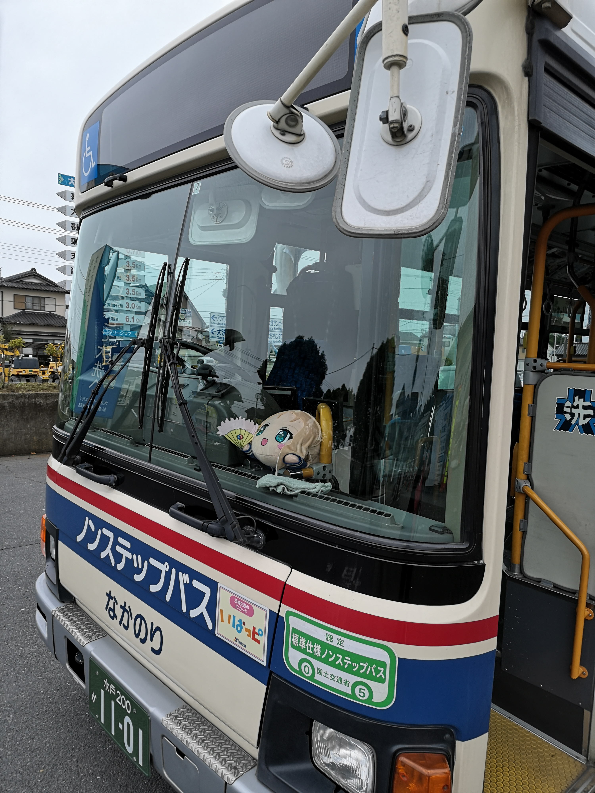

# 霓虹15日游游记 (九)

### 7月21日 东京—茨城县大洗町 2020.6.21

作为一个入坑比较晚的动漫宅，补番便成为了一项必修课。大部分的时候补番都会选择那些著名的高分番剧，比如《钢之炼金术师FA》、《进击的巨人》、《星际牛仔》，确实都是些经得起时间考验的作品；但有时候也会去选择一些风评似乎不错的冷门番，也时常能有意外的惊喜。而2018年最大的收获，就是这部《少女与战车》，一部讲述少女们为了拯救即将被废弃的学校而打炮（迫真）的故事。虽然我不是军事宅，不借助弹幕和字幕也没法第一时间理解番里玩的各种历史梗，但偏偏这样一部作品就是能让我看得很开心。果然什么事情只要是美少女去做就会变得很有趣呢！比如美少女打麻将，开战车，美少女开飞机，美少女开战舰什么的（这几部我还都看过，u1s1都还不错）。少战里主角团所在的学院名为大洗女子学院，而其命名来源就是我今天的目的地：茨城县大洗町。尽管少战的世界观里学校都变成了一艘艘学院舰，但大洗主场的取景，大洗的习俗文化都取材于现实生活中的大洗町，而这部尽管在国内不温不火、在霓虹大受欢迎的番剧几乎可以说是“拯救”了这座小小的城市，让大洗一跃成为顶级圣地巡礼目的地，这样的地方我怎能不向往呢？在查阅了攻略以及各种路线之后，我最终定下了从茨城机场返回上海的行程，而大洗町便顺理成章地成为了我此行最后的目的地。 

从东京前往大洗町要首先前往茨城县的首府——水户，再由水户转乘鹿岛临海铁道大洗鹿岛线，而从我所在的浅草出发，则要先乘坐银座线前往上野，再在上野换乘前往水户的JR电车。因为昨日回到酒店的时间较晚，加上收拾行李又花了些时间，我并没有早起，因此还是略显匆忙。到达上野站时，手机上的乘换案内显示最近的一班JR已经要开车了，而下一班还需要等待不少时间，我只得匆匆忙忙地刷卡进站，随后也顾不上前往位置较后的自由席，随意进入了一节车厢——这里我其实慌得不行，不仅是因为车要开了，还因为来不及确认，害怕上错了车，不过幸好并没有发生这样最坏的情况。

我前脚刚踏进列车，车门后脚便关闭，列车也随之启动。虽然眼前的指定席车厢并没有坐满，我自觉还是不应该坐在这里，只得略微尴尬地穿越车厢，然而这列指定席车厢之后的两节车厢还是指定席，又穿过一节车厢后我感觉更尴尬了，犹豫要不要继续前进，然后突然发现车厢间的连接带还坐着一个小伙——坐在他的箱子上。看样子他也是赶着上车没找到地方坐，便随意地坐在了这里。正好我想确认一下自己有没有上错车，便开口向他询问。意外的是小哥的英文相当不错——当然是以霓虹人的标准，因此与之交流还挺顺利，同时令人欣慰的是我并没有坐错车，到水户大概还需要40min。

另外一个让我担心的事情是，我因为着急是刷卡进来的，不知道这趟坐的新干线需不需要买票。正想着，检票员就进来了，我自然是略慌。不过经过和检票员略微交流之后，我似乎只需要用西瓜卡在他的pos机上刷一下就好了，不知道是补票还是只是认证了一下。

随着列车不断向水户前进，我与东京的距离也越来越远。不曾想竟然以这样站在车厢连接处这样戏剧的方式离开东京，真的是令人意外。

一路无言，和我坐在一起的小哥也在我之前一站下了车，而我也顺利地抵达了水户车站。尽管是茨城县首府，水户车站也并没有品川、上野那样的规模。略微研究了一下时刻表，我所要乘坐的大洗鹿岛线似乎还有一些时间才要发车。大洗鹿岛线和之前乘坐的近江铁道本线一样也是地方性质的小铁道，也需要买纸质票。不过多时，列车即将启动，令人激动的大洗之行终于要正式开始了。

大洗作为在霓虹也是顶级的圣地巡礼地，各种与少战相关的元素可以说是准备得相当丰富，就连这趟大洗鹿岛线也做了文章——一般人只能痛汽车，而这里痛了电车。但我的运气并不好（好像我在霓虹的运气一直不咋的2333），碰到了普通的电车。不过，普通的电车里也是能找到少战的元素的。

令人欣慰的是，在抵达大洗站的时候，我还是能够得以一睹痛电车的芳容的

一下车又看到了馍馍酱的提醒。

大洗车站还是远比丰乡町站“豪华”的——至少达到了一般小车站的水准。而随处可见的少战元素让着个普通的小站变得不普通。

车站检票口处显然是有少战周边店的，墙上整齐地排列着各个学校的战车服，真的好想要啊。。不过好贵。。而且穿出去也有些羞耻233

车站前的周边店我肯定是想一逛的，但现在最要紧的事情还是先抵达住地将行李放下。大洗作为一个小城并没有很多酒店，很难找到一家符合我要求的住处——豪华的酒店倒是有两家，都是位于大洗矶前神社前的海景酒店：大洗酒店和大洗海滨酒店，那个价格我自然是负担不起。我之前找到的攻略给出的规划是住在水户，早出晚归一是容易找到酒店，二是降低成本，不过我还是想住在大洗。经过了我的不懈努力，终于找到一家价位在400软妹币的Airbnb，还是别墅——尽管只有我一个人住。位置也是相当不错，从大洗车站前走到住处也就是15分钟的时间，而且房主还提供了自行车，而大洗的景点基本都能借助自行车抵达。因此我自然决定先前往住处安顿好，再借助自行车进行游览。

匆匆赶往住处的我并没有在途中过多的停留，但还是能不时见地见到少战相关的元素——展板，海报，痛车——这里我居然看到的是一辆痛自行车。同时路途上我也看到熟悉的711便利店，看来我的中饭晚饭至少有便利店保底了。

在来的路上我就已经和房主联系上了，而迎接我的是房主的父母——房主并不在，而房主的父母就住在隔壁。他们相当热情地欢迎了我——尽管用的是相当蹩脚的英文。打开门上的密码锁进入房间后，怎么说呢，不愧是别墅，尽管不是像K-ON里大小姐家那么大的房子，但空间还是很大，生活设施一应俱全。房内已经设置了两张床，而橱里就像哆啦A梦里那样还有两张床，加上沙发和折叠床，睡个5、6个人完全没有问题。果然我一个人住还是有些奢侈了233

放好了行李之后，我从房前停着的几辆单车里挑选了一辆——其实都不是特别好骑——重新返回了车站前。车站前的店铺自然是要一逛，而车站前本身也是必须要去的地点，原因自然是少战里出现了这里的景象。站前的三只海豚的金属雕塑似乎是大洗的地标，而大洗车站砖红色的外观也是相当有标志性。

车站前的小店尽管店面不大，但各种少战的周边一应俱全，还有各种不供出售的限定周边、声优签名等展出，可以说是少战爱好者的天堂了。

店铺里还有两张地图，指示了散落在大洗町内的战车和少战人物展板的位置。看来圣地巡礼的一大活动就是去拜访这些展板。

地图实在是有些大，用手机拍下来查看地图的话每次都需要放大，着实有些不太方便，因此我很想要一张纸质地图，既方便查看又可留作纪念。照看店铺的是一位慈祥的老爷爷，而他微笑着向我示意并没有这样的东西存在==不过作为代替，他递给我另外一样东西，也是一张挺大的彩纸。我接过一看，发现上面绘制着卡通版的地图，并对多个景点做了突出标注，而边上的附注告诉我，可以在其上标注的每个景点盖章，而那些景点大多也都在少战中出现过。看来着便是另一个玩法了。

我收下集印纸，谢过老爷爷，转过身来想在对面车站闸机旁的小卖部买点水或者干粮——时间已经接近下午一点，但匆匆赶路的我还没捞上吃饭。令我略微失望的是，小卖部没有什么适合填肚子的东西，基本只有糖果之类的零食，我只好随意拿一瓶饮料，不过这个时候我看到了更有意思的东西——少战的小周边，军神的亚力克立牌，而且是大洗鹿岛铁道限定。人呐，一旦碰到“限定”就很容一走不动路，何况是如此价格亲民的东西，怎能不出手呢？店主也是位慈祥的……老奶奶？好心的老奶奶给了我一个大号的塑料袋，用来装我手中的集印纸。

从Google Map上看，距离我最近的展板附近有一家711。我对旅行中的午餐一向是从简的态度，711正好免去了我在陌生的地方找饭店的麻烦，因此自然是决定在这里吃饭了。

接下来的一个钟头的时间里我便是在走街串巷寻找各种展板与少战元素的时间中度过，具体的过程暂且不表，就以图代替好啦( ఠoఠ )ﾉ

大洗街头巷尾的许多小店都隶属于大洗町工商会，而大洗町工商会正式少战企划的合作方，因此许多店铺都会以一个少战角色作为自己的看板娘，上面的铃木和春希美就是如此。

仅仅是在街头巷尾找看板还是有些单调，因此我也把集印的活动加入了行程，而我所前往的第一站便是大洗港附近的著名地标，高60米的展望台，大洗海洋塔。

在少战里，大洗海洋塔也屡屡出现——毕竟是地标性质的建筑。而现实这里似乎正在搞什么活动，像是集市摆了不少摊位，不过我到的时候都在收摊了，当然我也没打算买什么就是了。

海洋塔需要购票进入，而售票处前就放着这里的印章——没错，大洗海洋塔便是8处集印点之一。一楼的大厅是纪念品商店，除了小部分与少战有关的小商品（主要是明信片、挂件一类），更多的代表大洗特色的海洋生物玩具、土特产之类。我自然是没什么兴趣，径直走向通往展望台的电梯。

海洋塔的楼上共有两层，除了楼顶的展望台外，还有一家茶餐厅，而在街巷里顶着呼呼的海风弃骑了一个钟头单车的我自然不会放弃在这里休息一下的机会，便先来到了茶餐厅。令我惊喜的是，这家咖啡厅是少战主题，电梯门一打开便能看到蔷薇果在门口接客——显然蔷薇果便是这家店的看板娘了，刚好蔷薇果作为果茶的一种，更符合茶餐厅这样更为年轻化的氛围，大吉岭啥的太高雅了，我们这样的俗人高攀不起。

大概因为饭点已过，店里的人并不多。我挑了一个靠窗的位置坐下，从课桌的抽屉里掏出菜单——对，这里的单人桌居然用的是学校的课桌==。菜单也是在尽情地玩各种少战的梗，三种英式红茶自不用多说，而几款定食套餐则选择了煎鱼套餐（大洗的水产特色），pasta（呆梨），汉堡薯条（美帝），以及武部沙织的爱心咖喱233心疼纱织，恋爱达人这个梗居然在这里也有人玩。吃过了中饭的我没有胃口点定食套餐，也没有品茶的那份优雅，因而选择了看板娘指定的蔷薇果酱冰淇淋。

店铺的装潢也是尽显少战元素，迷彩的桌布，坦克状的牙签盒，人物看板，坦克模型，各类周边，还有粉丝画的各种少战人物画像，甚至还有四号的75mm炮从墙上伸出来。

不过最为有趣的还要数头顶上挂着的5张“特别住民票”，五个人自然是主角团一行，而每张地下还郑重其事地印上了“平成27年6月9日”的时间戳（应该是和2015年上映的少战剧场版有关）以及大洗町町长的印章。而我查了一下这个大洗町长小谷隆亮居然是真的大洗町一把手，不得不说霓虹人还是会玩。

从茶餐厅离开，我登上了位于楼顶的展望台。可惜了天公不作美，不然从高处俯瞰着小镇和港口应该还是挺漂亮的。

从海洋塔离开，我接着去寻找下一个印章的所在地：大洗まいわい市場，直译过来就是大洗市场。其位置就在大洗海洋塔附近，往和港口相反的方向。说是市场，其实是一个大型大洗土特产超市，里面的东西我自然是不感兴趣的，我的目的只有印章而已——话说这样是不是有点不太好。。。进来改了个章就跑路了。

下一个印章的所在地距离大洗市场很近的大洗奥特莱斯，应该也是大洗这座小城少有的大型商业中心了，是一座二层建筑，建成了带有热带风情的风格，中庭还栽了椰子树。

大概是因为工作日的下午，不少店铺都没有开门，不过我也没有逛商场的兴致，我想找的是这里的印章。不过在找印章的时候，我发现了一家有趣的店铺，一家大型少战周边店。我自然不会错过在这里一逛的机会，而且我也一直想在大洗这里买一件特别的纪念品。

店铺里除了售卖各种少战周边外，还有一个小小的少战展，包含各种名场景还原模型，以及CoCo咖喱店与少战联动的周边和展板的展出——对，这个CoCo咖喱就是我在秋叶原吃的大好评咖喱。

在挑选纪念品的时候我有些犹豫。说实话我一度很想买一件少战的衣服，但总觉得便宜的质地一般，还不如在淘宝上买，而质量不错的价格又有些太贵了。。犹豫之间，突然发现了一本笔记本似的东西，正面印着大洗的校徽，咦，这个好像不错，可以用它来集印章——除了集印纸上指定的8个景点外，很多店铺、景点乃至大洗车站也都有少战相关的印章，想到这儿，我便愉快地掏出了钱包。

然而买到手之后我有点傻眼了：这个东西不是像笔记本那样的开本，而是册页式的，里面都是空白页，纸质也比较像画纸。疑惑之中我发现了封面上的小字，原来这个东西叫做御朱印帐，是用给寺庙啊、神社啊之类的地方画御朱印用的，而御朱印类似于手绘的神签，起到祈福作用之余，也给游人留作纪念。这时我想起来，之前去过的很多寺庙神社都有御朱印所，因为都要收5、6百元的费用，我一直都没有收集过。。而我现在买到这一本，岂不是有点白买了的意味吗。。。不过转念一想，御朱印帐也算是霓虹特色纪念物了，其他地方肯定是见不着的，再加上大洗限定的加持，也是很有纪念价值的物品啦，不过用它来集印还是有些不太合适。。

奥莱在少战剧场版也有出镜，而且这里上还演了绝妙的好戏：知波单的霓虹豆战车仗着自己轻巧在楼上乱窜，还让电梯承受了生命中不能承受之重。而这一名场景的位置也是相当好找。

在一楼一个不显眼的地方，我总算是找到了奥莱这里的印章，盖上印章后，我突然意识到，因为是从中午开始游览，此时的时间已经逼近了下午4点，时候已经不早了。查到其中一个集印点，大洗信用组合今日不开门之后，我决定赶在4点半关门之前，赶到这下一个景点，大洗水族馆——虽然肯定是集不齐所有的印了，但能多盖一个是一个呀。

在前往水族馆的途中，我又找到了一个名场景：两度因为战车道被毁的肴屋本店旅馆。以后要是有机会住这儿就好了。

从大洗港口附近前往大洗水族馆的路并不算近，骑车也要个20min，加上我的车况实在是不佳，而道路高高低低蜿蜒曲折，骑起来着实有些费劲。不过随着一道长长的下坡，在道路尽头的鸟居之后，就能看到大海了，而大洗水族馆就在这条滨海公路的尽头。

大洗水族馆前有很大的公交站台，也有众多停车位，不过因为到了闭馆时分，水族馆门前空空荡荡，自行车位的车也很少。站台旁边的保安大叔看到我肯定有些讶异，怎么快闭馆了还有人风尘仆仆地过来？殊不知我就是过来盖个章的。

从正门进去便能看到水族馆的纪念品商店——看来世界各地的这种景点都这样，纪念品商店都会设在出口处骗一波钱==——而水族馆的章就在商店入口的一侧。盖好了印章，我在这里的使命也就差不多结束了。原本想在这里的海景饭点吃点东西，但这里并没有我想吃的东西——来了大洗总得尝尝海鲜吧？咋能在这里吃快餐呢？在这儿稍作片刻，吹吹海风，我便起身离开赶往下一个目的地了。

大洗水族馆在少战里也有出现，军神因为被知波单突击战术怒坑，只得转进进城巷战，沿着海岸一路撤退，最后在水族馆前被大吉岭伏击。

沿着来时的滨海公路一路往反方向走，便能到达我的下一个目的地，也是大洗最为著名的景点——大洗矶前神社了。

大洗矶前神社以岩上鸟居的日出而闻名。神社正对着东面的海岸，而其最外面的石制鸟居建立在伸入大海的岩滩之上。日出之时，鲜红的太阳照耀着鸟居，而身边就是太平洋的惊涛骇浪，想必是极为壮观的景象——可惜我此行应该是没有机会得见了，连日的阴雨没有影响前日的烟花大会已经是奇迹了，想要再求得一日晴天来看海边日出，着实有点贪得无厌了。

矶前神社建立在沿海公路一侧的山坡上，与其他神社朱红的鸟居不同，矶前神社的鸟居是纯白的，在这样一个阴雨的天气里有增添了一分肃穆。穿过鸟居，登上长长的台阶，出现在我面前的是神社朴素的山门。不得不说，少战里军神和喀秋莎开战车在这里下台阶的设计很有趣，但实际实施起来实在是有些困难，台阶中间的扶手阻碍就是最大的阻碍，同时我也没看到有其他路线可以直接开战车过来啊。。。嘛，不是有句话说，在虚拟世界中寻找真实感的人脑子有问题。什么，说的是我？那没事了。

时间已经来到了傍晚的5点，神社内几乎见不到游人，连神社的工作人员似乎也开始逐渐下班了，唯有一侧的御朱印所还亮着灯，这让我忽然想起我那本空白的大洗特供御朱印帐——虽然是最后的神社了，但也是特别的体验不是吗？想到这里，我径直走向御朱印所，支付了500的费用，把我的御朱印帐递给了画御朱印的师傅。

画完了御朱印，在神社的主殿进行了参拜之后（这里我就许愿能顺利回国吧），我回头寻找神社的巡礼印章。印章被摆放在神社内靠近山门的一侧，但大概是风吹的原因，印泥有些干掉了，实在是难印，导致我的这个章盖的不是太好。。放印章的桌子旁边还有抽签的机器，不过这里我就没有再去抽签了，我命由我不由天！（其实还是很在乎抽签的结果的。。）

从神社出来一路往下，就能看到一处缺口可以下到海边，而那里就是著名的岩上鸟居了。因为阴雨天临近傍晚的关系，灰色的石制鸟居立在黑黢黢的岩石之上，海风呼啸间海浪拍打在岩石上激起白色的水沫，明明是夏天，却让我想起了“秋风萧瑟，洪波涌起”的诗句。

尽管是这样的天气，海滩边却还能看到数位游人带着长枪短炮三脚架在这里摄影，岩上鸟居的魅力可见一斑。我也有模有样地掏出了我的微单，然而就算是打成了自动挡，在这样的天气下拍出来的总感觉不是滋味。还是技术不到家啊。。

岩上鸟居附近就能看到大洗的两家五星酒店：大洗酒店和大洗海滨酒店。在少战剧场版里，这里的海滩便是“可靠的同志”登场拆房子的地方，而拆掉的房子便是这两座“可怜”的酒店——讲真能上镜肯定是大赚的，做了一波宣传，还能靠圣地巡礼带动营业额，不过这里住一个晚上要1500+软妹币，实在是有些负担不起。。。

在海滩上我很想用手里的小卡片拍一张巡礼照，不过海滩上的风实在是太大了。。手里的小卡片被吹得根本摆不平，只得作罢。

在沙滩上拍完照片，沿着下图的那个坡（对真的有这个坡）就可以上到大洗酒店的后门处了。后门处是游泳池，不过这样阴雨且有点冷的天并没有人游泳，也没有人看管，我便径直绕过泳池走进了酒店，一个是这里也是一个集印点，一个是我想抄近路返回矶前神社前，去拿我的自行车。

穿过大堂后就可以看到大洗酒店楼下的纪念品商店了，而这里的看板娘是冷泉麻子，因此在印台周围摆满了麻子的周边。

盖好了印章之后，我想这既然大洗酒店有看板，那大洗海滨酒店肯定也有，便走进了隔壁的大洗海滨酒店。果不其然，大洗海滨酒店的看板娘便是少战的第一主角，军神西住美惠。

离开大洗海滨酒店，时间也接近了晚上6点，而这也将是我在霓虹的最后一顿晚餐了。我自然是想尝试一点不一样的东西。而在Google地图上搜索了一下，发现我的身边就有这么一家店。

“小军神”泽梓做看板娘的店是一家日式定食店，而我之所以来这里是冲着这里可以吃大洗的名物——鮟鱇鱼刺身的。尽管价格要快2000日元，作为最后一餐，这个钱我还是有必要花的。

配餐是典型的日式定食，主菜的刺身，配菜的小食、蔬菜与味增汤。说实话尽管这是我在霓虹吃的比较好的一餐，但刺身我实在不是太喜欢。相比刺身，作为小食的腌鱼块更和我的胃口一点2333

“酒”足饭饱之后，便是我返程之时。这时候开始有一点点飘雨了，而我突然意识到我的雨伞不见了，思前想后想起来我在去大洗市场盖章的时候把伞插在了门前的伞架上。以我对霓虹人民的认知，这种没人认领的伞应该是不会游人顺手牵羊的——况且这一天都没下雨，多带一把两折伞实在是有点累赘，但我因为是旅行不得不备一把。到了这个点再骑车回去找伞显然是有些过于麻烦了，因此我放弃了这个打算，还好雨也只是蒙蒙细雨，飘了一会儿就不飘了。

再返程的路上，我继续再沿途寻找可能出现的看板与名场景，顺便也去了一下没能去成的茨城信用组合。

终于，穿过了街巷的我回到了入住的民宿，结束了大洗一日的行程。不得不说大洗这样宁静而又充满了动漫元素的小城真的是像我这样的阿宅最好的旅行地，可惜时间还是太过短暂，因为要就着之前的烟花大会和之后回国的入职体检的原因，我实在是难以延长留在大洗的时间，而着也是我此行最大的遗憾。

回到民宿，用回来路上在便利店买的鸡肉串、薯饼和蔬菜汁做了夜宵，好好泡了一个热水澡休息了一番之后，我便开始收拾行李为明天的返程做准备了。把不必要的东西从背包里腾出来好把手办放进去，把买到的本子在箱子里好好藏好，把巡礼的集印纸、各个景点的门票、神签等整平、收好，把买到的纪念品用衣服包裹好防止托运时候损坏，以及最最重要的，把照片整理好、相机收好。所有的这些都是我在霓虹一行的见证，都是我的宝物，需要好好珍惜，供给未来的自己好好回忆。

### 7月22日 茨城县大洗町— 2020.7.13

凌晨4点的时候我被闹钟从睡梦中叫醒。顶着惺忪的睡眼，我慢慢挪到窗边拉开窗帘——对，我还是对晴天保有一点点幻想，然后看到了阴云密布的苍白的天空，然后我果断回去睡觉了。

等我再次被闹钟唤醒的时候，时间已经来到了早上七点。之所以还是起那么早，是因为今天我要赶早上7点50的大洗鹿岛线前往水户，在乘坐8点半发车的机场大巴前往茨城机场。临走之时我自然也是拍摄了民宿的内景作为纪念，尤其是浴缸——回了国之后估计相当长的一段时间里都没机会泡澡了。

出门的时候正好碰见房东的父母也早起出门，他们惊讶于我一早就要离开，我和他们解释了原因，和他们挥手告别。而这一别不仅仅告别了房东的父母，告别了大洗，也告别了霓虹，不知日后能否还有机会再见呢？

在路边的便利店买了简单的早饭，以及最后的MAX咖啡，我匆匆赶往大洗车站。清早的大洗鹿岛线乘客很多，有身着制服的学生，也有西装革履的上班族。毕竟水户是茨城的首府，而乘坐大洗鹿岛线去水户只要半个钟头，因此还是有不少人选择在这里生活。

因为电车稍稍晚了几分钟，再加上找出站口耽误了些许时间，从水户站出来已经是8点15，而下一班机场大巴将在8点23分发车，我顿时心中有些慌乱，一路小跑赶往乘车点。而机场大巴的乘车点在出了车站后还要在天桥上绕一大圈绕到天桥下面，我在天桥上找下去的路有花了不少时间，还好最后踩着点将将赶上。

大巴穿过水户市上了高速，之后很长一段时间都在一片碧绿的田野和山林间奔驰。大约一个小时之后，终于抵达了我霓虹之行的终点：茨城机场。选择从茨城回国其实也是我在做攻略找机票时的意外收获，茨城机场和春秋航空合作，每天就这一班往返于茨城和上海的航班，但因为茨城距离东京都还是有些距离，并没有多少人知道或者选择这条航线。但对于前往大洗旅游的我来说，这趟行程是最合适不过了。

茨城机场尽管也是国际机场，它的航站楼着实小的可怜，可以说是“一眼能望到底”，估计都没有稍大一点的火车站大。但小小的机场免税店出售的商品种类居然还不少，除了大家耳熟能详的各类巧克力、甜点，竟然还有电子产品柜台，而且还卖switch，着实把我有些惊到了。距离检票过安检还有些时候，我便在机场各处转转，二层靠近跑道的一侧还有一个露台供大家放风，而外面停着的飞机的舷梯居然也痛了少战主角团的形象。。看来少战的影响在霓虹真的还是挺大的，不愧是拯救了一座城市的动漫。

从露台回来，我突然想起来11点多出了关怕不是没有东西吃了，赶紧在机场里觅食。机场里提供的餐饮种类还挺多，而我则毫不犹豫地选择了拉面——这可是在霓虹最后的拉面了，也是我吃了这么多次拉面第一次吃酱油拉面，之前吃的都是豚骨。虽然是机场里的拉面，味道也还可以。

解决了“早中饭”，在免税店最后又买了几盒白色恋人和明治的巧克力作为带给亲友的礼物，安检的时刻到来了。为了应对春秋航空相当严格的行李要求，我做足了准备，在出发之前把包和箱子的重量都称了又称，因此安检过的还是相当顺利。在小小的候机厅中又等候了一个钟头，终于到了最后的登机时刻，而在这一刻心中所积攒的不舍、伤心、即将回家带来的几分喜悦、将要结束这样一趟童话般的旅程回归现实的无奈，种种心情涌上心头，百感交集。再见了霓虹，谢谢你在这过去的15天里给我留下了无数美好的回忆，有朝一日我一定会再来的，重游故地之余，也要弥补这次旅程中的几分遗憾。

飞机起飞之前还有一个小插曲，民航客机的跑道边还有一条跑道，而伴随着引擎的轰鸣，一架体积不大的飞机从我们身边一掠而过，依稀可以看到它尾部喷射的蓝色火焰——居然是一架战斗机！听旁边的人说，茨城机场时军民两用的，而刚刚起飞的便是霓虹自卫队的F-4战斗机。没想到临别之际还能有这等神奇的遭遇。

春秋航班上令人恶心的推销购物就不再细说了，最后剩下让我无比担心的只剩过海关——我买的这些出版物能够顺利过关吗？答案是可以。就我这趟航班来看，似乎被要求开箱的只有过于大件的行李，以及带着大量商品、明显就是做代购的人，我这箱子里十几本册子过安检的时候，安检员似乎都没有留意，就直接让我通过了，而我悬着的一颗心也终于落了地。从传送带上拎起我的箱子和背包，整理了一下自己的行李以及仪容，转头看了一眼背后的海关。旅行的日子再美好，也终究只是一段插曲，兜兜转转，终归还是要回归到平淡无奇的日常中去。突然想起动漫《日常》中的名台词：我们每天度过的日常生活，其实也许是连续发生的奇迹。而我未来将要面对的日常里，会有奇迹出现吗？海关处汹涌的人流容不得我多想，我只得背上包，拖起箱子，回过身来融入到人流中去。

​																												2020年7月14日凌晨0时31分

### 后记

从开始动心思写这篇游记到最终完成，已经跨越了快一整年的时光。我原本想在7月8日，也就是去年我出发前往日本的那一天之前写完，但是出于自身的懒惰，以及资料整理的时间超出了意料，最终没能够赶上。不过相比于以往我的各种半途而废来说，最终能够完成，也已经是有了长足的进步了。因此还是要给自己点一个赞，尽管超时了太久太久，当初立下的flag最终还是得以回收，着实可喜可贺。

翻回去看看自己写下的内容，不愧对当初自己的设想——“流水账”三个字就足够概括一切了，文笔也是差的不行，语文功底都还给了小学初中高中的各位体育老师，希望他们在收到我这份退货的时候，不要惊讶，哈哈。

从开始写这篇游记到完成了的今日，这其中无论是我自己还是这个世界都发生了天翻地覆的变化。我从菊花辞职，拼了一枪，终于跳槽来到了苏州巨硬，算下来也有2个半月的时间了，这期间还是承受了不少辛苦与压力，不过能有这么一个超出我意料的结局，还是令人欣慰的。而自春节以来的新冠疫情，更是带来了无数意料之外的事情。就连现在，窗外连绵不绝雨水，也是十几年一遇。2020年终将是令我终生难忘的一年。

今天下午的组内会议上，今年下半年的工作安排终于出炉，我也因此可以到，预见到在未来的一段时间里我必须要脱离终日摸鱼的生活，投入更多的精力到工作中去，在这个时间点上我最终得以完成这篇游记，总感觉也有些奇妙的意义。我一向是一个喜欢回忆、喜欢沉浸在过去的情绪中的人，喜爱的动漫会不时翻出来重看，旧时的照片会时不时拿出来回味。我不知道这是好还是坏，但在这个节骨眼上，我有必要与过去一段时间的情绪做一个告别，收拾心情投入到眼前的工作和生活中去。毕竟人还是要活在当下啊。不过有朝一日，当我清闲下来，需要去回忆过去的种种的时候，希望当我拿出这篇文章的时候不要羞愧于自己当年的一时兴起，而是能够回味起游玩时候的种种细节，以及当时敲下键盘写下这些文字时的心情。

​																											2020年7月14晚23时25分于苏州

