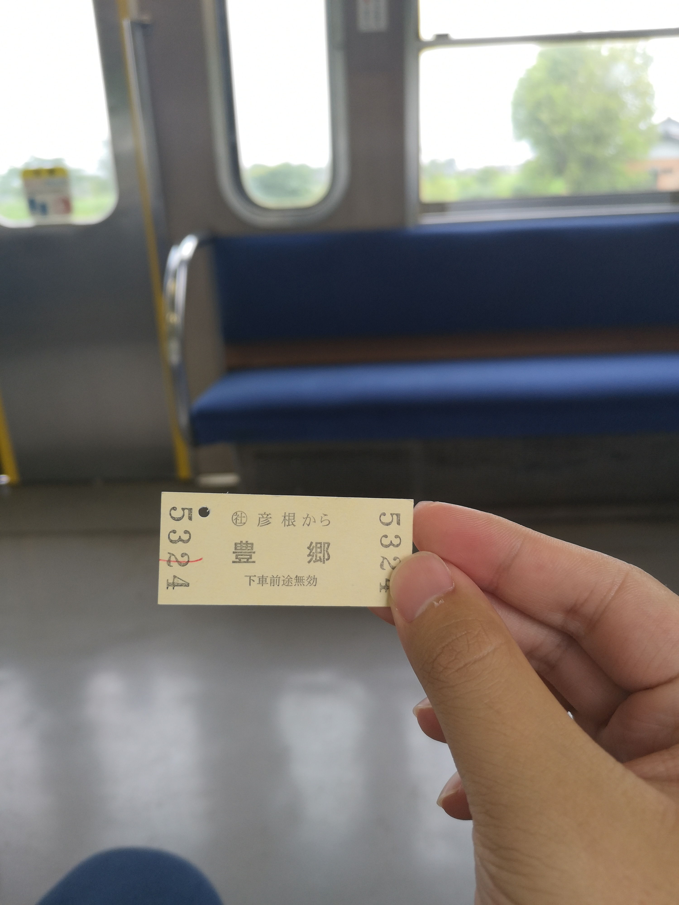
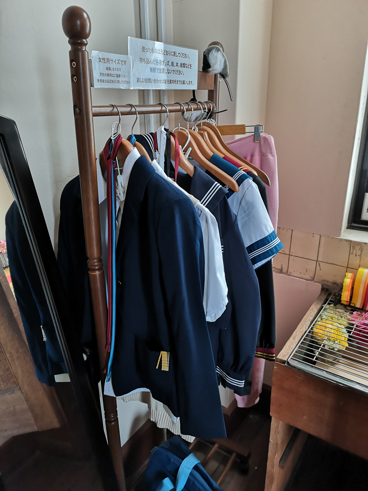
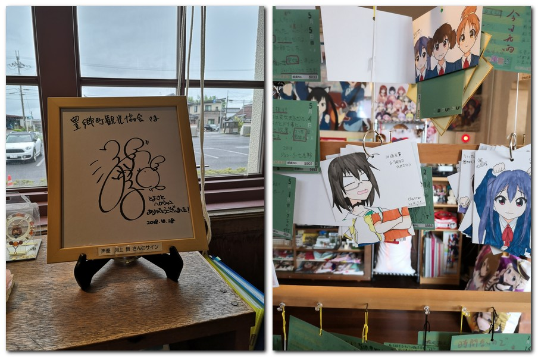
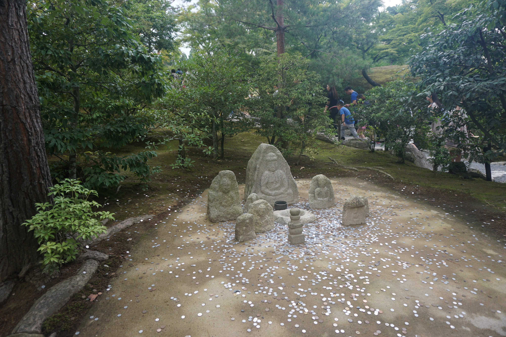
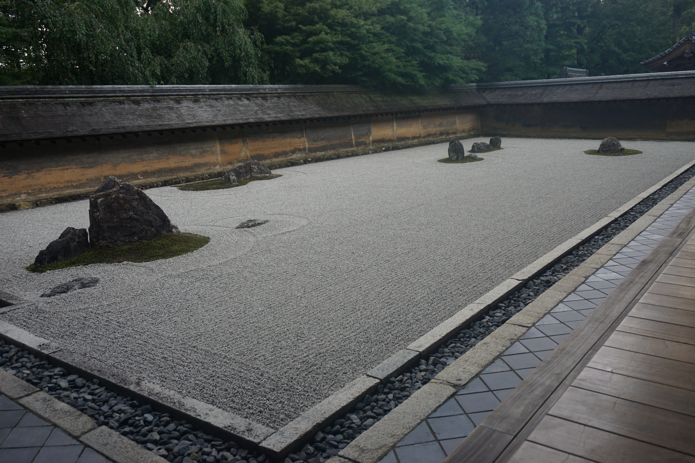

# 霓虹15日游游记 (二)

### 7月11日 大阪—京都—滋贺县丰乡町 2019.8.13

因为我对大阪的主要景点并不太感冒，所以我对大阪也没有太多的留恋。当然在这之后我读了一篇关于关西尤其是大阪人的各种段子的文章，现在觉得如果能在大阪住一住和大阪人打打交道应该还挺有意思的，也可以去逛逛日本桥。而这趟旅程中唯一让我有些不舍的就是我住的这个酒店了。除了被子稍微有点闷以外，其他所有的都很好，价格也不贵，尤其是有个坐式浴缸，让我感觉很新鲜而又很好用——我从来不知道这么小的卫生间还能设计放一个浴缸在里面，而泡澡这件事在这两天帮我缓解了诸多疲劳。而我的下一站——京都，由于考虑地点和性价比，我要入住的是一个迷你酒店，虽然是单人间，但既然有”迷你“二字，那和冰箱独卫开水瓶自然是无缘了，而在京都一住就是四天。因此早上我打好行李离开酒店的时候，还真有点依依不舍。

然而紧密的行程让我没有过多留恋的时间，我压缩了在大阪的行程，并且把奈良的行程压缩到了半天，而目的就在于能在京都多玩一天。不过由于昨天实在是很累，还是难得地稍微多睡了一会儿，也是为了避开早高峰省的我提着大箱子麻烦别人，我九点多才从宾馆出发前往京都。

从大阪到京都先坐千日前线到达日本桥，再转堺筋线-阪急千里线（这里阪急千里线是堺筋线的延长线，坐的是同一辆车）到淡路，转阪急京都线即可到达京都河源町。听起来好像很复杂，但因为这几趟车转车走的很少，总时间也就一个小时多一点，所以路途十分顺利。唯一出的一点差错是从地铁站出来的时候走错了口多绕了不少路，我还奇怪地图上说的口和出来的地方怎么不一样呢，结果发现地图上说的口好像因为施工被围挡了，我走的是它旁边另外一个口。。。

上午十点半左右，我便到达了在京都的酒店。由于霓虹的规定是上午11点退房，下午16点check-in，所以我还不能入住，不过酒店提供了寄存行李的地方，我依稀记得好像是可以付150块，用一个像自行车电缆锁一样的锁把箱子拴住，付钱则可以刷西瓜卡或者iccoa卡——这里就体现出了公交卡的优势，霓虹很多像这种小的自助付费点甚至是一些自动售货机都可以刷公交卡，所以尽管没有折扣，我还是觉得去霓虹玩买一张公交卡是挺有用的，工本费也不贵。

这里稍微说一下我住的酒店的地点。我住的四条乌丸地区应该也算是京都的中心区域，所以交通还是相当的便利的，几步路就是公交，5分钟就是地铁站，著名的锦市场就在隔壁的巷子，门前巷子出去的大路是一条商业街（8/27语：现在查到好像叫四条通大街），两边的人行道都有遮雨棚，往东走一站公交的路就能到河源町和祇园，购物和吃饭都很方便，又靠近景区，因此白天人人流量很大，霓虹人和各国旅客都很多。而我住的宾馆还算便宜，也很干净，除了因为是pocket hotel没有独卫，只要你能接受我还是挺推荐的。

存好了包，我从边上的架子上拿了份京都导览图，坐在酒店大堂稍微研究了一下，确认了我后续在京都市内的行程都可以使用公交一日券。我稍微查了查天气，蒙蒙细雨，不过下午应该会停，我又因为前几天积累的劳累，今天不想玩太多的比方，便决定把相对轻松的行程安排在了今天——滋贺县丰乡町。

百分之99的人来霓虹旅游应该都没有听说过丰乡町，更别说去了。丰乡町是距离京都市大约两个小时电车车程的一个的乡下小镇，并不近，周围并没有什么名胜古迹，也没有什么自然风光，距离滋贺县著名的旅游城市彦根市也有一定的距离。那为什么我要去呢？当然是因为这里有号称“强国源泉”的动漫K-ON里学校的原型、现在也是著名的巡礼圣地——丰乡町小学旧校舍。

滋贺县丰乡町是我在出发前几周临时起意想去的地点，而让我想去的原因自然是这一部轻音少女了。轻音少女是一部讲述了五个女高中生组成轻音社，为了表（he）演（cha）每天在音乐室里练（he）习（cha）的日常故事。作为萌系少女漫的天花板级别的动漫，轻音自然是名声在外，而我刚好就是6月中旬起意补了这部番，一共两部+剧场版，走之前剧场版还没看完，但不得不说真的很好看，制作精良，尽管音乐大多充满了少女的粉红色（主要是因为写词的式mio2233），但都很好听，而原作仅仅是一部四格漫画，这里不得不佩服三位主创山田尚子、吉田玲子和崛口悠纪子（女性视角来做少女动画真的有这么神奇的吗？）。这里安利一下anitamashii的视频https://www.bilibili.com/video/av51762493/。就像视频里说的那样，虽然是平淡的日常，但轻音营造出的沉浸感，让人感觉少女们真的就像在身边生活那样，活灵活现，而观（meng）众（nan）们则注视着她们的成长，和她们一同欢笑一同落泪。那么，对于一个猛男，现在有一个可以去丰乡町朝圣的机会放在他的面前，他是去还是不去呢？答案不言而喻。

然而走之前还是有一件事不得不做的，那就是吃饭。前面我也说过，我走之前只是大致了解了一下有哪些比较便宜的东西可以吃，但并没有想过每天具体要吃啥，所以吃饭这个问题每天还是要小小地头疼以下的。不过因为地段好嘛，稍微搜了一下就决定去尝一尝霓虹的“国民级”美食——牛肉盖饭了。Sukiya的中文名字是食其家，我在回国之后点外卖的时候才发现，这个牌子国内也有，而我在去年暑假回国的时候也吃过一次，不过我在霓虹的时候并不清楚。在霓虹，Sukiya的名气应该不比我们相对比较熟悉的松屋和吉野家差，而且它的店面貌似更多，分布也很广，好像价位也要稍微便宜一点。而牛肉盖饭就不用我多说了吧，好吃，便宜，分量足，在尝过一次甜头之后，我真的是一旦想不到吃啥就去点大碗牛肉盖饭233。这一回我还试了一下霓虹传统的生鸡蛋拌饭，味道还不错，不过感觉没那么好吃，而且还会加一点钱，不如省下来多加点牛肉，所以后面就没再吃了。

吃饱喝足之后，我便启程前往丰乡町了。从京都去丰乡町，要先坐乌丸线坐到京都站，转JR东海道、山阳本线到彦根站，再转近江铁道本线。前面两趟车都很正常，一趟是普通电车，一趟是类似于新干线的JR铁路，而这近江铁道本线，虽然名字听起来挺帅，还叫什么本线，其实就是一趟琵琶湖沿线的乡间小火车，没有现代化的闸机，电车也只有两节，因此丰乡町的“村”可想而知。电车很小，一眼就能望到头，从彦根站出发只能买纸质票，而从中间的小站上车，甚至都没处买票——至于怎么操作的，我们后面再说。伴着蒙蒙细雨，小火车在田野间细细的铁道上缓缓地上下颠簸，时不时经过的民居，要么是矮矮的小独栋房屋，要么是传统造型的日式民宿，然而几乎看不到人影，车上的人也很少，仿佛一个小小的检票口，就把城镇的喧嚣和向下的宁静隔离开来，这种感觉还是挺奇妙的。

丰乡站的站台非常小，一侧还有正经的站台，而另一侧只有一个供躲雨的小棚子。车站的附近市丰乡町医院，而过了医院就能看到一片一片的稻田——丰乡町就是个出门就能看到农田的田园小镇。不得不说轻音里面主角住的地方怎么看都是个大点的城市。。。丰乡町除了学校以外哪里都不太像。。。不过站牌上的近江铁道看板娘还挺可爱的。

从车站出来就能看到梓喵的谜之(?)路牌，左手边则是一家小小的面包店，里面还有紬的谜之路牌，我回来的时候因为进去拍照+问买票的事情有点不太好意思，还买了一小袋巧克力，到我写这篇文章的时候，家里还剩下了几颗，味道嘛。。一般般。

从车站走到学校大概也就不到十分钟的步行路程，不过由于一直下着雨，而且在我下车以后于还渐渐变大了。。所以我走的比较慢。一路上还能看到mio的路牌、此方(嗯？)的路牌和初音的路牌。我看网上人还找到了唯和律队的路牌，不过我貌似没有找到。一路上有些展览窗里还能看到有些年代的轻音的海报，稍微看了下内容，有关于剧场版上映，有为角色庆生，也有各种纪念活动的海报。

从mio的路牌处右转，沿着这条路走一长段，然后在一处幼儿园处左转，再转过幼儿园，过一个十字路口，就能看到右手边的景象开阔了起来，而那一片开阔的地就是丰乡町小学旧校舍前的花园了。作为旧校舍，这里现在自然已经不作为小学校园使用，其中的一部分变成了丰乡町市民图书馆，校舍里建了丰乡町小学校的校史馆，一部分的教室貌似作为了儿童托育所还是搞幼儿教育的地方。丰乡町本身就是个人烟稀少的小镇，而校舍里人就更少了。我在校门口探头探脑了一会儿，貌似没有人管，便小心翼翼地走了进去。走到教师楼门口，稍微有点犹豫，不知道就直接这样进去好不好。在我犹豫的时候，从里面走出来一个老爷爷。虽然我觉得老人家会英语的可能性不大，但出于礼貌我还是先开口“斯密马赛，English ok？“在得到意料之中的否定回答之后，我只好掏出翻译老师，问了一下是不是可以进去参观。老人家应该是见过不少来参观的游客，看了翻译老师之后就笑了，摆了一个”请“的手势，说了一串大概是”当然可以，请进“之类的话，还嘱咐我进校舍要记得换室内鞋，然后便转身离开了。

教学楼区一共三层，下面的两层主要是教室，而顶层则是会议室的地方，而那里就是音乐教室的原型。一楼里建着校史馆，我进去稍微逛了一下，有旧时校院的模型，过去教职员工和学生的照片，一些历史遗物之类的东西。而对校史的介绍只有霓虹语，我自然是看不懂，因此稍微转了一下就离开了。教学楼的走廊、楼梯与轻音里的样子几乎一模一样，尤其是楼梯扶手上的兔子、乌龟的雕塑，还原度相当的高。在我来的路上也看到了乌龟和兔子的石雕，貌似乌龟和兔子有关的故事在丰乡这里有些渊源？还是很有名气？难道是龟兔赛跑的故事吗？(这应该是也我唯一知道的乌龟和兔子的故事。。。)

三楼的会议室就是传说中的轻音部活动室了。和动漫里比起来，这个教室显得更加空旷了一点。从比例上来说，动漫里的活动室确实较显示瘦了个身，不过更重要的原因自然是这里没有那五个少女。

作为圣地，活动室里的布置还是相当用心的，除了没有养小猪的水箱和那个放高级茶具的橱柜外，其他的布置都挺还原，而且还有各种槽点。一边的桌子上还有一本留言本，我稍微翻阅了一下，应该每年都会有换新，想想轻音已经十周年了，这里究竟留下了多少朝圣粉丝们的记忆呢？

房间里还有另外一道门，进去以后是一个小房间，里面放着貌似可以提供给朝圣粉丝cosplay玩的衣服，以及放茶具的柜子（放在这里了吗？）。穿过小房间则是一个带舞台的教室，应该就是mio开粉丝会用的教室。

三楼可以通道外面的露台，那里应该就是轻音部拍宣传视频的露台。露台上还有一个有历史的风见鸡，不过因为外面在下雨，加上门是关着的，我也没想出去，也就没有去确认是否能出去。

从教学楼出来，雨已经很小快要停了。教学楼的左手边好像联通着新校舍，边上还有丰乡町图书馆，和纪念品店、咖啡厅所在的小楼。图书馆我看了下不能拍照，也好像没什么值得去看的，就没有进去。咖啡厅貌似没有营业，不过纪念品店开着。纪念品店里除了丰乡町的一些特产之外，有不少标着丰乡町小学旧校舍限定的轻音周边，这一点比风见鸡馆可是不知道高到哪里去了，excited！我作为一个轻音粉，自然是要为信仰充值一波啦。

纪念品店所在的楼还挺宽敞的，中庭放着不少桌子，应该是提供给咖啡厅的。而纪念品店的正对面，展览着无数轻音相关的周边和粉丝留下的留言牌子、手绘。轻音在商业上取得了巨大的成功，据说出过数千种周边产品，而这个展览区里，陈列的貌似是粉丝捐赠、收集来的各种周边，手办、挂画、立牌、海报、挂件、同款乐器、漫画

。。。应有尽有，在大概小半个教室的区域里，放了满满的两层楼！（这里有一个小二层，二楼也就是和楼下这个区域差不多大）简直就是死宅的梦想啊！不过貌似应该都是只用作展览不出售的，不过我也买不起就是了www这里我就不放全部的照片了，太多了。。稍微放几张照片来感受一下这份厨力。

教学楼右侧是学校礼堂，这里也是放学后Tea Time校园祭表演的地方，还原度也不错，不过比例也稍微有点问题233

最后，教学楼楼下右手就是传说中的”男主“的雕塑。

最后，给一个教学楼的还原照片，还原度很高，除了那两颗棕榈树有点出戏233

到这里，丰乡町小学旧校舍的朝圣之旅就结束了。我不知道我是否看到了所有的细节，因为网上也找不到相关的攻略，不过对于我来说，这两三个小时的游览真的很充实很有趣，不由得感叹一下霓虹人对于圣地巡礼地的建设还真的很用心，仿佛真的让那些动画里的人事物在现实中活了过来，充满了打破次元壁的感觉。

回车站的路上我想放着紬的路牌的面包店里拍个照，不过觉得光拍照不买东西不太好意思，就进去买了包巧克力，顺便问了下店主是否可以拍照，店主是一位上了点年纪的阿姨，阿姨愉快地同意了。到现在我写这篇文章的时候巧克力还没吃完2333味道嘛，其实也不咋地，就是很普通的牛奶巧克力。不过这家店里还是有亮点的，有各种海报，还有mio声优搞笑艺人日笠阳子的签名。

正当我准备买回程的车票返回宾馆，结束愉快的一天的时候，我突然发现，这个小小的车站里，既没有闸机，也没有售票机，也没有人工售票窗口，更没有工作人员。我傻了，那我该怎么坐车回去？怎么买票？我犹豫了一下没有进去，想找人问问车站这里暂时也没人，只好又回到了面包店去问店主。面包店店主阿姨自然也是English not Ok，而翻译老师这时候也貌似不太靠谱。店主先是让我看了下店里的近江铁道每日车次的牌子，我用翻译老师查了一下，木有发现需要的信息，又问了一下，也听不太懂阿姨说了啥，只好换了种方法，问了问能回答yes和no的问题，问她是不是直接在这里坐车，是不是不用买票直接上，是不是上车后再买票，得到了貌似肯定的回答后，我战战兢兢地走上了站台。这时，站台上多了一位稍微年轻一点的阿姨，正坐在那里玩手机。因为只有一个长椅，我在她一旁坐了一会儿，想了想，还是掏出了翻译老师向她询问了一下买票的问题。一开始翻译老师又表现不佳，难以沟通，对方也掏出手机，想试试能不能也找到翻译老师来把她说的翻译成中文，然而她努力了一会儿，貌似最终以失败告终。。正当我们两个都有点尴尬，露出尴尬而又不失礼貌的微笑的时候，车来了。我赶紧问她，是不是就直接上车，她好像突然明白了，转头用半英语半日语的话问我，你要去哪？我说，彦根，她果断说，跟着我上车！我便稀里糊涂地跟着她上了电车。

上了电车后，她挥挥手让我跟着她，走到了一个车门边。车门旁有一个可以出票的地方，她按了个按钮，伸手取了张票递给我，跟我手舞足蹈地解释了一番。说实话我不太能听的懂，不过看了拿到的票，我大概明白了：在像丰乡这样的站貌似是不售票的，在上车的时候可以去一张票来证明你从哪站上车，而在终点彦根下车的时候就可以凭这个票来付钱。原来如此！不过我还是不太明白，这个机制，是只有丰乡站这样子吗？如果中途还有站是这样，那我岂不是可以在这两个车站间白坐电车？不太清楚，不过对于这趟行程，买票的问题算是解决了。阿姨还和列车员稍微嘱咐了两句，貌似是向他解释了下我的情况，因为她要在我之前下车。坐定之后，我突然发现阿姨并没有买票，也没有再拿票，我便问她你怎么买票呢？阿姨微微一笑，从钱包里掏出了往返票。emmmm原来还有这种操作？

从丰乡町返回京都站，已经是傍晚六点多了。我因为晚上也没有别的行程，剩下的只有吃饭回宾馆休息，便决定一方面从京都站走回酒店，体验一下京都的街景，同时去找点稍微好一点的东西吃——不能总吃拉面和牛肉饭吧？还有一个原因是，我想看一看京都塔值不值得上，以及我记得京都站附近有一个挺大的寺庙的。然后稍微看了看，感觉京都塔不高，然后那个寺庙——西本愿寺好像人流也不多，而且又太大了，逛挺浪费时间的，就把这两个从行程中删除了（其实本来也就是临时起意）查了查吃饭的地儿，我找到了就在四条地区的一个据说也在霓虹小有名气的定食店——大户屋，我住在锦市场的一头，而这间店就在锦市场的另外一头，附近还有便利店，于是就愉快地决定去吃这个了。大概走了40分钟走到了定食店，我点了一份猪排炖蛋定食+齐木楠雄最喜欢的咖啡果冻，价格大概1000出头，味道还不错，性价比也还行。如果说牛肉盖饭是霓虹的“黄焖鸡米饭”的感觉的话，那大户屋这种可以算是个大娘水饺等级的了。这里还有个小插曲，因为这里进来不是像牛肉盖饭店或者M记那样没人管随便坐，进去以后是有店员领你进去到座位那里的，不过好像你坐哪里也无所谓，因为是坐下来用座位上的pad点餐。我进去之后，因为我没有带多少行李，相机也在包里，就背着个小双肩包，店员自然没意识到我是旅客，和我比比了半天霓虹语，而我自然是听不懂，所以愣在那半天无所适从。店员指了一下就跑路了，把我晾在了那里，我也不知道该不该去坐，前台还在收银，我只好等另一个店员发现我了之后，才明白原来是店员让我坐到那边单人座位区域去的，弄得稍微有点尴尬。不过吃的好事很好的，量也很足。

随后在便利店买了回去要喝的饮料和明天的早饭，今天的行程就结束了。今天相对很轻松，主要是转移住处+玩一个景点，很多时间都在车上，步行的距离也格外的短。回酒店checkin也就8店不到，稍微转了转，弄明白公共浴室、洗手间和洗衣机是怎么用的，便愉快地休息了。顺便说一下，这个酒店唯一有点不方便的，是他为了便于管理和旅客自助式使用所有设施，无论你是上厕所也好进房间也好坐电梯也好洗澡也好，都得刷房卡。因为没有独卫，所以每次出门去上厕所或者洗漱都得刷两次卡，弄得我好慌好怕哪次就出来上个厕所忘带卡，结果厕所也上不了房间也回不去会很尴尬。。房间因为是Pocket Hotel，很小，基本就是个床，所以做啥事都得坐在床上，不过舒适的还是可以的，而且酒店里所有的用水都是过滤后的直饮水，冲马桶的、洗澡的的水都是，很方便，但因此也没有提供烧水的器具，这点让我有点难受。我因为之前在六甲山吹了点山峰，怕受凉，这两天都在喝带的感冒中成药冲剂，结果没有热水，只好下楼问前台，刚好发现一个小哥因为要吃泡面也在前台问热水2333还好前台也理解了我的苦衷，给我灌了热水。

这里补一个小插曲：前台的服务人员里是有会说英语的，我之前刚到问怎么checkin怎么存包之类的时候会说英语，我以为交流就没有问题了——说实话挺安心的，终于有能愉快地交流的工作人员了。然而后来我下来问洗澡间怎么用、提供的免费室内服怎么用以及要热水的时候才发现，他们其中不少人的英语也就是我们初中的水平。。仅限于基础交流，稍微复杂一点就不行了。。有一个服务人员因为听不懂，还让我稍等一下，掏出了一个似乎是翻译器的东西，让我对着它说话，然而不一会儿他就放弃了。。这个东西着实是不靠谱。。。

最后就放张房间的照片让你们看看房间有多小吧！

题外话：这一章因为我忙着打垃圾游戏，以及懒，今天终于连夜写完了，图片又非常多，所以写了很久，现在也已经是8/21凌晨1点了。这一章废话有点多，写了大几千字，这样下去真不知道这整篇流水账写完还要多久QwQ自己开的坑，含着泪也要填完QwQ

### 7月12日 京都: 东福寺、京阿尼、金阁寺、龙安寺 2019.8.21

其实本来的行程安排是东福寺+京阿尼圣地巡礼+伏见稻荷大社的，不过由于种种原因临时起意从东南角一路跑到了西北角去看金阁寺去了，至于是什么原因我们后面再谈。还有就是，现在再谈起京阿尼说实在话心情真的是无比的沉重，我当时去的时候怎么也不会想到在六天以后会发生这样的事情，要是后来的自己能告诉当时的自己会发生这样的事情，我去朝圣的时候是不是就能阻止这件事情的发生呢？我这样幻想着，然而事实无法改变，逝者已逝，我们只能愿逝者安息，为生者祈福，希望京阿尼能够重新振作起来。因为我现在还是无产阶级，用着父母的血汗钱，说实话我也不太愿意用大笔他们的钱去为京阿尼贡献一份力，所以目前也只是花了一千多日元在网站上买了几幅电子图片表一份心意，但我会一直记得，当我经济独立的时候，一定要做点什么，捐款也好，买圆盘也好，买周边也好，总之希望能够出一点微薄之力。

说实话，作为游记来说，我感觉像上面那样写那么多现在的感受和想法并不太好，不过因为这件事情太过沉重，我想对于每一个热爱动画的人来说都是一个很难迈过去的坎，所以总觉得不写下来，难以再去写其他和京阿尼有关的事情——至少在京阿尼浴火重生之前。所以这么多话写在前面，也是希望在写这一节的时候心态能稍微平和一点，还能比较好的还原自己旅行时候的所看所想吧。

在难得地早早回到酒店早早地休息了一晚上之后，为了能在京都玩更多的景点，我又不得不重新开启了早起+暴走的模式。说实话前三天每天走两万多步，体能倒还跟得上，倒是由于我这个体重，脚和膝盖稍微有点受不了，尤其是脚，大概是我因为怕下雨老是穿那双lowa徒步鞋的缘故，这双更适合户外徒步而不适合城市步行的鞋子的硬而厚的鞋底，让我的脚心在稍微多走几步的情况下就会隐隐作痛，而这疼痛在后面几天又加剧了。。。这个情况我们也到时候再说吧。

今天起来的第一件事并不是去景区，而是要先搞定能让我在京都这几天得以肆无忌惮地自由活动的重要材料——京都公交一日券。京都不同于大阪东京，最最方便、覆盖地区最广、站点最多的交通工具并不是电车，而是公交车。京都政府为了方便游客，提供了公交一日券，每张券价格在600日元上下，可以让游客在初次使用后到当天午夜为止（当然公交车好像并不运营到半夜12点就是了。。）任意搭乘京都巴士和京都市营巴士两个公司在京都市范围内运行的所有公交车。虽然京都市应该有三四家巴士公司，但这两个公司的巴士应该已经覆盖了足够多的地区，包含了应该是绝大多数景点。坐一趟公交的价格在200块左右，因此每天只要坐超过三趟就是赚，所以还是很建议大家购买的——只要每天玩超过两个景点就绝对能够回本，而且走累的时候还可以任性坐车，何乐而不为呢。

我所在的四条乌丸地区离河源町站只有半站路的路程，而河源町站的地下就有日本官方旅游部门的服务点，可以购买到一日券。同时这个券也在各趟公交车上出售，不过每天数量有限，直接去坐车然后买券感觉有点不太靠谱，所以我决定去旅游服务点购买。旅游服务点的开门时间肯定在八点以后，所以今天我也不是很急着出门，8点多才出发。一开始我以为这个东西只能当天买当天用，不过到了服务点之后，我本来想问下每天你们几点开门，因为我之后应该还需要，结果服务人员说，这个东西买了以后长期有效，只有你第一次使用之后才开始算用的那一天，第一次用了之后还会在票反面打上使用的日期，于是我便愉快地买了三张。

京阿尼工作室其实并不在京都，而在京都南边的宇治市，所以我便把京阿尼连同沿路上的东福寺和伏见稻荷大社安排在了同一天的行程里。而京阿尼的周边商店周四和周六周日都不开门，我要想去充值信仰就只有周五也就是今天7月12日才能去，因此这趟行程就只能安排在了今天了。伏见稻荷大社后面有一座挺高的山，据说可以天气好的时候可以看落日，尽管关西地区由于梅雨季节阴雨不断，我还是想碰一碰运气，所以最后安排伏见稻荷大社，那么东福寺便自然而然地成为了今天的第一个景点了。

由于公交线路相当杂乱，google map的路线有时候不太靠谱，更多的还是要依靠我第一天在宾馆以及今天在旅游服务点拿到的京都市公交路线图，因此这几天在京都的行程的具体交通线路就不再那么细致地回忆了，不然考证起来太花时间。由于我住的地方市京都靠中心区域的地方，所以到市内各个景点其实路程都不算长，大多都是半个小时以内的公交车程（除了在宇治的京阿尼和远在西北角的岚山），所以连同步行的时间，我也在九点半左右就到达了东福寺。

就像各种番剧里说的那样，京都最美的时间是樱花季和红叶季，而我都没赶上，所以众多寺院其实大多都是看一份绿和一份历史。东福寺有名的景色是通天桥一带的红叶和庭院，以及方丈庭院里的龙吟庵，貌似它的山门也是国宝。因为没有红叶，通天桥一带更多的郁郁葱葱，但配合着横穿寺院的洗玉涧，和隐在绿叶中的古建筑，庭院里还是有一份别样的美的。因为到的很早，人流也相当的少，所以走在其中又多了一份远离尘世喧嚣的幽静。不巧的是，龙吟庵貌似在整修，周围全被脚手架包围，不过我对于日本建筑也没有什么了解，所以也不觉得有多可惜。

进通天桥和方丈庭院要交好像是三四百日元的门票钱，不过游览大殿（不能进去）、山门（不能上去）之类的外部的建筑都是免费的。这里稍微吐槽一下霓虹旅游上的一些规矩，之前在大阪城蹭导游的时候听到，霓虹的景区都是免费进入的，导游还说他带霓虹去国内的团的时候，霓虹人觉得很不适应：为啥我随便逛逛景区都要收门票钱？而霓虹这边，的确进景区不收费，然而只要和所谓的“国宝”沾点边的地方，都要交钱，一交钱少则300，多则5、600。。而很多时候，这所谓的“国宝”也不是什么太值得看的东西，你要是文物啊，石庭啊这种也就算了，有时候进去就是一个小建筑，还不能进去，只能在外面看的那种，或者是一个小花园，也没有太多特别的那种。。甚至是一尊佛像，而几百日元也够吃一顿饭的，不算很便宜了感觉。所以霓虹是一般确实不收费，收起来也真的挺狠的。当然像瘦西湖那种一下子一百来块，名头大景色其实也不咋地的，我也确实觉得挺过分的就是了，之前去镇江我也觉得，大几十块的金山寺，感觉并没有一二十块的焦山好玩。。

山门虽然在收费区外面，但十分雄伟，门前还有两片荷花池。我不太清楚荷花在佛教的具体寓意，只知道它在佛教里应该是很有意义的植物，大片的荷花，在渲染了佛教气氛的同时，也为朴素的庙宇增添了一抹亮色。唯一让我蛋疼的是，这边的蚊子好多，而我这天偏偏还穿了7分裤。。我为了拍一张对称的照片，腿上被叮了好多，结果还拍进去了一个游客。。。

从东福寺出来已经接近正午。我查了一下，东福寺出来可以直接坐JR奈良线直接坐到木幡站，而京阿尼本社和kyoani & do shop周边店所在的第五工作室就在木幡站出口的地方。因此我决定先到木幡站再找吃的。

东福寺站到木幡站只有20分钟的车程。从木幡站下来，一出门就可以看见京阿尼本社，而第五工作室就在右手边不到两百米的地方。两座黄色的小楼在难得的阳光下相当亮眼。

稍微查了下地图，从第五工作室右手边的铁道过去，有一家天妇罗店，而天妇罗也是霓虹的国民食品，我到了霓虹四五天了也没捞到吃，愉快地决定去吃天妇罗。

霓虹所谓的天妇罗其实就是裹上面糊的各种炸物，相比我们平时在国内吃的炸物来说，天妇罗的外壳会显得更加的轻薄。我点了一份鸡肉+鱼虾的天妇罗盖饭，和一小碗荞麦面，价格也比较亲民，1000块不到，不比牛肉盖饭贵多少。霓虹在吃这方面一般都比较重视材料的原味，调味的时候口味都偏清淡，而天妇罗也不例外。就我感觉来说，天妇罗的壳不是相对没有那么硬脆，不是很油，除了咸味和一点点油腻外也没有太多的味道。。吃的时候还是要淋上酱油味道会更好——霓虹的酱油不像我们平时吃的生抽老抽那么浓，拿来蘸着吃或者拌饭味道都挺不错的，不过这么说好像我吃完这碗饭更多的是靠酱油而不是天妇罗啊。。。我吃的这家感觉，炸鱼和土豆比炸虾和鸡肉好吃，而且鸡肉由于是盖在下面一点的吃的比较晚，感觉吃的时候已经不那么脆了。。不过味道都还是不错的。至于荞麦面嘛。。有点一言难尽，感觉就像是荞麦面煮熟了扔到淡淡的味噌汤里。。面也不是很劲道，是不是荞麦面本来就不像国内平时吃的面那样有嚼劲呢？反正不是太好吃。店家还送了张“無料券”，貌似是类似于下次来吃的时候可以用的优惠券，不过我下次来得是何年马月啊。。。

吃完饭，我自然要先去Kyoani & Do Shop充值一波信仰了——不然特意挑在周五来就木有意义了。Kyoani & Do Shop并不大，顾客也不多，想必能来这里朝圣的人应该都只有资深阿宅和京阿尼铁粉了。我虽然入宅时间已经是13年之后了，但对京阿尼的喜爱主要来源于03年的全金校园篇7年的幸运星、9年的轻音和09版凉宫，Clannad、冰菓和中二病还在在补番列表里，而这两年的作品只看了妹抖龙。而这几年京阿尼主推的作品，是紫罗兰，Free!和京吹，店里主要买的大件商品，原画啊，挂画啊，笔记本啊，文件夹啊什么的，自然也主要是围绕着这些作品的，而这些我都没有看。。。所以在这小小的周边店里，说实话我想买的东西并不多，老作品卖的大多都是些徽章啊明信片啊扭蛋之类的小玩具，不过不代表我就不买了——我还是买了一些幸运星和轻音的徽章的。Kyoani & Do Shop里还展出了一些非卖品，比如签名啊原话啊大件海报啊什么的，店里可以拍照，不过因为多是我不太感兴趣的作品，所以我也就稍微拍了一两张。倒是卖的徽章的留存量很有意思，明显能看出谁的人气高233我印象里团长的徽章好像就剩下一两个了，不过这里我好像没留下照片。。

京阿尼的几个工作室都是不对外开放的，我在第五工作室门口问了一下，不给我进去，回头在本社门口探头探脑站了一会儿，结果里面的一位女员工出来说抱歉我们这边不开放参观，我只能鞠躬+斯密马赛二连了。。不过从门缝中可以看到，小小的楼里面堆着很多纸质材料，办公室的布局也类似白领上班族那样的鸽子笼，和白箱里面描绘的很像。做动画真的是一项挺幸苦的工作，我们能看到京阿尼做出那么多高水准的制作，真的得感谢这些员工，感谢他们的匠人精神与对动画的热爱。

由于不开放参观，我便在稍微逛了逛周边店，在小黄楼这边留了照片，便准备跑路了。因为并没有安排在宇治市游览，宇治最有名的抹茶相关的店也距离木幡站挺远的，就只好在自动售货机买了瓶抹茶饮料喝装装样子。。说实话，因为是那种很纯正的茶，没有什么添加，而我又习惯于喝热茶，这种纯粹的茶水冰了以后我完全喝不出有什么特别。热茶我还能喝出点回甘啥的，冰茶就只剩了苦味。。冰的还是冰红茶那种茶饮料比较好喝。。

回去的路上我看了看天气，这时候是难得的晴天，虽然云不少，但是艳阳高照。我不知道是哪根筋搭错了，突然想到，金阁寺只有太阳下面才能金光闪闪，肯定比阴雨天气要好看的多，这么个好天气，不赶去金阁寺不亏吗？伏见稻荷大社的话，从金阁寺过来“也就”是四十分钟的时间嘛！先去看皮卡皮卡的金阁寺，再回来看夕阳，岂不是完美？于是我便一拍板：去金阁寺！

然而我没有考虑在内的是，天气预报报的雨尽管这时候没来，之后还是会来的。。虽然今天最后这雨并没有下下来，积雨云还是在晚一些的时候来了。。而我从木幡站去金阁寺，要先坐JR奈良线坐到京都站，再转公交车。路上要花一个多小时的时间，等我到了金阁寺，这太阳啊就已经跑路了。。自己定下的行程，只能是含着泪也要走完了。。。

金阁寺本名鹿苑寺，因其中内外都贴满了金箔的舍利塔被称为金阁而被成为金阁寺。金阁寺因为是国宝级得寺庙，所以进场就要收费。门票很有特点，是一张纸签，写了一些祝吉祥如意之类的祝福。我去的时候貌似金阁寺外部在整修，入口处搭了棚子，不过不影响里面的景观。金阁寺的核心——金阁曾于1950年被人放火烧毁，不过由于有修理时期制作的图纸照片等资料，得以复原重修。从入口出一进去就可以看见小小的金阁立在水边，三层的建筑除了第一层外都金光闪闪，虽然天阴了下来，还是显得皮卡皮卡的，很漂亮。

金阁寺内其实是一个挺大的庭院，有一个挺大的湖，而各种古迹、建筑、佛像都绕湖而建，游览的时候也基本就是绕着湖转一周，所以玩起来还是挺快的。由于我不太懂霓虹历史，对于金阁寺的历史遗迹也不太能看的明白，所以大多也是走马观花。

靠近出口的地方我看到可以求签，本来不是很想求的，不过一是资助的（类似于投币出票），二是难得地有中文签，所以就花了200块求了一个，挺微妙的半吉，让我想起了幸运星里的小镜，在清水寺求恋爱签的时候也抽了个半吉，不过我这个不是恋爱签就是了。。上面说的话虽然能看懂，但感觉也没说出啥所以然，我本来就不喝酒，所以肯定不会醉的好吗。。

从鹿苑寺出来是四点钟不到，我一想，反正已经阴天了，落日啥的肯定是不存在的了，那我干嘛还要再费事跑到伏见稻荷大社去呢？干脆在周围再玩个一两个景点算了，反正才四点，按金阁寺这个玩的速度，说不定能玩个两三个景点呢。掏出地图一看，龙安寺，北野天满宫都在附近，回程路上还能经过二条城，那就先去个龙安寺，然后剩下的再看心情挑一个就好了，便开始查金阁寺到龙安寺的公交，嗯，20分钟，挺快的，妥了。然而那个时候我并没有清楚地认识到京都公交车的可怕之处。京都公交车的确很方便，但由于霓虹人多地少，道路都比较狭窄，对于公交车这种城市公路上的大块头，进站停车就成了一个挺大的问题，车一旦多了必然会造成交通拥堵。所以，京都的公交车车站也会设置多个站台，然后安排不同线路在不同的站台停车。举个栗子，同样是四条河源町站，可能会有ABCDEFGH八个站台，分布在四条河源町那个十字路口周边不同的位置。而这个时候，首先我不知道这个多站台的情况，然后google map貌似也不知道，google map应该就直到这个车站的区域是在金阁寺出来的这个十字路口周围，所以就把导航点设在了几个站台中间的一个地方。我一看地图，欸？导航的地方也没有站台啊？嗯？这个十字路口对面有一个，就过街去，一看是这个站名，就坐下来开始等车，然而等了一会，明明显示两分钟之后就有车，怎么没来？看了下站牌，发现这个站台没有这趟车，奇了怪了，只好再找站台。。来回几趟，我整个人就裂开了，花了20分钟找站台还木有找到。。然后我意识到，电子地图炸了的情况下，只有纸质地图会比较靠谱，掏出纸质地图，终于找到了站台。等最后到了龙安寺的时候，都已经快要5点了，龙安寺都快关门了，只好就看一个龙安寺，然后撤退回酒店。

在去龙安寺的路上，我碰到了一个同样是亚洲面孔的小哥。之所以我稍微多在意了他一下，是因为我隐隐感觉他不是霓虹人，而他又和我一样是独自旅行的。因为目的相同，所以我们从车站附近一路沉默着一起走到了龙安寺门口，貌似是因为他看到了我带着的duke的帽子，便回头和我搭话。原来他是个米国人，也是因为毕业房价独自来霓虹旅行的，不过他是本科毕业，而我是研究生毕业。一路和他聊到买票进了龙安寺庭院，我因为想坐下来休息，同时多看看石庭，便和他道别了。

龙安寺外围也是一个很大的湖（镜容池），比金阁寺更大，不过龙安寺的精华所在并不在外面的景色，而在里面的庭院。龙安寺庭院也是国宝级别的，进去也得买票，而庭院中最为著名的则是”七五三“之庭了。所谓的”枯山水“，你可以理解成类似于中国的小园林，但不同于中国园林喜欢用真水假山，植树造林，营造一种人工山水的感觉，日本的枯山水以石为山，以沙为水，以小的乔灌木为林，意在表现一种象征性质的山水，是一种”精神园林“，据说多是日本禅宗用于冥想的辅助工具。七五三之庭则是其中其中的精品，又称为”虎子渡“石庭，不过好像好多石庭都叫虎子渡石庭，南禅寺的石庭也叫虎子渡石庭，所以我还是喜欢叫它七五三石庭。七五三石庭里一共有十五块石头，通过巧妙地选取它们的大小和摆放它们的位置，无论你从任何角度来看石庭，都最多只能看到其中的十四块石头。石庭都被认为是蕴含了禅意，而龙安寺石庭据说因为位置摆放和颜色的设计，达到了一种相互调谐的境界，据说还能是使人心情舒畅。说实话，就像大老师说的那样。。我在石庭前坐了半天，是半点禅意也悟不出来，但是不知道是真的像上面说的那样，还是只是因为我奔波了一天很累而到龙安寺的时候是傍晚，气温降了下来又有点小风，坐在石庭前是真的很舒服，也觉得这个石庭看着十分顺眼，之后在南禅寺也好天龙寺也好再看到石庭的时候，都觉着没有龙安寺的石庭好看。顺便，大老师他们修学旅行的时候也去了京都也去了龙安寺，不过我出发的时候还是太小气了，没有准备那么多的图片。。。

石庭真的给我感觉挺惊艳的，可能拍照拍不出来它的好看之处，还是得要自己亲自去感受，而龙安寺其他的景点，因为毕竟不是红叶季樱花季，而且又是阴天的傍晚了天色昏暗，所以并没有那么好看，拍照效果也不好，就不多叙述了。从龙安寺出来再绕湖一周兜兜转转，基本也就结束了。然而正当我准备跑路的时候，我发现镜容池的中间好像有多出来的一块小岛，上面还有鸟居，大概位置就在庭院外面，然而因为我从庭院的一边进去另外一边出来，这块小岛应该就夹在两个入口之间，给我掠过了，所以又从入口处跑回去一看究竟。结果发现其实就是伸出来了一块，上面有一个小小的神社。。好失望。。。

从龙安寺出来已经是五点半多了，我看了一下很多景点都关门了，而且从这里回酒店也要半个小时到四十分钟的车程，便只好启程返回。颠簸了半个多钟头的公交之后，我正在考虑晚上要吃什么的时候，发现了大老师他们出门碰头最喜欢去的餐厅——萨莉亚，一想自己也没尝过动漫里面常见的”名菜“——汉堡肉，便在萨莉亚解决了晚饭。说实话，汉堡肉我一开始还有点小期待，然而吃了之后我感觉。。还不如M记quarter pounder里的牛肉饼好吃。。。二次元果然是骗人的。。。

因为霓虹的蔬菜水果都很贵，平时在外面吃饭的时候一份套餐里面的蔬菜水果都非常少，每天晚上我都会在便利店买一瓶蔬菜汁喝。春物里面，二小姐让大老师跑腿去自动售货机买饮料的时候都会点野菜生活100，之前我住大阪时候在楼下便利店里买的是种叫“野菜days”的蔬菜汁，上面也写着“100%”，纸盒装，分量足，价格便宜，130多块好像，味道也不差，我之前一直以为这个就是二小姐喝的那种。然而一直到了京都之后我才发现，真的有就叫野菜生活100的饮料。。相比之前的要贵了不少，小瓶的就要100块，而比纸盒装小的大瓶要167块（应该是这个数），不过感觉味道比之前那种要细腻，虽然都写着百分比无添加，野菜生活要更甜一点，所以相比之下还是二小姐之选更好喝。不过之后很多时候我还是因为贪图便宜和分量会去买野菜days，毕竟钱是一方面，渴了的时候还是和大份的更爽啊！

尽管今天因为愚蠢的决定和愚蠢的公交车站台耽误了不少时间，但玩的还是很不错的，充值了信仰，吃了天妇罗，最后的龙安寺也算是春物圣地巡礼的一部分吧！回来的时间也不算晚，因此也能够早早睡觉——明天可是要很早很早就起床的，因为要赶在大清早没人的时候去清水寺和三年坂二年坂。

