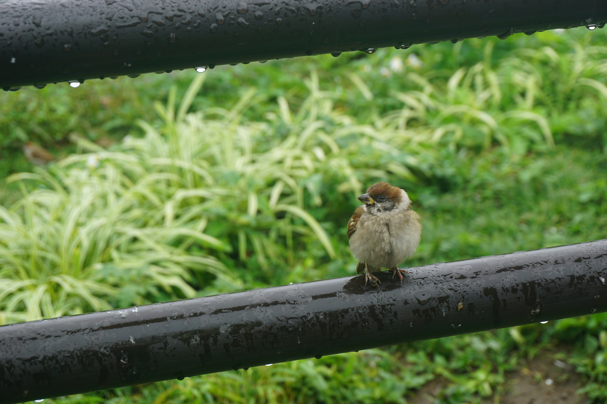

# 霓虹15日游游记 (五)

### 7月15日 京都—东京: 六本木大厦 2019.10.15

就像上一篇结尾时写的那样，在经历了种种意外的耽误之后，我的游记终于可以结束14日，进入15日的新篇章了。虽然写的相当之慢，我还是有些欣慰的：写得再慢至少也是一直在前进的，相较于一年前半途而废的我还是有所进步的。文笔虽然很烂，但如果能完成，依然是对我未来的一笔财富不是吗？

好了，让我们把时间拨回7月15日。这将是我离开京都前往东京的日子，这也意味着我的关西之旅正式结束了。稍稍总结一下，去掉飞抵大阪的那一天，关西的这六天行程尽管有不少遗憾，以现在的角度来看攻略也有不少做的不充分的地方，导致中途出了各种差错，但玩的还是相当尽兴，想去的地方基本都去了，想做的事情也都做了，除了出差错的部分，基本也没有浪费时间。大阪，神户，奈良，京都，丰乡，宇治，各自都有各自的精彩——至少都足够和我的胃口。现在即将启程离开关西，说实话还是挺不舍得。其他不说，光是京都就有足够的风景让我再玩一周，然而时间有限，为了能在这仅有的15天里尽可能地体验霓虹，我不得不告别古迹遍地关西，往关东的现代化大都市去。

为了早点到东京安顿下来，下午还能玩一两个景点，我自然是要早一点出发的。简单地用饭团和咖啡做为早饭，便提着行李离开了住了四天的酒店。虽然来的时候吐槽过没有独卫，没有热水，房间太小之类的问题，住了四天还是有点感情的——不管怎么说还是很整洁，床垫也很舒服，公共浴室也是那种单人隔间，洗澡水压也很足。这里忍不住吐槽之前尤其是在美帝玩的时候，好多酒店洗澡的水压真的是不够，洗的真心好难受。。。

去车站坐电车去京都站。阴雨了这么多天的京都难得出了一会儿太阳（参见11日的图，就是今天拍的），刚刚好就在我出门的这一阵，让我产生了一种“冥冥之中自有天意”的感觉。耳机里面放着K-ON的相遇天使，加上一瞬出来的太阳，竟让我有点莫名的泪目。要是能再在京都待几天就好了！然而木有如果，而且还来不及伤感，就出了一件让我哭笑不得的事情。我所在的地方是在四条河源町和乌丸站两站之间的，而这两站间的地下是打通的，我随便找了个口进了地下通道之后突然有点找不着方向，地下的GPS信号也不好，结果就是在两站之间来回走了半天，不知道应该往哪里去。。为了找个地铁站浪费了半天，最后还弄得从地下跑上来找GPS，最后还是从地上去的地铁站。。。也是没谁了。

京都站不愧是大站，大清早九点多就全是人。不少人正在站前道别准备离开，其中有一对母女，小姑娘年纪不大，看上去最多就是高中生，带着个行李箱，不知道是参加活动还是什么，看样子要离开家一段时间。两人在车站前用京都塔做背景拍照。这让我不由得又有些伤感。嘿，伤感个啥，还有东京在等着我呢，还有秋叶原呢，还有大洗呢，俗话说旧的不去新的不来，人还是得向前看的呀！


从关西到关东据说坐飞机其实比坐新干线要便宜，虽然高铁在国内已经相当普及了（至少在沪宁线上），新干线作为第一条商用高铁，还是让人忍不住要做一次——而且高铁还是要比飞机舒服的多哇。坐新干线可以买JR Pass优惠券，好像有7天、14天、21天三种，在有效期内可以自由搭乘新干线，但其实价格不菲，得至少坐两次才能回本，所以一般情况下短期旅行是用不到了。日本的高铁并不像国内的火车那样，要实名制买票，想坐座位都得买坐票才行，而是类似于电车，座位分指定席和自由席，指定席分配席位，自由席则就像电车那样，有空位即可坐——当然得要是在自由席车厢内。相应的也没有安检，没有指定车次，和电车一样闸机检票，高铁车次也非常多，基本十几分钟一班，随到随走。日本的电车、高铁都还是相当准时的，也都有APP可以查列车到达的时间，所以只要按时到达就能赶上。我一开始觉得这样真的挺好，国内为啥不这样搞，后来想想，我们的人口这么多，流动性这么大，平均素质也远低于人家，管理人员也很少，还是老老实实实名制+指定班次和席位吧。。

一开始做攻略的时候我以为新干线也像国内火车一样要提前订票，后来查查网上说要预定的只有指定席，自由席基本都能买到。我说实话将信将疑，在京都的这几天我还有一次找了个机会去酒店周围的一个火车票订票点想问一下是不是需要提前买，然而订票点的工作人员的英语水平把我劝退了。。。比划了半天+用翻译老师居然都没能弄明白，卖票小哥也没有日翻中的软件，只好作罢。因此，我一大早来到京都站的时候心里还稍稍有点虚。

一开始我走到一个人工的售票处，看到有不少人正在买票，而且队伍动得很慢。周围写有买票流程，还要写购票单？有这么麻烦吗？感觉好像有些不妥。正当我犹豫得时候，来了一位工作人员，我便赶紧向她询问。一问，她居然还会说中文，告诉我直接出门上二楼就可以找到机器售票，不需要在这里排队——这就对了嘛！我谢过工作人员，随后顺利地找到了售票处。售票处很小，不过没什么人。我站在卖票机器前面稍微有点犹豫，满眼得霓虹语也没有更改语言得选项，只好掏出手机找出之前看过的买票攻略，对比了一下有差别，不过大体上还是挺相似的，便开始操作。操作到一半略微有些卡壳，选了要去得站点之后的两个选项不知道该选哪个，幸亏来了一位穿制服的工作人员，便招手用英语+翻译软件问她如何买票。她问了下我要去哪里，随即便嘀嘀嘀按了几个按钮，然后就让我投钱了。我这时候还不知道霓虹高铁这么随意，出了票也没有写班次时间车厢什么的，啥也没有，走到检票口之后还是有点懵，便问检票口的人员是不是直接检票上楼就行了，得到了肯定的回答之后，我将信将疑地检票上了站台。


走到站台上我又想起了京都的名产——生八桥。就像我之前说的，这次来霓虹我本来就是冲着玩+圣地巡礼来的，对食物、纪念品啥的没什么要求，所以一直知道生八桥之名，但之前却一直没有想过要去尝尝，没想到临走了突然又想了起来，顿时觉得略有点可惜，毕竟是京都最有名的糕点。不曾想在站台上路过一家报刊亭似的小店，我稍微扫了一眼发现了“圣护院生八桥”几个大字，小小一盒，不免有些心动。再加上从京都到东京还要三四个小时，到了品川转车估计都要一点半了，早上又只吃了一个饭团，似乎买点路上要是饿了还能填填肚子——其实就是在为买点心找借口——便掏钱买了一盒。其实之后发现，我买的这种里面是没有馅的，并不怎么好吃。。感觉就像是比较粘的大糕，而且也不怎么甜。。

其实就算是检票成功找到了线路上了站台，我心里还是有点慌，感觉没有什么实感——明明是坐高铁，怎么也没指定班次，也没安检，啥都没有就像坐地铁一样过个闸机就上来了？正巧看到站台上站着几个棕色皮肤、似乎是东南亚来的小哥，便上去搭话——写到这里不由得感叹出来玩脸皮够厚有啥问题拉人就问真的挺有用的——果然是越南来的小哥，英语说的还不错。他告诉我买了票当天所有的车都可以坐，只要找自由席车厢就可以随意上随意坐座位。我才知道原来日本的高铁是和电车一样随意的事物。


 东海道、山阳新干线上有三种不同的车，分为最快的希望号（のぞみ，Nozomi）、稍慢的光号（ひかり,Hikari）和回声号（こだま,Kodama） 。希望号和光号感觉都类似于G字头，不过光号停靠的站点多；回声号感觉可以类比为D字头，速度稍慢站点也不少。因为错过了一辆希望号，我听从了越南小哥的建议，稍微等了一班，乘坐了能更快到达的下一班的光号。

车来的时候好多人对着新干线拍照，不过大概是因为国内有高铁，霓虹的高铁样子和国内的也差不多，所以我就没有拍。我一开始和两个越南小哥一起坐在三个座位的一侧，他们貌似一个是留学生，在东京读大学，另一个是放假了过来找留学生玩的，因此英语都不错。坐了一两站，我看见左边两个人的位子有一个靠窗的空位。因为这个方向朝北，而富士山正好在铁道的北边，虽然因为连日阴雨能看到富士山的可能性不大，但我还是很想坐过去，而且也很想坐到窗边看看窗外的景色，便和越南小哥们打了个招呼坐到了窗边。虽然果然是没能看到富士山，但也看到了一些有趣的景色，有霓虹特色的极窄的小楼，烟雾缭绕的山脉，依山而建的城镇，青翠的农田，开阔的湖泊。原本我还打算在车上稍微休息休息睡个觉啥的，结果看风景看得不亦乐乎。

抵达品川的时间大概是下午一点十分。品川在东京貌似也算是一个很大的车站了，因为我要到街对面去，过了闸机要走过一个很大很长的大厅，弄得我又稍微有点晕头转向。出了车站第一件事当然还是要先填满自己的胃，而我的选择自然还是以经济实惠为主，一搜周围又有熟悉的sukiya，不过这次我选择了元太同学最喜欢的鳗鱼饭。


我的行程安排是先从京都坐新干线到品川，再从品川坐山手线到秋叶原，再转银座线到达位于浅草的东京浅草WBF酒店。之所以要绕这么大一圈，是因为我要在位于品川的H.I.S.旅客咨询中心购买东京地铁券。东京地铁券可以在有效期内免费乘坐东京Metro地铁全线以及都营地铁线全线，而这两者基本包含了东京地区绝大部分的景点，而且是旅客凭护照才能购买，可以说是相当实惠方便，这也体现了霓虹极其适合自由行——交通极为方便。按照计划，我应该会在东京待到20号，而中间会安排一天去镰仓。东京地铁券分为24h、48h和72h三种，根据我的情况刚好可以买一张48h一张72h，把用完一张之后中间缺少的时间用作去镰仓玩，这么安排简直perfect。

H.I.S.在品川站出来二层的通道（天桥）连接的街对面的一栋楼里，而我吃饭的地方要再过一次马路，所以找的时候稍微有点晕，还绕了一点路——因为拖着行李来来回回跑稍微有点碍事，就在在天桥底下找到了电梯，想从天桥上面过去，结果发现走错了路进不去楼里，又得拖着行李下楼。。结果出来的时候发现二楼的入口在另外一侧。。不过还好进了楼之后，H.I.S.就很好找了，在二楼的电梯口就能看到它的牌子。工作人员热情地接待了我——谢天谢地，她的英语说的挺溜，不愧是游客接待处——还帮我拎了箱子，放到方便的地方去。我把来意稍微说了一下，她便明白了我的意图，和我又介绍了一下三种不同的地铁券、使用范围和使用方式。我和她说了我的安排，并问她这样操作是否可行，她回答可以，便掏出表格让我填写，问我要护照留了一份复印件，然后两张地铁券就到手了（虽然中途来了个电话让我等了一会儿）。

接下来便是从品川坐山手线前往秋叶原。google地图上标了山手线，然而车站里表示的并不明显，我只好连蒙带猜地去找站台——既然是JR的，那就得从JR的检票口进，然后要找标记同样颜色的线路——还算顺利，我心说经过了大阪京都的洗礼，霓虹这个找地铁线路的问题总算是可以应付了，然而这时候我还不知道不久之后会有更大的挑战。。。

秋叶原站在东京是重要的交通换乘点，再加上秋叶原也是著名的商业区，一下车我就感受到了这里的人流。而对于宅来说，秋叶原则有更为重要的意义——宅文化的中心，诸多番剧的故事舞台，而对我而言的番剧自然是命运石之门了。在山手线下车的站台上就能看到大楼上游戏、动漫等的广告，以及十分显眼的UDX大楼。下了站台过了闸机就能看到一排排的扭蛋机，不过我看了一眼并没有我想要的。从站台出来，眼前的景象则更是异样地令人熟悉。


当然现在的首要任务还是赶往酒店，所以没有多少时间在这里逗留。按照地图上的说法，我应该在这里转乘筑波快线前往浅草。然而我在JR秋叶原站附近找了半天都没法找到入口。。google地图在碰到这种情况的时候果断又白给了。。最后终于过了一个地下通道并走反了方向依次之后，找到了筑波快线入口的直梯。然而下去之后我发现，我的地铁券怎么也刷不过闸机。。讲道理这筑波快线也不是JR的地铁啊，怎么不能用地铁券呢？迷茫的我只好询问了闸机旁值班的大叔。大叔看了一眼券就笑了，和我说了一大串霓虹语，大概是说这个券筑波快线也不能用。我指指券，指指上面，手舞足蹈地问他那哪个地铁可以坐呢？他问我去哪里，我费了半天劲，又是查翻译老师又是查地图，最后憋出了个十分不标准的“Asaku sa”（浅草）。大叔看了看，和比划了一会儿路线，但我哪里能明白，正当我犯难的时候，他递过来一张打印的纸条，上面居然画了从这里去日比谷线的地图。。还和我说要坐到到“Ueno”（上野）转车。看样子他们经常碰到像我这样愚蠢的游人（笑），所以准备的十分周全。。后来我才查到，筑波快线属于首都圈新都市铁道公司（TX），不属于都营地铁和东京地铁。。他们旗下的线路也不多，感觉好像是私人铁路一样。。

尽管有了大叔给的地图，我为了找日比谷线车站还是费了不少劲。日比谷车站入口隐藏在一处楼里面，和JR站、TX站都不在一块，结果就是我绕了一大圈才找到。我本以为经历了大阪电车和京都巴士的洗礼可以稳吃东京地铁，结果还是小看了啊。。。

坐日比谷线到上野转银座线到达浅草其实是也很方便，而且省了几百日元，不过代价就是要多走不少路。虽然事后证明从WBF酒店走到东京地铁浅草站的路程还算愉快，但远还是要比坐筑波快线走得远的，再加上从日比谷转银座线中间的步行距离着实不近——感觉和南京在南京站1号线转3号线走的差不多——我一开始发现只能这么坐的时候还是稍稍有点不爽的。不过出了站来，我发现这里就在浅草寺门口，每次回酒店之前都可以从浅草寺里穿过，可以看到难得的浅草寺晨景和夜景。半路吃喝小店遍布，也有便利店，而且说实话并不算远——和我在京都走过的路差远了——真的是相当令人愉快的路线呢。


当初选WBF酒店一个是因为它离浅草寺近（当然当时没想到就在楼下这么近）第二是它的价格和周围差不多，虽然地图上看稍微远一点，但它却是唯一一个四星酒店。虽然到的时候还没到四点，但我和前台问了问（谢天谢地前台小姐姐的英文挺不错的，而且还有说中文的），已经可以入住了。真不愧是四星酒店，单人间虽然不大，但设施齐全，有冰箱有保险柜，床也很舒服，空调很安静，楼层高，隔音也很好，最重要的是终于又可以泡澡了！我放下行李稍作休息，想起来早上买的生八桥，拆开来尝了一下，哇是真的不好吃。。。是不是有馅的会好一些，有人吃过吗。。


在酒店稍作休整之后，我看了下时间，已经是奔着5点去了。说实话我原本计划是中午左右就能到达的，结果一是早上还是相对走的晚了一点，中午在品川多耽搁了一点，再加上下午在秋叶原又迷路了很久，这时间就哗哗地不见了。。原本计划是到的早的话要么逛逛秋叶原要么逛逛银座要么逛逛上野公园——反正先逛逛哪里都成，但到了这个点，只好跳过中间的逛街，直接前往预定好的下一站——六本木大厦，去看著名的东京夜景。

看东京夜景的著名景点有三个：最为著名的自然是东京铁塔（手动@柯南），位于中心地带，本身名气就足，是个可以一玩的景点，但身在东京塔中自然看不到自己；第二则是新建的晴空塔，够高，够新，富有科技感，但是位于相对偏僻的地方；第三就是我现在要去的六本木新城森大厦了，虽然不及东京塔高，卖点是可以以一个很好的角度看到东京塔的全貌，而且下面就是商业区，还有可以消磨时间的森美术馆。我选择六本木的原因其实自己也说不清，可能是能拍到东京铁塔吸引了我，也可能是想去看看逼格很高的森美术馆，但感觉都不是很决定性的原因，反正最终就是拍脑袋决定了就去六本木了。

从浅草到六本木要先坐银座线到上野，转日比谷线一路坐到六本木站——这也是我后面几天没事就坐路线，因为可以到秋叶原。到达六本木的时候已经快要六点了，我便决定先去觅食。从地铁出来，发现墙上贴着大幅的海报，写着什么什么carnival，嗯？还有活动吗？可是吃饭的优先级更高，我便问了问工作人员，好像这个活动持续到晚上七点。这个工作人员也挺有意思的，我一开始问他英语ok不ok，他犹豫了一下还是决定先尝试和我交流，然后我话说到一半他举手投降了。。叫我等一下，然后找来了边上一个lady救场。。。。

六本木作为东京著名商业区，周围自然是不缺吃的，但对于当时还是无产阶级的我来说，大部分的东西都价格不菲，略舍不得自己的票子，再加上今天有新干线车票这种巨额开销，就更心疼自己的钱包了。在周围转悠了半天之后，我最终选择了一家定食店，在六本木新城旁边的地下街里一处不起眼的拐角。店里不大，也相对比较冷清，当然店员也很少。我坐下来看了下菜单，感觉就像是国内那种私人厨房式的小店，菜色不多但看上去还可以，便点了一个相对比较熟悉的煎三文鱼定食。说实话三文鱼还不错，但是几个小菜的味道很迷。。尤其是秋葵，本来就是黏糊糊的菜，然后给做的更黏糊糊了。。。吃着有点恶心，但我又不好意思剩太多。还有鱼边上的那一团我一开始还以为是土豆泥之类的，结果发现式一大坨蒜。。这难道是霓虹人吃鱼的惯例调味料吗？反正这个我是真的吃不惯。


吃完了晚餐，天还是亮的，所以得找个地方消磨消磨时间。之前的carnival我查了查，貌似也没什么吸引我的点，也就没什么兴趣了，就稍微在大厦前的广场转了转，这里摆着大群的蓝胖子，好多人都在这里驻足拍照。


正当我觉得有点无聊的时候，我突然看到贴在柱子上的海报，这里居然在办进击的巨人展。虽然我还没有补巨人的动漫，漫画也只看了个开头，但这么难得的展览还是忍不住要去看一看的。进了通向展区的电梯，我发现巨人展也在大厦的顶部，和美术馆、楼顶观景台一样，都可以在楼下买票然后上去参观。由于楼顶有开放时间，我大概问了一下巨人展要看多久，便决定先去看巨人展了——其实也没什么选择的余地，因为巨人展8点钟就结束了，我到的时候已经是快要七点，算是末班车了。

巨人展的门票并不便宜，我记得要2000块钱——哎机会难得，还是咬咬牙买了票。本来我看到不少人都在排队买票，结果问了下发现大家都是买的展望台和楼顶的票，而买巨人展的门票并不需要排队，所以很快就买好了。坐电梯直升52层展厅，便能看到墙上巨大的海报。不知是因为展览已经办了一段时间，还是时间比较晚了，前来看展览的人并不多，大部分上来的人都是去天台和室内观景台的。检票进去之后，工作人员先是问我英语O不OK，接着递给我了一份英文版的注意事项，大致是开头的部分不能拍照，不过进去之后可以拍照什么的。接着她便让我在入口出稍候，因为进去后的第一幕貌似是有个小表演啥的，要等前一批结束了才可以入场。


和我一同进场的还有稍候来的三四个妹子。门开了进去之后，里面果然是一个小的放映室，先要放一段视频，讲的大概是就是巨人世界的世界观以及一些起源有关的东西，以及讲了墙内出生的孩子和墙外出生的孩子的童年。随后两盏灯亮起，左右各有一扇门供游人选择，左边蓝色的是墙外出生，而右边红色的则是墙内。进去之前工作人员和我说，进去以后会选一边进去，只是一开始看到的东西不一样，不影响正常参观。几个妹子都径直走向了右边，我一想他们都去右边，那我偏要去左边，就进去了，结果自然是发现墙外出生的人的命运好惨。。

就像工作人员说的那样，这个所谓的选择并不影响观看展览——两个门里面也就是关于墙内和墙外出生的孩子的经历的一些漫画的内容。展览主要就是对原作世界观的介绍，对剧情的叙述，展示了大量的原画和手稿。


接下来则是重头戏——一大段运用动画和3d建模表现巨人剧情的“电影”，而其中最为精彩的则是复现了艾伦大战铠之巨人。一长段影像结束之后，还有全员的人物立绘。配上光影和场景，还是挺有表现力的。


影像欣赏完毕之后，后面则是对人物的介绍，以及一个立体音频室，这里可以听到一段最终回的音频（剧透？）emm我一是不了解剧情二是听不懂霓虹语，所以嘛就听了个莫名其妙。

最后的展厅则是大量谏山创老师的手稿。在最后的墙上则有老师的签名。手稿线条是相当的混乱，但还是可以看出来，谏山创的分镜很有张力，而绘画功力也随着连载的进行不断地提高，后期的画面要比早期要好看的多。而他对于剧情的把控据说也是一流的，大量的伏笔都能在后续的剧情里很好地回收，剧情始终没有什么崩坏，这也是巨人能够大火的原因吧：才华+不断地努力。所以啊，富坚义博啊，小林立啊这些人，看看人家！好好看好好学！


展览的最后自然是惯例的纪念品店。这里赠送了每个入场者一张原画的复印，同时售卖了不少限定的东西。因为我对巨人没有那么深的感情，最后选择买了一个小小的原画摆件。

从巨人展出来，我看着墙上巨大的海报，还是挺想在这里留一张照片的，不过使用自拍杆始终拍不出效果，只好找路人帮忙——一位还带着一个估计刚上小学的小姑娘来玩的的霓虹lady，看上去挺年轻的，说实话因为她还带着小孩，我还有点不好意思。至于照片嘛。。这里就不放了。

看完了巨人展，接下来自然是要登顶六本木了。六本木大厦楼顶观景台的门票在楼上也可以现场买票，这里我因为语言不通还稍稍闹了一个笑话。。登顶要买票再存包，但我因为一开始没看到售票处，以为可以先进去存包，把顺序弄错了。。然后安保小哥和我说了半天我也没弄明白，结果就被入口的安保小哥瞪了。。他一定觉得这个人很莫名其妙。

楼顶观景台可以带相机，但不能用自拍杆和三脚架，也不可以背包，所以要先存包。这儿我碰巧看到一个挺有趣的数字的柜子没人用，便笑纳了。话说这个谐音梗霓虹人肯定不明白的吧。。


六本木大厦顶层的观景平台其实是直升机停机坪。在这里可以看到有东京塔全貌的东京夜景，可以说是东京相当有代表性的景色了。写着一段的时候（2019.11.02），刚刚在电影院看了《天气之子》，阳菜穿着和服在六本木大厦楼顶让东京放晴，夕阳从云层里一下子显现出来的场景真的是美轮美奂，所以现在写着这一段心中有种说不出的感觉，感觉当时看夜景时的开心和看完天气之子后的感慨纠结到了一起，形成了某种不可名状的情绪。


自六甲山之后，霓虹的气温虽然不算高，但也一直维系着夏天的尊严，所以一直我都是穿着短袖，最多加一件防晒服。然而上了观景台之后我有点傻了，不愧是50+层大厦的楼顶，这里的风真的是大，再加上日落之后气温下降，只穿短袖上来真的是失策。。然而就算这样我还是在楼顶呆了一个钟头，现在想想也是挺佩服我自己的。。

我在霓虹的这段时间一直断断续续地下着雨，没几天出过太阳（怎么感觉和天气之子又有点像。。），而这天也不例外。阴雨密布的天在东京夜晚人工的光亮之下有点泛白，照相出来的效果就略打折扣。不过就算这样，东京的夜景还是很美的。本来我担心这回拍照没有了三脚架，相机延时曝光会不会很容易抖动，导致最后拍出来的照片一团糟。幸好，观景台的扶手救了我。。这里的扶手不像天览台那里全是圆的，立柱的顶端是方的，正好可以摆相机。这一回我吸取了六甲山拍夜景的教训，对于相机的操作要更熟练了一些，拍出来的效果也要好不少。当然这还是建立在我拍了大量废照片的基础之上的。。。


观景台上人不算多，但是国人不少😂碰到了几个和我年纪相仿的自由行小哥，其中一个也带着单反，他告诉我这里用延时曝光可以拍到晴空塔，不过他的“炮筒”比我的要长，我的相机拍出来的效果就比较勉强了。。然后先后碰到随便留个纪念照的大叔、一定要拍出用手捏着东京塔的阿姨、以及一对男生很随意但女生拍个照要纠结半天表情和姿势还一定要开闪光灯的不是情侣的男女朋友要我帮忙拍照。所以还是那句话，端着“炮筒”的大部分人就只是想端着而已，并不是会拍啊。。。我也顺便叫他们帮我拍个照，说实话，我还是觉得我的技术还是能勉强胜过大多数人的，至少我每次找人帮我拍照拍的效果都不咋地。。当然无聊但又不是很想这么早走的我还做了一段时间的“人类观察”，结果就是被糊了一脸的狗粮，以及想偷拍一个独自来玩的妹子的背影用大光圈拍出那种繁华都市下只身一人的感觉然后失败了。。。

总之，在观景台拍了个爽之后，已经是九点半了，是时候回酒店了。由于距离并不近（要坐大半程的日比谷线），等我回到浅草的时候已经是晚上十点半了，然而浅草寺这时候居然还有零星的游人在拍照和求签（自助），不愧是东京最著名的寺庙之一。这时候我一抬头，发现在六本木大厦楼顶看到的晴空塔居然离我住的地方这么近。


最后的最后，尽管已经很晚了，我还是照例去了便利店买了点夜宵吃——惯例的野菜生活100，而这次的小吃我选择了鸡排。接着，回酒店，泡澡，玩手机，长途跋涉+六本木大厦楼顶吹了一个钟头的冷风带来的疲惫渐渐涌了上来，盖过了初来东京的兴奋，于是熄灯睡觉，结束了这一天的行程。

### 7月16日 东京: 上野公园，台场2019.11.03

人言，学的时候就要用力地去学，工作的时候就要用力去工作，而玩的时候也要用力去玩。想想来到霓虹的这么些天，我也算是拼命地去玩了吧：每天七八点起来，徒步十几公里，走两三万步，还时不时玩到晚上九十点以后才回酒店休息。的确这么玩着，感觉每天过的无比充实，玩得也无比开心，但不得不说疲劳一定还是积累了不少的。于是在到达东京的第二天，无论是出于疲劳也好，还是出于想喘口气也好，总之我是难得地歇到了九点多才爬起来——而且睡得并不怎么好。想想为了能稍稍玩得不是那么地赶，后面的行程还是需要有一定的取舍的。思考了下后面的行程安排，尽管名义上我还要在东京地区待5天，但去掉去镰仓、千叶以及最后一天去看足立花火，其实满打满算也就是两天半的时间了。秋叶原，台场，这两个几个地方是一定会去的，台场的游船因为天气原因似乎花这么一两千坐一趟不是那么值得，上野公园、皇居这样的地方去不去不是那么重要，毕竟也就是古迹和园林，在京都看的也是不少了。银座和新宿歌舞伎町倒是有点想去看一眼，就是不知道有没有时间。想到这里，我决定把台场和秋叶原安排成两个半天以上的行程，而剩下的半天就挑一两个景点看看，时间多就多玩几个，少就直接去看重头戏了。今天就安排去台场逛逛，总之应该会是相对轻松的一天。

之前也提到，银座线坐到上野转日比谷线是这段时间里将要经常跑的一条线路，而上野公园距离银座线上野站并不远，所以今天的第一站最后便敲定成了上野公园了。不过出发之前，还是要优先解决早饭的，楼下不远的便利店自然成了不二之选。淅淅沥沥的小雨带来的寒气在早上九点多还残留着少许没有散去，因此我选择点几个热食作为美好一天的开始。一杯咖啡，一串鸡肉串，一块炸土豆饼，坐在酒店前的桌子上三口两口吃完，尽管路过的行人看到我这样貌似觉得有些奇怪😂但还是吃得很开心的。便利店，赛高！

上野公园全名上野恩赐公园，是日本的第一座公园，国内大部人对它的认知应该都来自于鲁迅先生的《藤野先生》：

```
东京也无非是这样。上野的樱花烂熳的时节，望去确也象绯红的轻云，但花下也缺不了成群结队的“清国留学生”的速成班，头顶上盘着大辫子，顶得学生制帽的顶上高高耸起，形成一座富士山。
```

（鲁迅：嗯，我的确说过这句话）

从银座线上野站出来，过一个十字路口，就可以看到一个长长的楼梯，而从楼梯上去就是上野公园的范围了。上野公园是一个开放式的公园，而它给我的第一感受就是：大。真的好大，占地53万平米，这可是在寸土寸金的东京地区啊，真的没想到能有这么大一片公园。公园里郁郁葱葱，不少树木都有年头了，不少古迹建筑都隐藏在树林里——对，上野公园并不是一个简单的“公园”，更像是一个古迹群、文化建筑群，这在我来之前是完全不知道的，仅仅只是冲着名字想去踩踩点，打个卡什么的，来了以后才发现，这里有神社，有国宝，有博物馆，有美术馆，有科技馆，总之是个充满了人文和历史的地方。

我在公园里随意走着，跟着路边的标识和路旁的“令和祭拜”（大概）的旗帜转到了清水观音堂。据说这是仿照京都清水寺而建的，但我并没有感觉两个有多大的相同点。。可能一是我就在周边转了转，登了一两个厅堂就下来了，二是我在京都看了这么多古迹之后，出了京都之后感觉好像就对其他地方的古迹不是那么上心了，加上当时我对上野公园也没有做多少研究，现在看来或许有些……遗憾？感觉好像也不至于。

雨渐渐从我刚出门时候的零星雨滴变成了不经意就会让人淋湿的小雨。我从清水观音堂下来，走下一段台阶，发现街对面是一片湖，从岸边延伸出去的小岛上还有一个神社，便欲过街一看。大概是因为下雨，以及时间还比较早（10点了还算早吗？）路上行人和车辆都不多，不见人声，唯有电线杆上的几只乌鸦在雨中有节奏地叫着。

过了街右手边是上野动物园的入口，据说这里有中国赠送给霓虹的大熊猫，但今天动物园并没有开门，我也没有逛动物园的闲情逸致。湖心岛上的神社叫弁天堂，供奉着弁财天，七福神中的唯一女神，传说她精通音乐，是善于雄辩的天女， 能给人带来欢乐。神社很小，但估计是因为在市区的原因，感觉香火还是很旺盛的，一边挂着大量的绘马，另一边的架子上则绑满了求得签——霓虹有抽到不好的签绑个结可以帮助消灾的说法，不过话说这雨一下不久全泡烂掉了吗。。。

一边的石像有点搞笑。。话说这样真的好吗。。。。。


一旁的湖水被分成了三块，其中最大的一块叫“不忍池”。正值盛夏，湖里荷花正在盛开。湖里铺满了荷叶，一眼望不到头，雨水落在荷叶上，形成了晶莹剔透的水珠，不时因为水珠过重，有荷叶低下头让水珠从身上滚落。尽管下着雨，麻雀们依然在树上，草地上，栏杆上甚至是荷叶荷花上跳来跳去。雨势渐渐小了，我便在湖边的小亭子里（但是并不防雨）找了一处座位，擦干了凳子坐下静静赏景，这麻雀也不怕人，渐渐在草地上、栏杆上聚集起来，叽叽喳喳地叫着，时不时晃动脑袋和身体抖一抖雨水。




我安静地坐了一会儿，又来了几个游人，其中有个大叔估计是想逗鸟还是怎么样，掏出像是面包一样的东西想给鸟投食，结果把聚集在草坪上的鸟全吓跑了。。话说这样喂食啥的不太好吧。。。

在这边看够了也歇够了，我围着弁天堂转了一圈，准备原路返回。这是雨突然变得大，我只好找了一处“桥洞”避雨，等雨小了再出去。我看了看时间，差不多刚11点，还可以再转一个小时。看了看路牌，周围有不少博物馆艺术馆，便想去科技博物馆或者国立博物馆看一看，结果发现今天不知是什么日子，所有的博物馆都关门停业。。只得作罢。


因为想去看博物馆的缘故，我从上野公园的西南角一路走到了最东面国立博物馆的一侧，而貌似这里才是上野公园的主干。宽阔的广场中间有一个巨大的喷泉池，两旁的树木都是一人抱不过来的古树。然而我还没来的及转，雨又开始变大了，只好找了一处WC在屋檐下稍稍避雨。待雨停之后，我寻思时间也不早了，不如去吃个午饭启程前往远在东京南端的台场，便沿着大道往回走。然而走了一段之后，路边的旗子上“重要文化遗产”吸引了我的注意力，原来上野公园里还藏着这种东西？

所谓重要文化遗产，是始建于1672年的上野东照宫。我查了查资料（现在），东照宫是供奉德川家康神的神社，本社位于 栃木县西北部的日光市，而这座神社则是为了供江户地区的居民使用的。经历了地震与战火，这座神社幸运地保存了下来，是珍贵的江户时期的建筑。我走过常常的神道，发现惨败费用竟然是……500块？这么贵？感觉京都那么大的平安神宫神苑也就是这个价格啊。但既来之则安之，我还是付了费用进去参拜，进去以后稍稍有些失望：真的是太小了。除了外为的神木之外，里面就是一个不大的神殿，也不能进到神殿里去（当然这个是肯定的），所以分分钟就能转完，感觉这600日元有点不值。。

不过有一说一，东照宫还是挺有特色的，因为整个宫殿和外面的唐门都贴满了金箔，金碧辉煌，屋檐下的彩绘据说都是先贴上金箔再在金箔上作画的。德川家康，不愧是你。可惜和金阁寺一样，没能看到太阳底下pikapika的东照宫。


从东照宫出来返回车站的一路就不细说了，没有什么值得一提的，唯一只有入口处有一座青蛙喷泉，进来的时候木有看到。照片就不放了，免得-1s23333

稍微查了查google map，上野站周围还有家大户屋。唔呣，是时候稍微改善一下伙食了，我当即敲定了去大户屋吃中饭。这家大户屋在上野站旁的一个十字路口的楼上，要从正对着十字路口的一个电梯上去。我找了个正对着窗户的位置坐下，这里正好可以看到整个街景。随手点了个猪排饭套餐，服务院给我上了水，然而这杯水让我有点哭笑不得。。


唔呣再查资料的时候发现周围还有个阿美横町，好像是个著名的商业区。不知道以后有没有机会再来这儿逛逛。

吃完了午饭，我下楼准备前往地铁站，从塑料袋里掏出雨伞准备过街，尴尬的事情发生了。。伞坏了。。整个伞头从伞柄上脱落，装不回去了。。讲道理这把伞挺新的，放在家里也没用几次，怎么在这个节骨眼上坏掉了呢。。幸亏对面就是711，我只得冒雨过街，去便利店随便买了把透明的伞。话说霓虹也挺奇怪的，不像我们习惯用三折伞，他们满大街都是那种透明塑料布做的两折伞，不会不方便吗？不过好看确实挺好看的。

换上了新雨伞，我继续启程前往台场。台场并不在东京地铁券可以到达的范围内，需要先坐银座线到新桥，再转百合海鸥线。据说百合海鸥线是挺著名的电车线路，还有一本书叫搭地铁游东京。。所以真的是有铁路宅的啊。。。

话说这个电车公司还有自己的网站，还有中文。。。https://www.yurikamome.co.jp/zh/嗯。。logo挺好看的。

从新桥站出来，沿着海鸥形状的标记就很容易找到在车站外面的海鸥线站台。海鸥线和之前的神户的新交通港湾人工岛线很像，都是穿梭在高楼和大海之间的电车，的确风景优美。由于是始发站，很容易就坐到了位子，但比较蛋疼的是不一会儿旁边坐下了一个奇怪的人，看上去是东南亚来的，还带着个坐轮椅的胖叔叔，他上来后把轮椅安置在了车厢前面开阔的地方，自己则在我附近坐下，到这边其实都还好，主要是他身上有股淡淡的、难以形容但是不太好闻的味道。。。

我要去的第一个目的地，自然是位于有明的东京国际展示场（emmm好像并没有那么自然）。来这里的目的，一是朝圣——这里可是一年两次的圣战——Comiket的举办地；二则是圣地巡礼，不少番剧里都出现了CM主会场，石头门也不例外——还有最近得天气之子。我还能依稀记得，凶真站在CM会场的一个像亭子一样的地方为了不让嘟嘟噜担心，和她说自己是在担心会场里有潜入的机关的间谍，这次来也想能不能找到那个场景。海鸥线可以直接坐到国际展示场正门站，所以相当方便。电车还没到站，远远的就能看到那标志性的像一尊四方鼎一样的建筑，那就是东京国际展示场的主场馆。尽管很想立即去近处一观，但下了电车之后我第一件想做的事情还是要感觉找个地方买点东西喝——之前淋得雨不知为何让我有点冻得慌，而且一路坐了这么久的电车着实是有些口渴了，再加上连日的疲惫，有一些困，一杯热腾腾的咖啡自然是最佳的选择。

随处可见的便利店既是霓虹的一大特色，也是我在霓虹这段时间最为喜欢的一点。正如其名，便利店基本可以满足每日生活的所有正常需求，一日三餐，冷热饮品，以及一些生活必须品的需求统统可以在便利店里得到解决——甚至不少便利店里还提供厕所，而对于旅行者来说，便利店基本可以解决所有问题，而且还有一定的品质保证，所以霓虹实在是太适合自由行了。想想动不动前不着村后不着地，找个餐厅都得走半个钟头的美帝，霓虹简直就是天堂好吗！尽管是相对远离市区而且非活动期间就人烟稀少的国际展示场，周围依然能找到好几家便利店。我找了家罗森点了一杯黑咖啡，可惜的是这家便利店偏小，没有地方坐，只好站在门口把咖啡喝完。

在我到达有明的时候，雨已经停了，刚买的两折伞便也排不上用场，又放不进包里，显得有些碍事；我的背包又不是户外旅行包，上面没有挂钩，我只好把它挂在背带下面，然后把背带拉短。后来我还试过把伞挂在包顶端的提带、插水杯的侧袋，总之效果都不太好。所以再容我吐槽一下。。霓虹人民们，你们真的不会觉得到哪里都带着两折伞很麻烦吗。。

从便利店这一侧去国际展示场要过街。这里的道路设计成了电车在路中间走高架的模式，因此过街需要走人行天桥，不过会场这边有直接的天桥可以直接通往二层主馆。我坐扶梯走上天桥，因为没有举行什么重大活动（貌似还是有活动的，偶尔能看到戴着工作人员牌子的人走过），这附近显得比较冷清，宽阔的天桥显得空空荡荡，而标志性的主场馆就矗立在道路的尽头。


因为好像是在举行什么会议得缘故，我就有点不太好意思进去场馆看了。话说天气之子里面，阳菜他们做定制天气的时候，是不是在这边帮两个cosQ娃的妹子让天空放晴的？（不用说是不是，肯定是！因为我今天又去看了一遍IMAX版哈哈哈哈！）

因为不好意思也不准备进馆里，我就准备在场馆周围转一转。走到主场馆背后，发现一处很长的楼梯上，有一个挺漂亮的姑娘在拍照，貌似是艺人在拍外景还是拍写真啥的，或者是拍宣传照？我因为不想打扰她，就站在一旁等待了一会儿。边上一个身穿西装的男士看到我在等，有点不好意思，过来跟我说对不起什么的，难道是经纪人？不过这时候他们照片貌似也拍完了。

走上平台，这里貌似是副馆楼顶的停车场？好像也有展台的功能。平台周围立着一些奇形怪状的亭子似的东西，正式石头门里凶真站的地方。


从这里可以看到海湾，远处的摩天轮在缓缓转动。海风微微带着些潮气，吹在身上带着丝丝凉意。我定定地站在这里许久，心里感觉空空的，但不知为何又不觉着无聊，尽管就是这么站着，却感觉可以一直在这里站下去。

当然以上内容是我编的。我尝试了连接附近的wifi，妄图找石头门动画里的场景来做对比，然而事与愿违，wifi连不上，google也找不到类似的场景图，在这边傻傻地站着纯粹是有点累了想歇歇吹吹风。

展馆还是得有展才好玩，即使是圣地也一样。在平台上吹够了风，我动身离开准备前往下一个景点。这时候大概也就是下午三点左右，我便因此稍微有些纠结该去哪里玩。当初想来台场也就是为了看一眼著名的台场高达，这时候去好像略微有些早。之前在来时的电车上好像也看到了在宣传这边一个类似于未来科技馆的展馆，里面好像在办什么灯光展，就是用各种颜色的灯来营造比较“梦幻”的场景。但查了查地图，貌似过去也不是非常方便。而去台场高达也没有公交可以直达，要么坐一段电车到稍微近点的地方，要么就直接走路过去，大概30min左右的路程。略微思索一下，反正台场这边主打的旅游特色就是现代化的娱乐项目，说实话我也不是那么的感兴趣，走路去看高达，顺便欣赏欣赏沿途的风景，也不失为一种不错的选择。

台场这边的整体风光给人感觉就像是那种刚开发好的新城区，设施已经比较完善了，也有各种娱乐场所，但人流稀少。当然这里人流少的原因我觉得还是和国内那种因为居民还没有搬过来住所以人流量少有区别的，因为这里感觉似乎是没有居民区，是一个纯粹的现代化文化娱乐功能区，所以人流少大概还是工作日+没有大型活动的原因。由于大片的区域都是步行区域，也很少看到车，走在路上有一种仿佛进了一座空城的错觉。天空是不是还飘下一点点小雨，让周围显得更加清冷和寂寥。不过，我的内心还是火热的，而且我也乐得独自一人，仿佛这片天地就仅仅属于我自己。而且，虽然仅仅是这样走着，只要留心还是能发现乐趣的，比如远处的摩天轮，比如宽阔的步行桥，比如似乎仅仅只有几栋楼，没有一个明确的校园的武藏野大学——话说这个名字也是槽点满满——这些景象时不时能带来惊喜与快乐。


徒步的过程就不细说了，总是是一段略显得寂寥但又不失趣味的过程，而我的最终目的地，则是位于台场购物广场前的独角兽高达立像。从之前的梦之大桥走过去，穿过一大片绿地广场似的区域，一个转弯，就可以看到那座通体白色的雕像——高达，屹立于大地之上。


RX-0独角兽高达，出自高达UC，机师为主角巴纳吉·林克斯，被称为“可能性之兽”——以上是我从网上抄的，因为我一级高达都没有看过。但这么大号的“手办”屹立在面前的时候，还是相当令人震撼的，独角兽高达的造型也是足够的酷炫——圈钱兽之名我也是有所耳闻。而这一台独角兽高达可不仅仅只是一个雕像，据说还可以变形和音乐，而这也是吸引我来这里观摩的原因。不过到了这里我才发现，高达表演并不是你想看就能看的，每天有固定的场次：


可以看到，白天只有变身表演，而大部分的重头戏都在晚上。。真的是相当地尴尬。要是我住的地方离台场近一些还可以考虑看看，可从浅草和这里一个在北部一个在南部，路程要一个小时，让我呆到晚饭后就为了看一个几分钟的表演是真的有点做不到啊——毕竟我不是高达厨。另外略微尴尬的是，最近的一轮变身表演要等到5点，而我到的时候是四点不到，看来还得在这里找点事做以消磨掉这一个多钟头的时间。幸好台场购物广场就在背后，再怎么样也应该有可以消磨时间的地方。大老师曾经说过，现代人有了智能手机就可以解决所有问题——应该说过类似的话吧，在去山里给平冢先生帮忙的时候。哼，充电宝，电量的储备还足够吗？

独角兽的下方有一个小小的高达周边店，店的一侧有四台限定版扭蛋机，而店里主要是售卖手办，边上还有一个高达咖啡馆（好像和秋叶原地铁站旁边的是一样的店），咖啡馆边上也有高达周边店，卖的则是一些其他的周边产品。我本来看到了限定版的扭蛋有点想出手，但这扭蛋是500块还是600块一个，而一般的扭蛋是300，只能感叹厨力还不够。而高达的手办也好周边也好是意料之中的贵。。这里的手办大多都是独角兽相关的机型，不少都是大几千甚至上万的价格，圈钱兽名不虚传。。。

两个周边店都不大，我稍微转了一圈感觉没什么想出手的，便稍微逛逛就走了，转头进了购物中心。和国内不太一样的是，这中心进去的一层完全没有国内的化妆品首饰店，满满的全是餐饮。不过好消息是这里全是座位，走了这么久的路终于可以好好休息一下了。不过我一直是那种，要用店里的东西，不买点什么就不好意思，所以还是要稍微买点东西吃的。而正巧这里有一家筑地银座，据说是很有名气的卖章鱼烧和大阪烧的店——讲道理我在大阪也没吃章鱼烧大阪烧，结果在这里给我碰到了。

毕竟还没到饭点，尽管人不少，但各家店排队的人并不多。我应该是点了经典款的章鱼烧，价格记不太清了，反正不算便宜，不过卖相还是挺不错的，撒了不少香料和木鱼花，还送了一包Mayonnaise，不由得想起了幸运星里的小司——不过人家是做的亲子丼里。什么？你以为我想的是土方十四郎？sorry，我还真没怎么看过银魂。。。


章鱼烧的口味和我在国内吃的不太一样，外面的一层壳是酥脆的，似乎不仅仅是铁板烤，还在最后过了一下油。口味相对来说淡一点，不过有了蛋黄酱也足够了，总之味道还不错，不过没有到那么好吃的地步。

有了章鱼烧在手，我便有了在这里休息逗留的理由。虽然木有能用的wifi，流量还是相当足够的，手机里还存了整套的幸运星可以看，总有办法打发时间的。

大概4点50分不到的时候，我便起身出门——总还是要防一手人多，先去占个好位子拍照的。围观的人确实不少，除了亚洲面孔，也有相当多的欧美面孔，高达在欧美宅圈的人气果然还是相当不错的。而其中最厉害的是一个东南亚面孔的小哥，他在独角兽雕像面前蹲下放下包，然后变戏法似地从包里掏出了三四个不同大小的独角兽高达手办，让手办和雕像合影。。。真的是真爱粉+土豪，我们这种低端玩家还是告辞了。。。

随着时间渐渐逼近5点整，高达雕像前的人渐渐多了起来。天公虽然不是很合时宜地又开始下起了蒙蒙细雨，不过并不是很影响观看，不少人都没有打伞。我找了个前排的位置站定，调整好手机和相机——一个录像一个拍照，静静地等候着变身表演的到来。

然而事后证明，大家这样搞得这么隆重还是稍微有点不值得的。。。首先，高达迟到了几分钟，本来以为会在5点准时开动，结果5点到了高达并不为所动，而是等了两分钟才开始。。。放音乐😂让我忍不住吐槽“动啊铁奥！”伴随着一声"Banagher Links，unicorn gundam， やきます!"现场想起了泽野弘之的《UNICORN》，接着在音乐达到高潮的时候——泽野式停顿点——高大的雕像开始缓缓地动了起来，机身上也开始发出毁灭模式时身上发出的红色光芒，不过可变的部分并不多，机体上大多就是零部件打开啊翻转啊，比较明显的也就只有独角一分为二。不过真爱粉应该还是能看的很激动的，毕竟那么大只还能变身的高达还是很难见到的，而高达和机甲变形可都是男人的浪漫啊！


短短的高达变身结束了，留下的自然是拍照。我因为预先站好了位子，剩下的也就只有调试自拍杆了。不过对于我的自拍杆来说，高达还是稍稍有些嫌高了，怎么调拍出来的效果都一般般。这回有个带小孩来玩的应该是东南亚来的大叔主动过来问我要不要帮忙拍照，我便欣然接受了他的提议。他的技术意外地还不错——是少不至于像我之前在竹林小径以及在尼亚加拉瀑布那边找的人帮我们拍的那么糟糕。。。

随着表演结束，大家拍照留恋，人群也就渐渐散去了，广场上又顿时人流稀少了起来，毕竟是工作日，霓虹人工作压力大也是有名的。广场前人来人往，唯有高达日复一日地屹立在这里，守候在这里。离开之前，我回过头来看着高达的背影，突然想到，会不会有朝一日，高达会真的一飞冲天？不知道那会是因为高达站的太久寂寞了，还是因为它有必须离开的理由？胡思乱想之间，高达雕像已经被甩在身后了。

我依着google地图导航往车站走去，却发现半路被拦住了：警戒线、告示牌等各种分隔物划出来一大块区域，里面貌似在作表演还是开演唱会啥的，能看到一个360的舞台，但具体的内容由于有围挡的临时墙挡住并不能看到，总之应该是有艺人在表演，挺热闹的。我很好奇，不过并不是很感兴趣。

因为要绕过表演区，本来准备去台场站坐电车，却不知不觉走到了船舶科学馆这边。电车线路虽然在路中间，但这一站在路的这边貌似并没有入口，只好过街。过了街没走两步，附近墙上的告示引起了我的注意，虽然是霓虹语，但勉强能认出是在宣传这附近有南极观测船开放参观。嗯？小南极，也就是《比宇宙更远的地方》是我今年看过的最好的、也是最喜欢的作品，南极科考船怎么能不去一看？

观测船停靠的位置距离车站并不远，大概也就是几分钟的步行时间。比较令人郁闷的是，观测船已经打烊了，不过能看到船也算是不幸之中的万幸了吧？因为压根就不知道这里有船。

此船名为“宗谷”，与小南极里的破冰船不同，这个船比较小，感觉似乎并不是破冰船（反正我也不懂），配色倒是动画里一样的白色橘色的配色。因为上不了船，自然无缘一览南极科考的种种设备，但总感觉能有缘看一眼这艘船，自己和小南极里的那种感觉又近了几分。


看够了船，时间也来到了6点。码头附近的墙上贴着告示，说若有见到一种什么蚂蚁请立即联系有关部门云云，看来即使是霓虹这样的岛国，也免不了遭到生物入侵。

沿着原路返回车站，登上楼梯之后视野一下子开阔了起来，之前被围墙挡住的舞台一下子展现在了面前。


看样子是一个名为EXILE的男团的露天演出，不知是因为下雨还是什么原因，感觉观众并不是非常多。正在表演的曲风偏向于HIP-POP，我对这种音乐一窍不通，但是我认识的几个同学对这个好像有些了解，说的就是你游哥和晟神，于是随手录了一小段发到了微信群里，然而游哥表示听不懂霓虹语不知道如何评价。。。。

启程返回酒店。因为计划是今天悠哉地转一转早点回去休息，加上不太想在台场这边吃饭，便决定稍微忍一下回浅草再处理晚饭。在新桥转车的时候看到有少战版的柏青哥机器广告，话说霓虹人究竟是多喜欢柏青哥。。。


其实在最早的计划里我是想在往返台场中安排其中一程坐游船的——台场和上野还是浅草之间有高科技游船乘坐，不过考虑到阴雨天气景色不会有多好，游船又有班次限制导致时间不够弹性，再加上1000+的船票钱（其实这才是主要原因吧。。），还是选择了电车往返。回程一路无事，顺利地回到了浅草。时至7点，天还没黑，浅草寺周围依然熙熙攘攘，不过不少店铺都已经歇业，拉上了卷帘门，这让那些开着的店铺显得格外显眼——再加上是这种时候最受欢迎的小吃店，这家鲷鱼烧店一下子就吸引了我的注意。鲷鱼烧，也是番剧里面常见的点心，还有出包王女里的小暗加成，也是相当知名的。不过真的上手之后才发现，其实也就是做成了鱼形状的红豆夹心烘烤型点心，口味上并没有什么太特别的地方，当然在这样有点阴冷潮湿的天气里吃一块热乎乎的点心还是相当开心的。


等吃完了鲷鱼烧，夜幕已经开始拉上，雨后的天空呈现出一种深邃的蓝，浅草寺的建筑亮起了灯光，照亮了朱红色的墙漆，在深蓝色的天空下显得格外耀眼。不远处（虽然我并不确定有多远）的晴空塔也被点亮，在夜幕下和浅草寺交相辉映。


在穿过浅草寺往酒店方向走的路上，我找到一个卖柯南联动款饮料的自动售货机——其实之前在关西玩的时候就有看到了，不过当时因为想带罐子回去所以准备到东京住下来以后再买，以免一直拖着个空罐子，然后在这里找到了。口味嘛是乳酸菌味道的汽水，略微有点诡异，不算太好喝。后来我把这个罐子和京都限定版可乐的罐子一起带了回去，结果前段时间发现这个柯南联动款饮料在金茂这边的BHG也有卖。。emm不过款式就一两种，当然我在霓虹玩的时候也没有想过要收集全这个系列就是了。

接下来要纠结的就是晚饭了，而纠结的主要原因还是——穷啊！！！本来想在车站到浅草寺这一片解决的，一是不少店都已经关门了，二是好多店的价位让我稍微有些承受不起。。犹豫犹豫着就快走到酒店了。突然发现酒店附近有一家类似于王将的小店，也是卖饺子和拉面的，之前一直没见着开，原来一直要到晚上才开门。看看时间已经七点多了，随即决定，在店里买一份饺子，再在便利店买些吃的，晚饭就这样糊弄一下算了。嗯不得不说日清的速食泡饭味道意外地不错呢，霓虹人要求包装上示意图一定要和实际相符，泡饭里还真的有不少虾米。在这个相对清冷的天气里用一碗热乎乎的泡饭做结束还真的挺合适的呢。


呼，看看开始写这篇的时间，第一部分是10月13日，第二部分是11月3日，而现在为这一篇画上句号的日期已经来到了11月24日了。工作真的是枯燥而辛苦，每每加班回来，只能稍微写个四五百字，还要整理照片、复现行程，查一些有关资料，能在上班之余把这篇完成真的不易。这一篇又是到现在为止最长的一篇，因为只放一天量有些不足，两天好像字数又超了。。最终选择把东京头两天的行程都放在了这一章。从开始写游记到现在，着将近2w字是我写得最久也是最辛苦的，不过也很庆幸自己可以坚持下来——工作了还真是麻烦啊。还有6天的行程，不管还要写多久，都希望自己可以继续下去，给自己一个交代吧。Fighting！！！