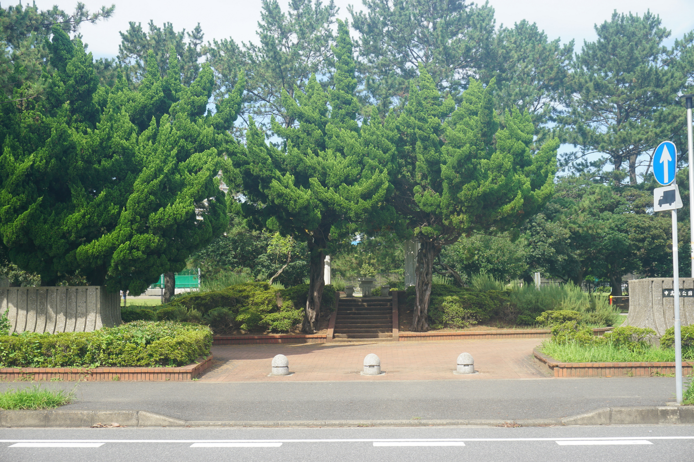

# 霓虹15日游游记 (八)

### 7月19日 千叶圣地巡礼 2020.4.18

作为一个《春物》的死忠粉，我对于渡航笔下所描写的主角们活跃的舞台——千叶，自然是充满了好奇之心。作为东京都市圈的一部分，千叶县距离东京并不远，有电车可以直达，因此在规划旅行的最初期，我就把千叶巡礼加进了行程。尽管作为一个独自旅行的单身狗，千叶最著名的景点——东京迪士尼乐园实在是不适合我去，但能够在千叶的街巷走走转转，看看小说动漫里出现的场景，体会体会千叶稻毛海岸的风光，也是相当不错的。因此，今天整个白天的时光都将在千叶度过。

——话是这么说，但今天早上实在是起不来。镰仓之行尽管比不上暴走京都，但也着实走了相当多的路，冒雨返回的时候时间也不早了，晚饭也拖到了快晚上八点才回来，等返回了酒店真的是累的不行。感谢酒店的浴缸，让我能够好好地放松一下身心，然后睡个好觉——我离开霓虹的时候最舍不得的就是这个几乎在霓虹家家都有的浴缸了😂

总之，当我爬起来准备出门的时候，时间已经来到了早上快十点了，早饭也变成了早中饭。按惯例在便利店解决早餐，轻车熟路地步行前往浅草站乘坐银座线到上野转日比谷线，接着八丁堀换成JR京叶线前往千叶。

东京都和千叶之间有三条线路：JR总武线，JR京叶线以及隶属京城电铁的本线—千叶线。它们的共同特点是：不能使用东京地铁券（笑）。其实三条线路大体是平行的状态，尤其是总武线和京成电铁，在千叶县内的部分距离的非常近。造成这种现象的原因自然是霓虹的电铁私有化，各个公司都想来分一杯羹，同时，在霓虹，开发电铁便会拥有电铁沿线的房产的开发权，这又进一步鼓励了电铁公司来开发线路，而代价就是像前面说的那样的线路冗余。不过对于我这种游客来说，冗余倒不是问题，最大的问题在于站点变得非常混乱。。。具体到千叶这里，则表现为：我所要前往的稻毛海岸地区，有总武线的稻毛站，京成电铁的京成稻毛站，以及京叶线的稻毛海岸站。。这里三条线路相距还比较远，还没有太大的问题，顶多可以根据景点安排来选择合适的路线，等到了千叶市中心这里，千叶站和京城千叶站简直就是靠在一起，对于我这样的外地游客，想必会造成不小的困扰。

我所前往的稻毛浅间神社其实距离京成稻毛站最近，但因为一开始想去看一眼稻毛海岸站前的萨莉亚，所以定了去稻毛海岸。结果因为已经在京都吃过萨莉亚，对于霓虹萨莉亚的口味不是特别满意，同时从稻毛海岸站出来发现自己出的是北口，而去萨莉亚所在的南口要绕上一大圈，实在是不想再麻烦，便直接步行前往稻毛浅间神社。

从稻毛海岸站步行至浅间神社需要大约20min。今天的天气意外地好，尽管没有晴空万里，但相对于之前没完没了的阴雨天气，这样能看见蓝天的天气已经是好的不行了。而好天气带来的负面影响就是热。。之前走个二三十分钟都是洒洒水的，但在阳光带来的湿热下，就显得有点难熬了，偏偏路边还没有什么树荫，我还很愚蠢地穿着防水的鞋子，带着一把伞。。

稻毛浅间神社并不是一个很有名气的神社，wikipedia上仅有日文页面，中文搜索搜到的顶多也就是在介绍千叶景点的时候提到一下，因此我只好搬出翻译老师，来勉强理解wikipedia的内容。

稻毛浅间神社的历史始于公元808，由富士山本宫浅间大社请至千叶。1187年曾以富士山的心事建造（？这里的翻译其实我看不太懂。。），1964年9月曾因部门火灾被焚毁，1966年重建，即为现在的样貌。按照大老师的说法，这里周围曾经是一片海洋。wikipedia上着重介绍了浅间神社的神乐与附近的松树林，前者于1962年被指定为县指定非物质民俗文化遗产，后者则于1960年指定为城市指定自然古迹，被规划为稻毛公园。浅间神社的鸟居正对着宽阔的日本14号国道，但因为并不是著名的景点，又不是节假日时期，尽管道路宽敞，往来的车辆并不多，加上周围树木环绕，整个神社显得相当地幽静。话说小说里小町在评价浅间神社的时候说的是“那个常常在办祭典的神社”（第十卷第一章），好像与给我的印象不太吻合啊www

浅间神社的主要场所建在院内的一处土丘上，穿过入口处的鸟居，再走过一道山门，便能看到净手处和一左一右两道台阶。按照传统礼仪洗净了手，拾阶而上，眼前是一个挺开阔的平台，左侧是浅间神社的神乐表演的小舞台（？），右侧是游客购买纪念品、绘马，抽签以及画御朱印的地方，而正中间就是浅间神社的本殿了。

小说里，大老师和小町来浅间神社做新年参拜，并在这里碰到了雪乃和团子。新年时分这里作为一个还是挺大的神社，游人自然是络绎不绝（也引得大老师吐槽），但我来的这个工作日+中午的组合时间段，几乎看不到其他游客，只有几个巫女在柜台前售卖纪念品。

纪念品我是肯定不会买的，但参拜许愿可以有，毕竟是大老师战斗过的地方（笑）。许什么愿好呢？就简单许愿自己买的东西回国时候可以顺利过关吧233

番剧里对于浅间神社这段剧情的描绘只是一带而过，重点放在了后续大老师和雪乃坐电车回家的部分。除了本殿这里，浅间神社周边上镜的另一个场景是位于浅间神社后方的手水社。浅间神社从其北面和南面都可以进入，而这间手水社位于北面的入口。动画里在这个场景大老师一行四人准备返程，而团子接到了三浦的电话便离开去找三浦和海老名。京成稻毛站位于浅间神社北面，这段剧情安排在这个位置也挺合理的。

既然和动画里一样选择从北面出来，去看一眼距离不远的京成稻毛车站也就是顺理成章了。从浅间神社到京成稻毛站之间都是窄窄的小路，一路上相当地安静，连过往得车辆都很少。这么说来，好像每每到了我压马路的时候，都是走在这样安静的小路上，一个是我很少沿着大路徒步，一个是我徒步的时间往往都在清晨，中午或者晚上，还有就是会在这样的原本就相当宁静的小城镇里。我还是相当喜欢这种一个人走在小路上的感觉的，不会因为空旷而显得寂寞，同时自得其乐得意忘形的时候也不会因为周围有陌生人而感到羞耻。不愧是诞生了大老师的城市，简直就是为孤独者量身定做的氛围。

然而这样的氛围持续了没多久就被打破了。在一处十字路口突然出现了两个警察。可能是由于在美帝读书的时候碰到警察都没什么好事，我看到霓虹的警察的时候也会有莫名的慌张：我是不是穿着一眼就像是异邦人然后被警察盯上？我是不是这样压马路违反了交通规则？路上别人丢弃的牛奶盒子我是不是应该捡起来，以防警察认为我乱丢垃圾？胡思乱想中，和警察擦肩而过。当然，两个警察聊的正欢，完全没有在意我。

京成稻毛站也是一个建在路口的小车站，车站的入口边就是铁路道口。春物动漫里，大老师雪乃和小町在这里准备坐车回去，小町借口回去买平安符跑路，给大老师和雪乃创造独处的机会，而大老师并没有意识到小町的用心良苦，使得小町忍不住骂大老师，顺带扩充了一波雪之下小姐的骂人词库。

在这里乘坐京成电铁可以很方便地返回，但并不能前往我要去的下一个景点，所以我自然是不会在这里乘坐电车的了。时间来到了下午一点，我本以为车站周围总归能找到点饭馆啥的，没想到失算了：这附近大多都是居民区。好在从道口过去不远有一家7-Eleven，加上我早饭吃得晚，也不是很饿，在这里凑合一下也不失为一种选择。饭团+炸鸡+可乐，吃得也是相当愉快。什么？你说饮食健康？这能当饭吃吗？emm好像确实能当饭吃。。

吃饱喝足，在车站前拍了上面的照片，接着前往下一个地点：千叶市美滨图书馆。从这里走回去要步行将近半个小时，实在是有点遭不住。咨询了Google Map后，我决定前往不远处的海浜公園入口行（此处为霓虹汉字。。）乘坐高浜缐。

霓虹的公共交通尽管有多家企业竞争，很多地方甚至还会有地方性的私营交通，但JR东日本的西瓜卡和JR西日本的ICOCA卡基本都是可以用的。公交车在小城里绕来绕去，不一会儿便回到了稻毛海岸站前，似乎这里也是终点站，大家都在这儿下了车。沿着之前相反的方向，步行两三分钟，动漫里那个令人印象深刻的牌子便出现在了街的左侧——千叶市美滨图书馆，动漫和小说里这里还是千叶市市民活动中心的所在，不知道现实生活中是不是这样。侍奉部一行（尤其是大老师）和一色与搓螺旋丸的玉绳会长领衔的海滨综合高中学生会一行在这里度过了令人难忘的时光（笑），之后的情人节活动也在这里举办。

美滨图书馆的斜对面是一色每次开会前买零食的便利店，也是让大老师在雪乃和团子面前也能十分自然地主动从一色手里接过购物袋的万恶之源。不过现实生活中，万恶之源已经消失不见了，取而代之的是千叶信用金库，不过依稀还是能看出曾经的样子。

由于没有查到美滨图书馆是否对外开放，以及没有找到传说中的市民活动中心，在图书馆门口拍好了照片后，我接着前往下一处景点。从美滨图书馆往西南走很小一段路，是千叶市立高滨中学，这里可以看到暑假参加社团活动的学生正在球场里打棒球，在这样太阳高照的日子里练习想必也是相当辛苦的吧，操场上奔跑的孩子们大多都是皮肤黝黑，这是他们努力挥洒汗水训练的证明。霓虹的社团活动带来了学生的全面发展，但学生在假期也要花费相当长的时间在活动上，这带来了时间和金钱的开销，对学生和家庭来说也是不小的负担；而在一个好的社团混出点什么带来的可能就是学校内的地位，混不好的很可能就会脱离学生团体，遭遇校园霸凌（比如大老师），因此参加社团对学生变成了变相的强制活动。所谓有得必有失吧，在有些人获得了快乐的同时，一定也会有人因此而受伤。这样的社团制度值得我们羡慕和学习吗？我这样想着，一边继续向前。

沿着中学旁的小路走一小段，就到达了下一处名场景：中高滨公园（中高浜公園）了。这是一个树木环绕的街心公园，因为靠近学校的一侧建有一个棒球场，这使得公园还有些面积。棒球场的背后有亭子和椅子，也有一些秋千之类的娱乐设施。我找了张椅子坐下歇息，稍稍逃避一下午后强烈的阳光。

中高滨公园的南边隔了一条街就是稻毛高中的北门，同时春物里，这条路也是大老师放学回家时的必经之路，因此这附近也发生了不少剧情。在动漫登场的镜头，则出自s2ep04后半部分，放学后团子和大老师一起回家，在公园门口跟大老师下定决心要参选学生会长，击败雪乃以维系住侍奉部的存在。

从公园出来过到街对面，就到达了春物立总武高中的原型——千叶市立稻毛高等学校。我做攻略查资料的时候有看到人在论坛里说他夏天来的时候发现稻毛高中的校门例行维护，完全看不出样貌，因而我来之前还有些担心——想想我之前碰到了多少建筑在例行维护。。不过当我真的到了地方便完全放心了：动漫里以及小说里对学校的还原度真的相当之高。

学校自然是没有机会进去的了，幸好没有什么人路过，不然我在门口徘徊这么久，怕不是要被当成可疑份子。从校门口离开继续往西南方向走，就能逐渐闻到咸腥的味道，大老师口中的总武高限定的午后特殊海风从海面吹来，带来些许凉意——个锤子，并没有什么海风吹拂，只有午后灼热的阳光无情地打在我身上。不过总武高临近大海却是事实，从这里向西南方向一个街区，就是稻毛海滨公园，也是春物第一部片尾曲的取景地。美丽的稻毛海滩是日本最初的人造海滩，晴朗的时候可以远眺整个东京湾，而今天正式这样一个难得的晴好天气。

稻毛海滨公园是一个相当大的公园，从稻毛高往海边走的路旁还容纳了一个多用途球场，不少小孩子正在球场上踢球。这不禁让我有些羡慕嫉妒恨：国内的球场实在是太少了，真希望能够多建一点，就算收费也好啊。

然而当我满怀期待地奔向海滩时，却发现整个沙滩都被一道铁丝栅栏隔开了。原来倒霉的我又碰上了稻毛海滩维护，看告示要维护到10月份。我不禁低头看了看脚上的徒步鞋：为了在海滩上漫步而不用脱鞋而特意穿的徒步鞋显得格外地愚蠢。。

漫步稻毛海滩是没有机会了，但欣赏东京湾还是可以的。从这里前往下一个景点，需要我徒步20分钟，而徒步的路线，就是要一路沿着海岸，穿过海滨公园，转上沿海大道海浜大通り。

海滨公园内不怎么能看到大海，但大片的草坪和草坪上开着的不知名的夏花倒是看了个够。等走出公园的范围，在一处由于施工围挡而变得很窄的小路上，我偶遇了一位骑着单车的老大爷，大爷见我走来冲我微笑颔首，我赶忙露出一个略显仓促的微笑回礼——虽然我已经在霓虹度过了十几个日子，对这种陌生人间的打招呼还是有些不习惯，但又觉得还是显得霓虹人民相当地热情，尤其是在这样的小城镇或者乡下的大爷阿姨。

从公园里出来，再经过一处水闸，海岸方向的视野就变得相当开阔了。虽然从沙滩变成了混凝土的防波堤，但海岸的景色还是一如既往。天气尽管不是万里无云的晴朗，远处的海面上也蒙着一层朦胧的雾气，但透过它还是能依稀看见东京湾两边的种种建筑——千叶正好位于东京湾中间的一段，因此海湾两边的景象都能看到。

沿着海浜大通り一路向前，便可以到达我的下一个目的地：美滨大桥（美浜大橋）。美滨大桥坐落在花见川入海口处，由于花见川并不是什么大江大河，美滨大桥便也并不是什么很雄伟壮观的桥梁。之所以来这里，自然也是因为春物的圣地巡礼。小说里，大老师由于和学生会主席选举事件和雪乃团子产生了隔阂，决定独自一人帮助一色和海滨高中一同举办圣诞晚会，但因为种种原因最终无计可施的时候，平冢先生驾车带着大老师来到美滨大桥谈心，促使大老师和雪乃团子坦白实情，最终解开心结。在动画里，马拉松大会时大老师询问叶山志愿时所在的折返点也被设在了这里，同时第二季op里阳子小姐出场的那一cut的背景也是这里。

从稻毛海岸走到美滨大桥还是着实走了不少路的，要再走到最近的电车车站还需要花20~30分钟，此时的我着实有些不愿意再走了，便决定在附近的打濑中学校站乘坐公交车前往海滨幕张站。话说google map的街景真的是个好东西，尤其是在我找这些完全不知名的乘车站点或者步行路线的时候。

其实距离美滨大桥最近的车站是检见川滨站，但我实在是想去见一见大老师口中有着很多公司、常常作为英雄片的外景地点的海滨幕张——其实是因为时间已晚，原本想去的千叶车站有些来不及去，只好去海滨幕张聊以慰藉而已。

海滨幕张目前是霓虹国内最大规模的复合型城市，在我看来是作为东京都的卫星城般的存在，用来承担一部分城市功能。这里有Outlets这样的大型购物场所，国际展示场这样的举办国际会议或展览的场地，诸多星级酒店遍布其中，也靠近港口和成田国际机场。同时，海滨幕张据说是以“都会中的花园”这一概念来规划建设的，在我找到的不少游记或介绍里，都说这里的城市规划得很漂亮。如果喜欢都市，那这里应该还是挺值得一逛的。但对我来说，海滨幕张给我留下的仅仅是车站前的匆匆一瞥，实在是时间有限。

在海滨幕张乘坐京叶线返程的路上，我又不得不考虑起那个令人头大的问题：晚饭吃什么。往往中饭我都是在景点周围随意凑合凑合，但晚饭总还是需要思考一下，虽然以我的预算吃不了多好，但吃的舒心总是有必要的。尽管浅草站周围还是挺繁华的，但看看那些店铺的价位，三个$实在是有些承受不起。思前想后，还不如去秋叶原解决算了，反正顺路，还能看看秋叶原的夜景，以及再去漫画店搞点事情：尽管有风险，特产这种东西总还是带不够的呀括弧笑。

前往秋叶原需要在八丁堀换乘日比谷线，而日比谷线的秋叶原车站在靠近神田平河町这一带。因为要找吃的所以我出站口选的比较随意，结果不小心走到了和向秋叶原广播会馆方向相反的出口。正当我找路的时候，街边一家名为CoCo Ichibanya的咖喱店引起了我的注意——虽然不是石头门0里桶子和他夫人吃的那家Go Go Curry，但用咖喱作为晚餐，好像还挺不错。抱着试一试的心态，我走进店里，在点餐机前思索片刻，选择了猪排咖喱+烤肠的组合。就结果而言，真的是意外的惊喜——这家咖喱稍微带点甜口的口味极其对我的胃口，而猪排和烤肠的口味也挺不错，八九百日元的价格也在可以接受的范围之内。查了一下这家似乎也是连锁店。我随即宣布以后再来霓虹的话这家店也被纳入我的“解决吃饭高性价比名单”内了，从此牛肉盖饭，咖喱饭和拉面将组成我的霓虹吃饭“三剑客”阵容——不过之后似乎没有机会吃到了呢，毕竟不是松屋或者sukiya那样烂大街的店。。。

吃饱喝足了之后，接下来自然要再探漫画店了。前两天我在网上查到，虎之穴在秋叶原似乎有ABC三个不同的店铺，相聚都很近，而我第一次去的是A店，那么这次自然是要去其他的店铺逛逛了。但当我走进B店的时候，总觉得这里哪里有些不对劲。逛了一会儿我意识到，异样似乎来源于这里的顾客：怎么总感觉女多男少呢？当我坐电梯往上才发现，虎之穴B店里贩卖的同人志，是以女性向为主的。望着满墙的美男子海报，我只好露出一个尴尬而不失礼貌的微笑，默默地掉头退回电梯里。

又仔细查了一下，C店似乎是以周边和玩具为主的商铺，以漫画为目标的我还是又默默地回到了隔壁的虎之穴A店——毕竟相比其他店铺，这里的漫画还是更多更全。

再一次将虎之穴A店逛了一遍后，我的包里又多了几本用黑色塑料袋包裹的漫画书。希望上天保佑我不要因为我的一时贪心，在过海关的时候卡我吧。嗯，最后两天要是再碰到神社，在那边许个愿吧。

虎之穴的营业时间持续到晚上9点半左右，而等我买完东西，时间也来到了晚上9点，而此时的秋叶原依然是人来人往。夜幕下的秋叶原在诸多灯光的照射下，竟一点也不比白天黯淡。算了下时间，明天将是我在东京的最后一晚，这么多景点里，自然是秋叶原最是让我念念不忘。嘛，明天上午还有点时间，让我最后再来一次秋叶原吧。我心中暗想着，定下了明天上午的行程。

从秋叶原返回酒店已经是轻车熟路，因此不再细表。这里像多说一句的是，浅草站通往浅草寺的那个我每次都会走的没有空调的出口处，有几家令我印象挺深的店铺，一个是无论我多晚回来都还在营业的烧烤店，还有一个则是卖二手碟片的。其实我一直很想看看这里出了正常向的旧碟片以外有没有什么非正常向的东西。。。

回到宾馆已经是10点多了，不过明日的行程可以说是我整个霓虹之旅中最为宽松的一天了，上午计划也就是在秋叶原转转，因此，还是要泡一个热水澡舒缓一下身心，为今天的旅程画上一个热气腾腾的句号。

2020年5月17日，我终于得以把这一日的行程写完尽管比预期要晚了太多太多，但我至少还是把这一章写完了。千叶之行的内容多为圣地巡礼，因此从字数上来说少了很多，不过图片却一点都不少。能坚持把这篇游记继续写下去对我这样一个懒人来说真的是挺不容易的。眼看着距离霓虹之行已经快一年了，我的游记却还没有写完，实在是有点。。。但过去了这么久，旅行中的一幕幕现在回想起来却依然是那么鲜明，可见这次旅行在我心中的分量。所以，加油吧~

### 7月20日 足立花火 2020.5.17

提到霓虹的夏季，脑海中瞬间蹦出的无非就是这几个元素：浴衣，祭典，以及烟花大会。各种作品中描写到霓虹之夏的时候，往往都会有男女主角身着浴衣，在路边摊购物、嬉戏，在漫天的焰火下收获感情上的升华看。这样的场景想象一下都会觉得无比美好，因此早在我规划旅行的最开始阶段，就开始考虑能否将烟花大会加进自己的行程中来。不巧的是，霓虹各地的烟花大会其实大多都是从8月份开始陆续举办，一直延续到快10月份，而我的入职体检安排在了7月底，实在是难以把旅行安排到8月。纠结之中，“第40回足立の花火”几个字引入了我的眼帘。7月20日，东京都足立区，在7月份举行的零星的几个花火大会中，唯有这个时间相符，同时也不会很影响行程规划。也就是为了迁就这场花火大会，我才安排了关西入关东出这样的行程，同时无法同时前往箱根和镰仓。

足立区位于东京都西北侧，蜿蜒的荒川河的一支自西北向东南穿过足立区，而花火大会就将举行在河川之上。足立花火的举办地距离我所居住的浅草地区虽然仍有相当的距离，但也已经是东京都地区最为便利的花火大会之一了，人气也是相当之高，因此需要提前占位子。好一点的方法是在周围的居民楼或宾馆短租一室，可供三五个友人作为无人打扰的特别席位，但这样的方法对于独行侠的我还是有些难以实施，因此只好用最原始的方法——早早前往河川，然后“画地为牢”。花火大会在晚上7点半举行，而我的计划是在吃过中饭之后就前往会场，届时所需要的地垫、食物、水等在附近的便利店购买。我也提前为我的相机的两块电池、手机、Kindle以及充电宝充满了电，足够支持从中午到半夜的使用。但做了这么充足的规划之后，当我出门之时我依然心中有些慌：近日连绵不绝的阴雨，不会让这唯一的烟花大会泡汤吧？前些日子我也在路过的神社为之祈祷过，希望今天一切能够顺利。

如之前所说，今天大部分的时间都将在荒川河边度过，原本剩下的备选景点，诸如皇居，东京塔之类，要么是相对比较远，怕耽误了时间，要么就是纯粹不太感兴趣，还不如在秋叶原在随意逛逛，交通还方便。因此上午的行程就很随意了，也不用很早起床。当我到达秋叶原的时候，时间已接近11点。

因为起的晚，早饭基本没怎么吃，所以到达秋叶原的第一件事就是找个地方吃早中饭。而地点我也早已决定好了——之前没能去成的、桶子和阿万音由季约会的Go Go Curry。

Go Go Curry似乎在秋叶原也是挺有名气的店，占据了十字路口一侧相当黄金的一处店面，巨大的猩猩logo非常的显眼（为什么是猩猩？）。虽然是时间才刚过11点，店里已经有不少食客了。我在吧台座坐下，点了一份猪排咖喱。菜上的非常快，感觉好像我刚点完单咖喱就上来了，然而首先从卖相上就不如昨天晚上的CoCo Ichibanya，口味上虽然不难吃，但还是不像CoCo Ichibanya那样那么对我胃口，然后配的卷心菜丝我略微有点接受不能，唯有分量是胜出的，尤其是我接受不能的卷心菜丝。。。总的来说给个及格分。

吃饭的时候我就在想，在秋叶原还有哪些地方没有去逛过，随即便想到了一家神奇的店。在秋叶原无线电会馆背面有一个6层楼高的奇妙店铺，绿色的LOGO也是相当的显眼：Pop Life Department M's。至于这是什么样的店铺嘛。。。看了它广告上的代言人，想必部分童鞋就已经明白了。而其中的产品嘛。。。真的是令人大开眼见，不仅有各种用具，甚至还有各种play用的服装道具，在负一楼还有影片出售，总之种类之多，只有你想不到，没有你看不到。然而明明是这样的店铺，店里的顾客却大多一副习以为常的样子，还有不少女生在店里闲逛，购买物品。我甚至看见一个女生在店里大刺刺地给她男票打电话问需要买什么。。。

从店里出来，时间也不早了，终将还是要和秋叶原告别的。想想这一趟来来回回在秋叶原转了三四次，做了圣地巡礼，去了女仆咖啡厅，买了漫画，买了手办，预定的行程完成之余，还有不少意外的收获，真的是不虚此行。我还会回来的！做出了这样反派式的宣言之后，我坐上了前往足立区的电车。

按我找到的攻略来看，足立花火会场所在的荒川河段南岸大片面积会被设为贵宾席，因此前往北岸找位置会是更加明智的选择。我所规划的路线是坐日比谷线直达位于荒川河北岸的梅岛车站，再步行约20min到达会场。日比谷线在到达北千住站后，列车会继续向前，化身东武晴空树线，这也是霓虹电车的传统艺能：换线不换车。这样做的目的是因为电车各段的运营方不同吗？具体原因我也不是很清楚，但这样神奇的操作必然有它的意义。

从梅岛站下来，第一件事自然是去购买地垫、水和食物。从车站出来就能看见街对面的Lawson Store 100便利店，这似乎是罗森的一种变种？水和食物很好解决，我自备一杯白水之余，还购买了宝矿力×1，麦茶×1，前者是为了求老仙保佑不要下雨，后者则是希望无尽麦茶之力可以将可能的雨水吸走——当然这都是笑话。吃的话则用饭团和三明治来解决。但找来找去，最重要的地垫实在不知道在哪，主要是这货的包装实在是没什么特殊性，容易和什么餐布呀雨衣呀搞混，而它的日文究竟是啥我也是搞不明白，只好去问店员，然而地垫用英文怎么说才准确呢？翻译老师似乎也给出不了准确答案，而操着蹩脚英语的霓虹店员就更难理解我的意思了。。幸好手语是世界共通的，经过一番指手画脚，店员总算明白的我的意图，唯一略显尴尬的是，地垫最小的型号也是2-4人的尺寸，我用起来会不会有点嫌大。。

从梅岛车站前往荒川河边只需要沿着车站前的旧日光街道一路向前。虽然才下午两点，路上已经有一些背着包、提着吃的的行人，显然他们也是在前往烟花大会会场。我一边走着，一边心里盘算着到烟花大会开始前的时间如何打发，虽然我带了充电宝和kindle，但就在河岸上坐一下午还是有点无聊。正想着，道路左手边出现了一个小小的购物中心，地方不大，但似乎五脏俱全，扫了眼广告牌，百货、服装、饮食似乎都有，甚至还有书店和音像店。成了，等小说看腻了就来这儿逛逛。

沿着旧日光街道一路向前，远远地就能看到道路尽头的高架桥和背后高高的河堤。穿过高架桥下的马路，登上河堤，花火大会会场边一览无余了。荒川河河滩比我预想的宽阔不少，尽管如此，河边上以及正对着对岸贵宾席的地方已经铺满了垫子。。看来我还是小看了霓虹群众对烟花大会的热情，只得找一个稍稍有点偏离中心的位置，铺下自己的地垫。

天空一直有点阴阴的，还时不时飘点零星小雨。好在雨一直没有下大，而且花火大会的官方网站也一直显示今日活动按时举行，这让我稍稍定了定心。不过反过来想，这样的天气也避免了我在等待的时候接受夏日阳光的洗礼，也算是一件好事。我正坐在垫子上看书，旁边来了两个男生，看上去年纪和我相仿，也是过来先占位子。我一开始还没怎么在意，等他们垫子铺得差不多了，突然发现他们好像在说中文。嗯？这都能碰到国人得吗？我忍不住和他们搭上了话，具体内容我现在已经记不真切了，但我还能记得和我交谈得那个小哥并不是国人，应该是东南亚那边过来玩得华裔，也是冲着烟花大会特意挑了这个时间来东京。他们似乎之后还有几个朋友要来，正在纠结自己的垫子是不是到时候不够坐。我说实在不行可以坐我这儿，反正我就一个人，随后被婉拒了==不过也是好事，我正好感觉现在的位置好像还有点偏，想趁着还有空位再往中心位置挪一点，便和他们到了个别，又往中心处挪了十米左右。

我坐在河滩上玩玩手机看看小说，时间久了着实有点无聊，有些坐不住了。虽说霓虹人平均素质很高，不至于出现有人趁别人不在强占别人提前占的位置，但我还是有些担心。眼看时间还早，趁着还没太多人来，河滩上还有不少位置，我决定出去溜达一圈，把贵重物品随身背好，用三脚架、水和吃的把地垫压住——虽然地垫有塑料钉固定了四个角，但因为我是一个人用2-4人大小的垫子，没好意思把垫子铺开，所以不压着还是怕被风吹跑——并用马克笔在垫子上写下自己的名字以示主权。

先前看到的小购物中心意外地无聊：音像店和书店里的东西都不多，也没有我喜欢的漫画或者动漫BD，更不用说18x的东西了。。服装店百货店什么的也没啥好逛的，剩下的就只有餐厅，但又不到饭点，因此前前后后逛了半个多钟头，我就动了返程的念头。唯一值得称赞的是厕所——又大又干净，还是智能马桶盖，正好供我解决一波内急😂

返程的路上，人明显多了起来，还多了不少小吃摊。路过的烤鱿鱼摊实在是太香，我也忍不住买了两串，拿在手里边走边吃。看着走在我前面穿着浴衣拿着烤串的小情侣，我不禁感叹，有那味儿了，只可惜我太穷舍不得租浴衣，也没有妹子，虽然我一路上玩过来自得其乐，但真的到了这个时候，也会想要是有个妹子一起来会不会更好什么的……

回到河滩上，时间来到了下午的4点40，距离大会开始还有将近三个小时，但河滩上的人已经相当多了。不少人的装备真的是相当精良：有长枪短炮、专业设备那样的精良，也有带着折叠凳、手推车甚至是折叠桌子那样的精良。而来的人们上到头发花白的老人，下到还坐在婴儿车里的娃娃都有见到，看来烟花大会在霓虹真的相当受欢迎。而这些人之中最惹眼的还是各种情侣，因为往往都是情侣会选择穿浴衣。

说到情侣，我就不得不说我选的这个位置真的好！当我出去溜达一圈回来的时候就发现，我前方、左边、右边和左后方各有一对情侣，唯有右后方是一个妹子一个人静静地坐在那里玩手机。我还庆幸自己还没有被情侣包围，然而临近烟花大会开始的时候来了一个小哥坐在了妹子旁边——原来那个妹子为了她男朋友提前了三个小时过来占位子。。要是下围棋的话我应该已经被吃掉了吧。。

如何在大型集会时解决如厕一直是一个老大难问题，之前看郭杰瑞讲时代广场跨年的时候就有提到，大量的人流导致一旦进入会场就很难再出去，而时代广场内又没有公共厕所，导致几个小时甚至十几个小时里，如厕只能依靠纸尿裤甚至是塑料瓶来解决。不过，霓虹的烟花大会主办方悉心准备了大量的临时厕所，还区分了男女卫生间。在美国上羚羊峡谷旅行的时候就见过这种塑料的临时厕所，当时厕所里惨不忍睹的景象还是给我留下了相当深刻的印象。。因此去上厕所之前我还有点莫名的紧张，然而这里的厕所居然相当干净，而且几乎没有异味。不过女厕所的排队问题还是没有解决，尽管女厕的数量比男厕多不少。。

随着开幕时间的临近，天色开始渐渐变暗，会场也变得热闹非凡，人潮涌动，就连我身边仅剩的一点点地方也被匆匆赶来的老奶奶占领。广播开始用中日韩英多种语言播报一些与大会相关的内容，如大会举行期间不要随意走动，结束后请遵循工作人员安排离场等等。我也趁着这个时间赶紧调整自己的相机——尽管并没有什么技术可言，但做做样子还是能给自己带来点心理安慰和满足的233

终于，伴随着广播里的“米娜桑，空吧哇”，以及突然开始舞动的灯光，喧闹的会场逐渐安静了下来，人们的注意力也被集中到了河面上，我期待已久的烟花大会终于拉开了序幕。

伴随着音乐而来的第一束花火在河川上方绽开，全场人的热情也随之被点燃。令我没想到的是，足立花火大会是以烟花+音乐的方式呈现的，不知道这是现在烟花大会的常规操作，还是足立花火的特色？

烟花的规模并没有像国内的大型活动上的烟花表演那么大，但胜在氛围和持久。接连不断的花火和音乐的节奏相辉映，营造出的梦幻般的氛围，确实是约会和告白的好场所，也难怪各种作品——尤其是恋爱向作品——对花火大会的描写不遗余力。

令我意外的是，现场真的放了《打上花火》，而伴随着音乐，之前我看到的那两个奇怪的吊车开始发挥了作用——两根吊臂间原来拴着用来放烟花的绳子，而金色的花火从那之间泻下，如同瀑布一般。可惜无论是我的手机摄像，还是相机拍照，都没法完全记录下当时的场景。

我本以为经过了六本木大厦拍夜景之后，再拍烟花应该效果会好很多，结果发现完全不是这么回事。。曝光时间、光圈大小都需要自己调整，而没有快门线又导致没有办法手操曝光时间——一直按住快门很容易导致相机抖动。因此虽然我拍了大量的照片，真的能拿出来看的寥寥无几。。

不过再怎么样，一个多小时的烟花“狂轰乱炸”还是相当过瘾的，持续不断的烟花带来了视觉和听觉的冲击，在我的鼓膜和视网膜上留下的冲击甚至在表演间隙乃至表演结束时候还久久不能消散。

终于，烟花大会在盛大的黄金雨之中迎来了尾声，伴随着主持人宣布大会结束，人群中响起了热烈的掌声。虽然这烟花大会还是比我想象中的要平和一些——毕竟没有国内大型晚会那么大的规模——但还是足够精彩，这一个下午的等待还是值得的。都说没有烟花大会的霓虹之夏是不完整的，那经过了这一晚，属于我的霓虹之夏是不是已经完整了呢？

接下来则是大型活动的传统艺能——观众退场了。坐在河滩上的时候我还没有觉得人有这么多，等到了散场的时候才发现，人已经多得走不动路了。由于河堤下到马路的出口在会场的这一段只有两头才有，而其中的一头正对着去往电车车站的路，因此几乎所有的观众都要从这一头的出口离开，而外场和内场的人群会从两个不同的方向汇聚到这里，因而就在这里阻塞了。不过主办方显然很有经验，早早的有工作人员开始疏导人群，让观众分批离开；观众们也大多都预计到了这样的情况，都是一脸轻松地排队等待。只有不懂事的孩子开始闹腾，不过我身前的这位家长还是相当有素质，迅速地安抚了孩子——真希望平时公交上那些孩子的家长们向他学学，地铁上的熊孩子真的是吵得可以。。

霓虹四处很难看到垃圾桶，因此这种大型集会的一个传统就是自带垃圾袋。不过在河堤下到公路的路口处，显然是主办方预设了垃圾收集处——堆满了垃圾袋，我自然也是愉快地把垃圾袋丢在了这里。

当我走到之前的小购物中心的时候，老天终于撑不住，开始下起了雨来，而且越下越大——感谢老天撑到现在，让烟花大会能够顺利进行。时间来到了晚上9点，说实话我在这个时间还是有点对秋叶原念念不忘，想找个地方看看能不能买漫画啥的，因为明天要ban去的地方是村的不行，必然没有这样的店。然而我也知道秋叶原大多店铺在9点半就关门大吉了，不死心的我只好逛了逛梅岛车站楼下的小书店，自然是没有acgn相关的东西。。到了这个时候，我才终于想起，在我的霓虹之夏因为烟花大会变得圆满的时候，我的霓虹之行也接近了尾声，心中一下感觉有些空荡荡的，不是滋味。或许是因为这趟旅程太过梦幻，一旦结束了旅程，我便要仿佛要从梦中醒来一般重新面对现实。旅途终究会结束，现实终究是逃不掉的，尽管有些悲从中来，但我能做的还是收拾心情，去享受我在霓虹最后的时光。

乘车返程以及回去为明天的行程做准备就不再细说了，我的烟花大会之旅在此划上了句号，而我的东京之行也即将结束，明天我将离开住了6个晚上的浅草WBF酒店，启程前往最后的目的地：茨城县大洗町。以这样一个绝大多数人都不曾听说过的意外之地作为我这趟也是足够令人意外的单人霓虹之行的结尾，实在是再好不过了。想到这里，返程途中的那一丝悲伤渐渐被我抛在脑后，我开始期待明天的行程，脸上不由得泛起了一丝笑意。

吼吼，倒数第二的章节在今天（2020/06/21晚11时30分）终于画上了句号，实在是可喜可贺，终于能够赶在霓虹之旅一周年之际把这篇拖了如此之久的游记写完了。还有最后一章，冲呀！