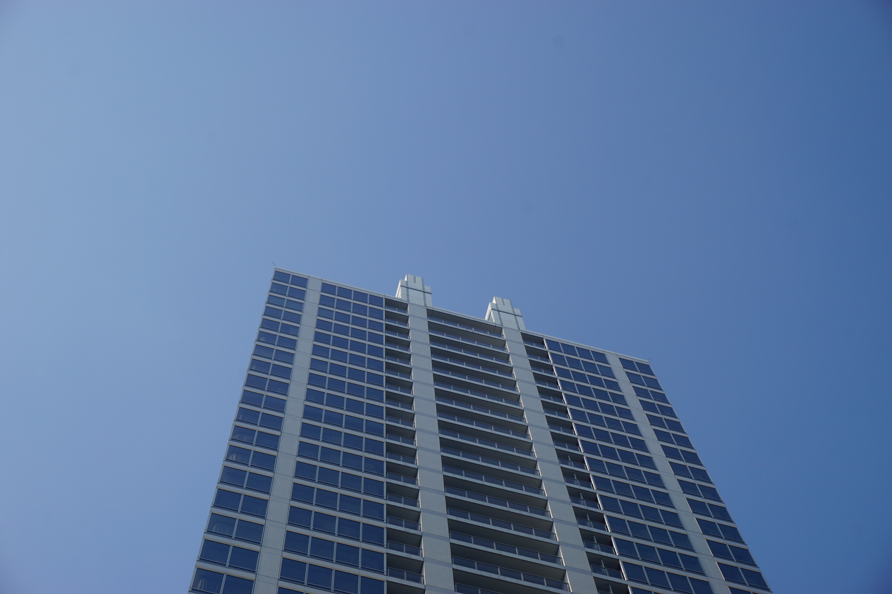
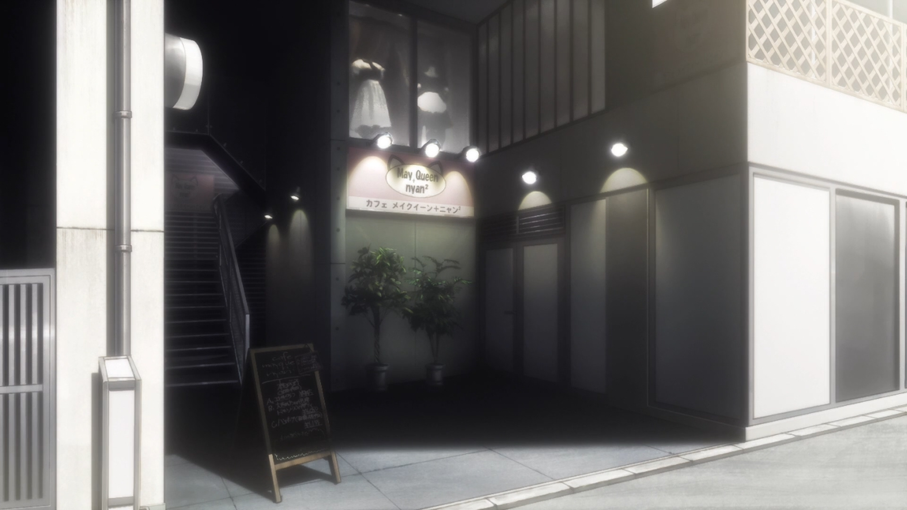
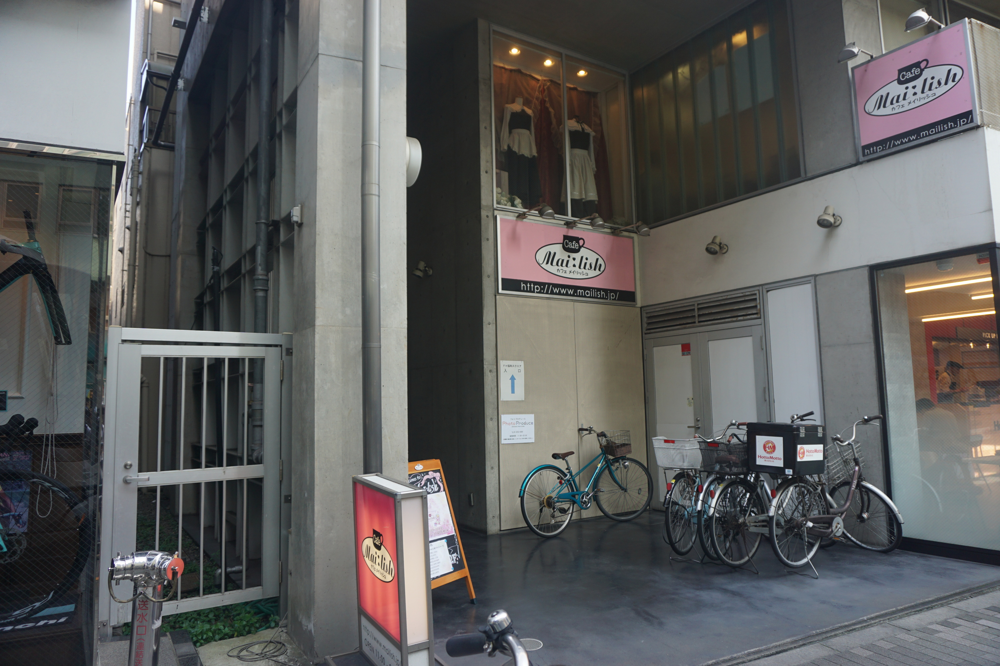
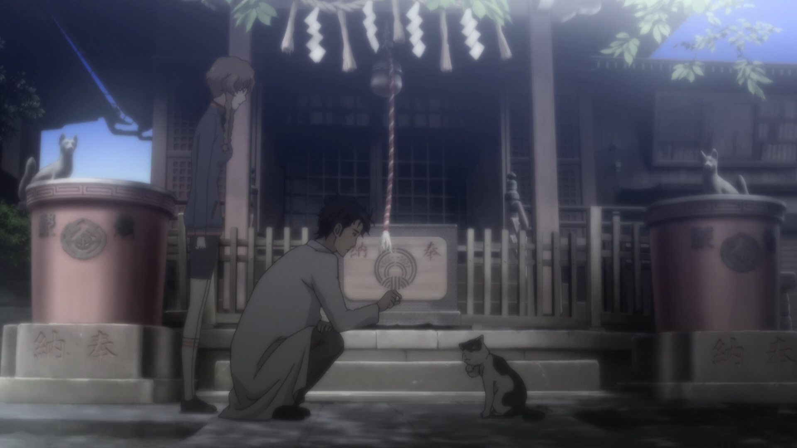

# 霓虹15日游游记 (六)

### 7月17日  东京 秋叶原历险记 2019.11.24

秋叶原，对于普通游客是电器街、数码产品购物点，而对于ACGN圈人来说，则是更加特别存在——这应该是二次元世界里最为著名的御宅之街了。而今天的安排，就是一整天耗在秋叶原，一是在这里转转店，体验一下御宅圣地的气息，顺便看看能不能买点什么，二则是《命运石之门》的圣地巡礼。

经过了昨日的歇息，今天又重新回到了早起出门的节奏——此乃谎言，因为这个男人9点中才不慌不忙地下楼吃早饭，他知道稍微早点出门只会碰上东京早高峰，要六七点钟出门才行，然而那样他起不来。例行去便利店买了咖啡和热食——今天的早饭是鸡肉串，吃的很开心。接着便穿过浅草寺，搭乘银座线到上野，转日比谷线前往秋叶原。之前从品川转车来浅草的时候，也是在秋叶原换乘的日比谷线，因此也不是第一次到秋叶原了，但上次只是匆匆一瞥，而这次才是真正的秋叶原之旅。之前也提到过，日比谷线的出站口位于相对比较里面的地方，出来的地点并不像JR线一样正对着标志性的UDX会馆，但总感觉从这里开始才是秋叶原的入口，因此我还是绕到了UDX天桥这里。

虽然已经快十点了，整个秋叶原依然仿佛刚刚苏醒过来的样子，来往的行人并不是很多，估计也是因为工作日，而且过了上班时间，而游人的高峰期还没有到来——想必大部分组团旅游的来这里也就是看看电器，走马观花，真的来秋叶原逛街的，也就只有我这样的自由行阿宅了。

在UDX会馆二层平台找下去的路的时候（没错我就是这么蠢，找不到路了。。），发现了一家贴着Friends贴画的店，貌似是卖动漫周边的，不过我到的时候并没有开门。

从UDX二层下来往前走，我在路边的自动售货机里发现了Dr.Pepper。嗯，这一定是命运石之门的选择呢！作为石头门粉，同时又在美帝喜欢上了Dr.Pepper味道的我自然是不会错过的。话说我在狗东买的Dr.Pepper今天到了(19/11/27)，这个味道真的令人舒心。

UDX下来的路并不是秋叶原的主干道，站在这里其实并不会感觉有什么不同，但沿着它往前走到十字路口，景象立马变得不同了起来——动漫/游戏广告随处可见，各式各样的店铺让人目不暇接，时不时还能看到身着“奇装异服”的人们，甚至还能见到招揽顾客的妹抖——简直就是天堂好吗！因为来之前并没有做过攻略，只是知道几个著名店铺的大名，等真的到了地方，竟有些茫然，不知道该从何逛起，略微思索一下，这里果然还是要先从秋叶原无线电会馆开始呢。

秋叶原无线电会馆堪称秋叶原的地标，也是石头门里“人造卫星”降落的地方，不过由于原建筑不符合抗震标准，已经于2011年8月拆除重建，并于2014年重新开张。不同于石头门里相对比较冷清的感觉，现在的无线电会馆是一座大型商城，里面有大量的ACGN相关店铺，会馆顶部则用作办公，据说B站日本总部就在里面，不过我知道这个已经是回来之后的事了。

然而在进会馆之前，我发现周围有一家店排起了长队，店面上还放着小圆的广告。我看了半天没有弄明白这店到底是干啥的，稍微用英语问了下工作人员，果然无法交流。。随后我发现几个欧美老哥也在排队——嗯，虽然还是英语但是至少能交流了，我便问他们这是在排啥，结果他们也笑了，说我们也是看到都在排队觉得很奇怪就排了。。。我心说那那那我就排排看呗，反正也不会掉块肉的说，便排进了队伍里。霓虹的这种正式的排队都会有工作人员举着牌子示意队尾，而且常常不会像国内那样走之字，而是排成一列一列的，然后按先后顺序一列列放人。我看了下时间，目测是10点开门，果然不一会儿就开始逐渐放人了，没花多久就进了店里，随后我就傻眼了，原来这是个柏青哥店，外面的小圆广告是在宣传联动的新机型。。。早就听说霓虹人很喜欢空闲时间打柏青哥，果然名不虚传。。店里似乎不允许拍照，我稍微掏出手机没拍两张就被店员警告了，又没有什么玩柏青哥的兴致，也不会玩，只好默默离开了。

从柏青哥店出来，迎面就是著名的GAMERS——就是《幸运星》里此方经常去的店，我不由得先把无线电会馆放在了一边，先走进了GAMERS。店里低一点的楼层主要在卖音乐CD和轻小说，高一些的楼层则是动漫BD和游戏。我稍微看了下价钱，BD是真心贵。。买不起，而其他相对便宜的小说啊什么的又苦于读不懂霓虹语舍不得买。。。哎感觉真的需要找时间自修一下霓虹语啊。。。

店里主推的大多都是当季热门作品，而其中《流汗吧！健身少女》的宣传展板被放在了最显眼的地方，那个猛男教练实在是太魔性了😂。。

尽管不准备买东西，店里还是有值得一看的东西的，比如这里有大量的著名声优的签名，真的不愧是名店。

从店里出来，发现好像是水树奈奈除了新单曲，要来秋叶原搞活动，GAMER这里似乎也要办相关活动，正在摆摊，难道是签售吗？话说水树奈奈应该算是声优里在演艺圈成就最高的人之一了吧，而且也是演艺圈的常青树。

接下来的一站依然不失无线电会馆（是你自己说第一站要从无线电会馆开始的啊喂！），而是GAMERS旁边的一个小巷里的一家卡店。作为一个多年的游戏王玩家（虽然从来都没有玩过实卡，太贵了。。。），我对于这种国内很少见的卡店文化相当感兴趣——这里会提供卡片的出售、交易、收购以及对战场地，甚至会举办比赛。我进的这家卡店整个一层都是游戏王卡，大量的各类卡片陈列在玻璃展柜里，并明码标价提供出售。略微扫一眼就能看到不少熟悉的卡片——有旋风，死苏，强脱这样的泛用卡，闪刀，骚灵，雷龙这样的环境主流卡，当然也有像凭依着装、熏风这样卡图好看的收藏用卡。自从link发售开始，主打link的卡组逐渐成为了环境的主流，因此卡店里大面积的展柜都被染成了浅蓝色。这里为因为新规则而被大幅削弱的同调和超量默哀一秒钟。。

我一开始是有心买几张正版卡带回去收藏的，但是想收藏的卡片，像青眼白龙啊，三幻神啊这种中古卡片很稀有，而新卡的泛用卡大多又很贵，便宜的卡不买一个系列又感觉没什么意义。比较想买的闪刀系列、淘气仙星系列不愧为主流，价格是真的贵。。最想买的已经被禁的防火龙竟然很难看到，后面在其他卡店看到的时候感觉价格也不菲，所以最后还是作罢了。。

卡店每层并不算大，但足足有七层之多。除了第一层的游戏王和第七层的桌游室之外，还能看到各种各样的卡牌：手游相关的，端游相关的，动漫相关的，轻小说相关的，当然还有像万智牌这样的独立桌游，种类繁多真的令人难以想象。想想我们小时候，能接触到的有对战价值的卡片只有游戏王和宝可梦，然后到了高中，说到桌游基本就是三国杀，而现在说到桌游基本就是狼人杀，其他的卡牌游戏基本看不到。。。国内很少有这样的卡片，一个当然也是因为这些卡片商没有进入中国市场，没有发行正版卡片（这里当然有盗版卡猖獗的原因，没错就是zz少年馆。。），还有一个也是国内大部分的孩子也没有这样的经济条件——卡片真的挺贵的。现在国内有卡店的，只有北上广和成都这样的经济发达和区域中心城市，卡片游戏在国内的发展还是主要在网游、手游上，实体卡片在国内的发展还有相当长的路要走。

无线电会馆旁有一家大型电器卖场。秋叶原在萌文化崛起之前，一直是以电器街著称——直到现在，普通游客来秋叶原大多也都是以购物为目的。卖场的负一楼售卖的是相机及其周边，我为了后面的烟花大会，很想买一根快门线，便下楼去问了一下，然而我的相机的快门线这里只有原装配件，价格实在是负担不起。。

在众多的插曲之后（插曲也太多了。。），终于轮到了秋叶原无线电会馆的回合了。就像之前说的，无线电会馆其实就是一个大型的二次元周边商场，从手办，到卡牌，到漫画，到周边，各种商品可谓应有尽有。如果我没记错的话，一楼进去左手边是一家罗森，而右手边则是一家卡店，二楼出售了一些模玩以及电子产品，三楼则有著名的K-BOOKS，出售模玩、周边、同人志售卖，也经营大量二手交易，四楼则有一家大型二手手办商店，五楼则有一家相当大的卡店——虽然应该是没有之前的那家大啦。。以上这些是我主要逛的店铺，其他还有一些中小型卡店、模玩店、偶像周边点（就是AKB48那种的），以及在5楼还是6楼有一家卖娃娃的店，就是那种可以换装的人偶，虽然挺好看的，但总觉得有点瘆人。。

在一楼顶头这里我看到了一个石头门0联动款的自动售卖机，不过这个时候我刚刚喝完Dr.Pepper，所以并没有买的念头。稍微查了一下，这个联动款的售卖机在秋叶原好像一共有6个，但估计我是没有机会全部找到了。。

大体上我是先一路走马观花地转到楼顶，途中物色了一些想买的东西，随后再从顶楼往下一路逛下来。不过在第一趟的途中，那家二手手办店实在是相当地吸引人——因为他就是把二手手办直接陈列在展示柜里标价出售，都是脱盒的，仿佛一个大型手办展，这种看到了怎么走的动路嘛！我自认为尽管实际看过的番不算太多，但对于大部分有一定名气的作品都有大致的了解，看到这么多各式各样的手办，自然是如同报菜名一般开始认角色😂边上碰见不少国人，不少很明显看来看去也就认识认识什么桐老爷啊，蕾姆啊，Saber啊，小埋啊这种这几年大热作品里的人物，或者是海贼火影龙珠这种长篇少年漫里的角色，稍微冷门一点的就不认识了，哎这年头居然都没人认识团长了吗？看过K-ON的人这么少吗？逢坂大河都不认得？猎人里的小杰都不知道吗？少战都没听说过？我一边叹气，又一边不禁露出了动漫婆罗门的笑容。

虽然是二手店，但还是有相当多的精品手办的，比如格式的fate手办，约战手办，初音手办，都是相当大件，也相当精美，一看就是大厂出品，保存的也十分完好，当然相应的价格也是以万日元计算的。。。我估摸了一下，一方面是怕手办弄坏肯定不舍得托运，所以不好买太多或者太大回去——毕竟我行李不少而且还坐的春秋航空，另一方面就是囊中羞涩预算有限，我能买的也就是小一点的或者景品了。。加上之前在K-BOOKS逛的时候已经有看中的东西了，所以在这里就先不出手了吧，好钢还是要用到刀刃上嘛~

在楼上的卡店里，我碰到了两位国人在看游戏王卡，明显其中一个相对了解一点而另外一个只是陪着过来的，不过很明显那个相对了解一点的也停留在早期同调的版本，正带着他的朋有在这里找什么死者苏生啊，大岚啊啥的还说这些都是强力卡禁卡啥的，听了他的话我实在忍不住搭了话，说这些现在正式比赛里大多都是可以用的，就算被禁了也有功能类似的替代品，同调已经落寞了，大师规则四现在是link的天下吧啦吧啦——估计是太久没有人能聊这些话题，我像是打开了话匣子，开始给他们科普一些比较基础的目前游戏王主流环境、规则、主流卡组以及一些我知道的游戏王这些年的环境变迁史。不过再怎么说我已经是长期处于退坑状态，之前link普及之后还一度想找人一起打网战，但并没有人陪我。。（这里真的要感谢下圆神以及其他不知道名字的、无偿维护ygopro这个开源项目的大佬们，是这些用爱发电的人们让我们这些没有实力买正版卡组的人们体验到原汁原味的游戏王对战）因此现在除了偶尔从关注的几个B站游戏王up那里了解了解现在的环境啊卡表啊什么的，主流卡组的构筑和特点基本都不知道啦。。哎，真的是无论什么游戏，只要是有社交元素的，只要周围没有人一起玩，真的就只会慢慢从生活中淡出。想想初高中班上大批人被我和二达拖着打牌的场景，现在是再也没有机会再现了。哎，想想家里那些舍不得扔掉的盗版卡，那些都是我逝去的青春啊！

在下楼去买漫画和手办之前，我稍微玩了几个扭蛋机。几乎每一层在靠楼梯的附近都有一排扭蛋机，我原来是挺期待能不能看到乌帕什么的，结果自然是没有了。。之前在关西的时候，就经常能看到什么关西哪里哪里的吉祥物系列啊，什么关西限定玩偶啊的扭蛋，还有之前看到的“狸”的玩偶，话说真的会有人想买那个吗。。。这里也不例外有一些奇怪的系列，不过毕竟还是秋叶原，二次元相关的还是居多的，比如钢弹的，各种偶像企划的，当然少不了我挺喜欢的“偶像大尸”——Zombie Land Saga的。看来看去比较熟悉也比较喜欢的就只有我们的偶像大尸了，价格我记得是300日元？结果一发出了不说话的传说中的山田妙，二发出了特工队长二阶堂咲，我想要的Sakura酱爱酱和纯子都没有出。。犹豫了一下还是停手了，万一再给我来个什么莉莉啊夕雾啊啥的我估计就遭不住了。。。不过这并不代表我不喜欢这其他几个角色哇！FRAN CHOU CHOU 赛高！

接下来就是去K-BOOKS了。如果我记得没错的话，K-BOOKS几乎占据了整整一层，一片是漫画、同人志、小说之类的书籍区，一边是周边、唱片等的零售商品区，还有一片则出售新旧手办，并有专门负责手办收购的区域。因为书籍区在下楼楼梯一侧，所以我理所当然地先去了书籍区。此时大热的自然是辉夜大小姐和五等分，不过就我的感觉，无论是漫画还是动画，辉夜的素质都要比五等分高出一个档次，但就宣发和人气来说，反而是五等分更胜一筹。。这就是炒股的魅力吗😂

对于一个霓虹语几乎一窍不通的人（emm出发之前尝试背了一下五十音图，结果自然是妥妥地忘光了。。。）来说，原版漫画和轻小说目前真的也就只有收藏价值了。。并不是那么地吸引我，但书籍区这一片还是很有吸引力，而吸引人的自然是那些有点颜色的东西。。其实讲道理，18x这种东西其实很正常，只是我们成长的文化环境让我们在接触/谈论这些的时候会比较羞涩。一般18x的区域都会有个帘子挡起来，上面或者地上写着18x的标志，提醒未成年人不要入内。说实话当我第一次看到这个的时候，还是会心里咯噔一下，咽一下口水，并明显感觉脸上开始发烫体温开始升高的，伸手去拨开帘子进去的时候总有一种在打开潘多拉的盒子的感觉。。。其实之前在GAMERS就有看到，那里的18x区域只有一小块，没有K-BOOKS这里这么大，尽管如此，那时候我依然心里有一种想看又不想看、略微有些罪恶感的感觉，进去稍微转了一圈就默默地出来了，但这一次我是做好了心理准备，要在这里好好逛一逛，看看有没有什么熟悉的东西——讲道理都这么大了，我想绝大多数同龄人都应该会看过几本本子、认识几个老师的吧😂

这里说明一下，18x的地方都是明文禁止拍照的，虽然我看到有些游人掏出手机来偷拍，我自己也挺想拍的😂不过作为一个有素质的绅士（hentai），我还是忍住了——这种场景就看看好啦，以后有机会还可以再来嘛www

相对于手办，印刷品的价格真的是相当亲民了，而且纸质真的是相当的好——好多两百多页的单行本厚度都和我手边四百多页的TOEFL红宝书差不多厚了，价格也就是大几百到千元。但买本子嘛，自然是。。。我心中自然是相当纠结的，想买又心有担忧。在进行了一番心理斗争，并在贴吧查阅了一些经验之后，我还是毅然决然地决定，要买一点土特产当纪念品回去收藏，以便研究霓虹文化——什么武田x光老师，水x敬老师，我才不认识呢！

在挑选了两本单行本准备去付款的时候，我的心里还是略微有些慌的：我在担心这里的收营员会以一种怎样的姿态来面对绅士们，还有就是会不会需要我提供年龄证明？如果发现我不是霓虹人会不会有什么影响？同时其实内心还是有些羞涩的，总觉得平时大家都在私下里看的东西，在这里却放到了公众场合来。。我能感到我的脸还在微微发烫。不过真的到了收银台，我发现我是多虑了。收营员和便利店里没有什么不同，正常扫码，结算，还贴心地用黑色塑料袋把书装好，再用胶带封好口——一开始我以为是因为是本子所以才这么做了，不过后来我买正常漫画的时候发现好像都是这么操作的——然后收钱找零阿里嘎多，表现出了作为一个收营员的职业素养，不由让我感叹霓虹人的服务精神，以及感慨同人本这样的文化尽管在霓虹也不是能拿的上台面的东西，但至少也是很正常的事情。

接下来的行程则是今天逛街的重头戏——买手办了，而这其中一个要买的则是早在我上楼闲逛的时候就预定好要买的了。之前走到K-BOOKS这一层的时候，我一眼就看到了这个手办，稍微看了眼价格就毫不犹豫地把ta列入了本次的必买清单里，而ta现在就立在我的桌上：

尽管从价位来看，这个手办是个景品（当然这也是我毫不犹豫的原因之一：便宜），而且不是我比较喜欢的原版着装，是和舰娘联动的，还是二手手办（不过有注明二手未拆封），我依然是毫不犹豫地买下了，因为这可是我最喜欢的作品之一《幸运星》里我最喜欢的角色小镜大人~《幸运星》作为一部十几年前的作品，却依然是我所看过的最好的日常萌系作品之一，而且相比于其他日常系作品，它玩了大量宅文化相关的梗——这里要感谢字幕组的辛勤考证和努力科普，这让这部作品的观赏性更上一层楼——故事也更贴近生活，尽管是十几年前的故事却仍然能让观众感叹啊“这个事情我也做过”、“这样是我了”。而小镜则是我第二喜欢的傲娇系角色——仅次于助手，也是我认为最有常识、在实际生活中也能被接受的傲娇系角色之一——当然助手也很好。有了这么多理由，怎么能不买呢？之前上楼的时候其实还有些小担心会不会等我下来的时候ta就被人买走了，幸好回来的时候ta还在，说明ta真的是和我有缘呀。

另外说一句，这里联动的是舰娘里的加贺，小镜胸前的牌子、脚边的装饰都是加贺的。话说之前我以为这里是有玩声优梗之类的梗，结果现在查了下发现，镜的罗马音是Kagami而加贺是Kaga。。嘛，反正玩梗也是幸运星的特色之一啦。

从我的预算和可以携带回去的空间来看，我可以再买个千把块钱的东西，而这稍微让我有些犯难了，本来我很想买个少战角色的油库里风的玩偶，但一个是没看到合适的——想买统帅的但统帅的只有很小的，看看其他角色又感觉毛绒玩具还不如手办。。然后看到了少战的海报，很想买张挂家里，但又觉得性价比好低。。至于文件夹这种，感觉又没有观赏性又没有太多的实用价值。。最后看到几个少战的轻粘土二头身人偶，感觉又稍稍超了点预算。。哎，我就是一旦没有足够让我必买的理由的时候买东西就会特别的犹豫。。。最后还是下定决心，买了一个3000块的军神粘土人偶。哎想想毕竟这种二手手办，基本也应该不会再版了，回国之后能买到的几率也很小了，多花点钱就多花点吧。

待我把秋叶原无线会馆逛了个大概，购物也购得差不多了的时候，已经快下午一点半了，尽管还没逛够，辘辘饥肠警告我必须要先去吃个中饭。啊。。又到了蛋疼的找饭馆时间，这周围有没有食其家或者松屋啊。。实在不行就去一下石头门里面那家牛肉盖饭的原型店吃好了。。正当我这么想着，突然发现了街角有一家女仆咖啡厅。emmm这也是御宅文化的一大组成部分呀，虽然我对女仆并不是十分感冒（可能我还是偏腼腆了一点）但过了这个村可就没了这个店了啊。

这家女仆咖啡厅名为Maidreamin，似乎还是个连锁店？具体位置在无线电会馆西北方向街对面的一栋楼里面，要做电梯上去。等电梯的时候来了一对白人夫妻，看上去年纪不算小了，因为用英文交流，忍不住搭了两句话——他们貌似并不是宅，不过也听说过女仆咖啡厅，所以过来体验文化的www

店的装饰整体以白色为主，缀以淡粉色淡蓝色的装饰和家具，一股子少女气息扑面而来。一进门就有女仆打招呼，称呼客人为“Master”，这个称呼让我有点意外，我原来以为会是“ご主人様”（Goshujinsama），不过查了下Master也有主人的意思，就是会比较让人出戏——我可没有令咒和Servant，怎么就成了Master了？

虽然妹抖龙里面小林女士狠狠地批判了现在的妹抖咖啡厅里的妹抖装扮不符合真正妹抖的标准，但现实中的妹抖咖啡厅里的妹抖还是穿得像托尔那样，毕竟阿宅他吃这一套呀。我被招呼着经过一道门走进了店里，店里不算很大，不过在东京这样寸土寸金的地方也应该不算小了。除了客人的坐席以外，店的顶头还有一个小舞台，看样子是给妹抖们表演节目的。待我坐定，不一会儿就有妹抖前来向我说明这里的规矩：首先是猫耳和狗耳头饰得选一个戴上。。。emmmm不得不说这样略有些羞耻，不过既然是规矩我还是照做了；接着就是这里的费用了，500块一小时的入场费，然后必须至少点一个小套餐。说实话价格挺贵的，我点了应该是最基础的套餐，一份蛋包饭一杯冰拿铁，总共算下来也要3000日元。令我意外的是，一进来大概是领班的妹抖（pad长？）问了我从哪里来，随即居然派了一个会中文的妹抖，而英文就更不在话下了，我来的时候店里除了之前的白人夫妇，还有一批印度小哥，自然都是英文服务了。想不到在这么一个小小的女仆咖啡馆工作还有会外语的要求，服务业真的是越来越难了呀。

从颜值上来说，说句实话这里的妹抖大多长得一般般。。但女仆装+卖萌还是能让人感觉这些妹抖依然是“萌”这一元素的化身。店里客人并不多，除了之前的印度组、白人夫妻组之外，还有一组国人夫妻，四个国人阿宅小哥，一个单人来玩的霓虹妹子，以及坐在店两侧最远处吧台座的两个大叔。emm感觉那两个大叔好像待在这儿很久了，应该是霓虹老宅吧。。在我在这里待的半个多小时里，有妹抖在台上唱歌跳舞，有妹抖和大家一起做游戏，抽奖（霓虹妹子好像抽了一个大奖），吃的东西上来的时候还要和妹抖一起念奇怪的卖萌咒语，像“Moe Moe Kyun❤”这种，必然是少不了的啦。总的来说，虽然很羞耻，但还是很萌很好玩的。

当然槽点也有，而且我是真的不得不吐。首先，这个餐上的实在是太慢了。。。之前我也说过，我是饿着肚子来的，然而我坐下来快20分钟，居然只给我上了一杯冰咖啡。。如果我记得没错的话咖啡还有助于燃烧脂肪的。。咖啡下肚之后我感觉就更饿了😂我还记得我在这里掏出手机和大表哥聊天，跟他疯狂吐槽。。最后当我饿的不行了的时候，我的蛋包饭终于上来了，然而。。。并不好吃。。。。酱的味道有点太重了，吃一两口还行，吃多了感觉有点恶心。。。平时我其实就不怎么喜欢浪费粮食，在女仆咖啡店里就更不好意思浪费了，所以还是硬着头皮吃完了。。。这个中滋味嘛。。总之不是太好。。

结束的时候，客人可以和一位女仆合影留念，我最后和服务的妹抖合了影——尽管她长得不算好看，但她服务的很不错，还和我聊了一会儿天，聊得也蛮开心的，想想和她合影也是尊重和感谢她的努力了吧。最后走的时候还会送一个小礼物，我记得有应援用的小巴掌还是荧光棒，有徽章，还有猫耳狗耳的头饰，我想了一下选了猫耳头饰，因为我觉得这个东西是我到商店里永远不会去买的。。所以带这个回去以后看到了应该就能立马回想起来这次的经历😂

虽然吃的不咋地，但也还算是吃饱了，在妹抖咖啡厅玩的也挺开心的，算是休整完毕。接下来的行程则是本次霓虹行里三大圣地巡礼之3——秋叶原石头门圣地巡礼了。

石头门圣地巡礼应该是我功课做得最多的巡礼，也是计划之中会最为辛苦的巡礼，因为其大部分巡礼地点都在秋叶原附件，而具体地址不是那么清晰，而且只能步行到达。加上地点又多又杂，还有一两个考证不明确的地点，总之我知道将会是一场较为辛苦的旅途。

巡礼的第一站还是要从UDX会馆的天桥这里开始，尽管早上已经来过了，还是要来这里拍个照。从天桥迎面就是UDX那标志性的大屏幕，而台阶上回望即可看到JR秋叶原站。这处台阶在石头门里多次出现，打工战士在这里告诉了凶真自己来这里是要寻找父亲，助手在这里鼓励了凶真，这里也是本篇和剧场版里胸针和助手告别的地方。我也带了小卡片想去拍照，但无奈效果实在是太差，这里还是放实景和番剧里的场景对比一下好了。。。

接着是UDX会馆的大屏幕，这里图也上了不少了，就不多赘述了。沿着之前来秋叶原时候走的路走到十字路口处，这里应该就是凶真第一次跳世界线，周围人群都突然消失的地方。这里其实我有带画片，但是差距实在是有点大。。我为了拍照还来回过了好几次十字路口，感觉好愚蠢，而且效果还很差。。。

接着是石头门0游戏里桐子和他老婆约会地方，咖喱店Go Go Curry，据说这一家在秋叶原这片还挺有名气的，不过相比之下还是女仆咖啡店比较重要=。=

接下来要找的是Rounder存放IBN5100的投币式储物柜。这个地点在我找的攻略上写的十分不清楚。。大致是在沿着UDX会馆走向秋叶原主干道的路附近的一条小路一路往前，在左手边的一条小巷子里。现在想想应该用Google Map留一个定位的。。。

在找储物柜的半路上发现了这张略带喜感的“广告”，尽管我看不懂霓虹语，但其中汉字所透露的只言片语和图片还是透露出里面玩了不少少战的梗。。比如红茶梗，博科熊梗，学生会长的奇妙奖赏梗之类的，作为少战粉感觉很有意思。哎要是能看一场少战4DMAX电影就好了！可是霓虹语是一个障碍，时间则是另一个更大的障碍。。。

搜寻了半天+走了些冤枉路之后，我终于找到了传说中的投币式储物柜。据说这个柜子原本因为某些原因被业主拆除了，但后来又不知道为啥复原了，边上的自动售货机也还原了。总之还能看到这个柜子真是太好了。IBN5100肯定是没有的，我也犯不着撬柜子去检查www

从这里开始我用了大量这个博主文章里的图，同时我巡礼的时候也参考了很多这篇文章里的内容。感谢博主为我们这些后辈们指点迷途🙏附传送门：https://card.weibo.com/article/m/show/id/2309404025942434527045

接着跟着攻略来到的是DAIBIRU。这个地点其实我在玩游戏的时候完全没有注意到。。。大致是从UDX这一侧往对面的大楼看的场景。

接下来是室外咖啡厅。这个我依稀记得动漫里好像也有出现，不过在动漫里找不到了。。

接下来是菲利斯的家，是一座高层公寓，现实里叫做Times Tower。

唔呣，的确就像攻略里说的，虽然还原度很高但没什么意思。。而且想拍出角度来很难。还有一个蛋疼的事情是，我发现不知道从什么时候开始，我的相机镜头上面就脏了，估计是哪天下雨镜头沾上了污水，但相机的小屏幕看不出来，导致后面很多图都有污点。。对比度低的问题不大，一旦光线好一点，对比度高一点，就不行了。。。这张图因为背景是蓝天我用仿制图章修了一下，不知道后面的图好不好修复。。。

接下来要找的是未来道具研究所——大桧山大楼的原型，因为实际并没有这一个建筑，网上对于lab的位置也众说纷纭。我就偷懒用了这个博主给的地址：

现式中这里是两座三层的小楼，楼顶有阳台——这一点倒是和lab一模一样。下面右侧楼门牌上写着小桧山大楼，至于是游戏用了借用了这里的名字，还是这里致敬了游戏，就不得而知了。

"Lab"所在的这种城中区域感觉在霓虹挺常见的，多是这样窄窄的小楼，总让我感觉挺有趣的，因为国内真的很难见到这么窄却又有好几层的小楼，就让我很想知道里面究竟是什么样。

在"Lab"附近我又找到了一个石头门0联动的自动售货机。Lab这一片应该算是远离了秋叶原的喧嚣地区，周围感觉多是小公司办事处或者事务所，行人和车辆都非常少，这里还能看到石头门联动的售货机，感觉要找齐全部的6个还是挺困难的。

想想后面可能就见不到联动款售货机了，便随手在这里买了瓶石头门联动款饮料。本来心说如果这个瓶子质量不错的话还能带回去留个纪念，结果这个瓶子不像之前的柯南款汽水或者京都版可乐那样是金属罐，感觉一下子就没什么收藏价值了，稍微有点小失望。我打开瓶盖喝了一口，嗯？怎么一点味道都没有，难道是我的味觉出了问题？又喝了一口才意识到这个联动款饮料居然只是矿泉水？本来我以为至少是个宝矿力那样的运动饮料，还想着走了这么多路，也该补充点糖分了，结果给我来了瓶白水。。。

唔呣刚才（2019/12/15)看到一个帖子https://www.bilibili.com/read/cv462123 ，关于Lab的位置有不同的说法。。。emm我感觉这个比较靠谱，毕竟二楼还改成了SG周边店。。。

接下来则是重要场景：女仆咖啡厅May+Queen Nyan2。正如攻略里说的，这个位置距离lab并不远，说实话这个攻略里安排的路线还是比较科学的。现实中，这里是一家名为Cafe Mai:lish的女仆咖啡厅，我查到的资料写着这里不仅仅是普通的女仆咖啡厅，还以提供高质量的甜品闻名。不过这个资料是2010年左右的了，现在是如何我并不清楚，而且这次我来的时候没有想过要进去坐坐。。现在想想是不是有点遗憾呢？emm好像也还好。。。。

就像攻略里说的，这里的人行道真的很窄。。我为了拍这张照片甚至站到了马路上，还被路过的大叔用奇怪的眼光看了一眼。。。不过还好这时候路上没什么车。突然想起来当年参加学校夏令营去澳村的时候，也是因为几个同学没注意压马路的时候走在了行车道上，结果被一个白人老太太骂了==

接下来的几处场景，除了牛肉盖饭店以外其实我的印象都不怎么深了，纯粹是因为都在附近，便跟着攻略走马观花地看了一下。其实一开始我有想过来这家牛肉盖饭店尝一下，不过临时起意去了女仆咖啡厅。。。。

接下来沿着秋叶原大道一路往南，就是万世桥了，这里也是助手给凶真打电话以及和凶真把IBN5100搬回Lab的时候发（da）生（qing）争（ma）执（qiao）的地方。

其实在万世桥附近有用历史悠久的神田万世桥火车站改成很有特色的商业街，不过当时我的注意力都在巡礼上。。以后可以来看看。

接下来要去的是琉华子的家——柳林神社的原型之一——秋叶原柳森神社。之所以说是之一，是因为实际上琉华子家的名称和地点以及部分场景来源于柳森神社，而主要建筑则来源于位于上野的秋叶神社。从地点上来看，神社距离Lab并不算远，这里到秋叶原车站的距离也不算远，因此石头门里神社的地点设定还是相当严谨的。不过，现实中的柳森神社仅仅是一个很小的神社，想想也是，如果在秋叶原这样的闹市区能有琉华子家那么大的一座神社，应该还是会有些名气的吧？

从柳森神社出来右转走几步，就可以看到一座横跨神田川的人行天桥。从桥上回头就能看到柳森神社的牌子，可想而知这里与柳森神社是有多近。而在18话凶真和琉华子（女）约会的时候，就是在这里等琉华子的，这不是就在别人家门口了嘛==

在这里拍照其实还挺尴尬的——这里来往的行人其实相当多，而人行道又很窄，要想拍的好一点又得等一个人稍微少一点的时机，所以我在这里拿着相机鬼转就显得很显眼也很古怪，感觉若不是知道这里和石头门的关系，别人看来这个人就很莫名其妙：为什么在这里鬼鬼祟祟地拿着相机，拍一个完全不是景点的地方？

转完了柳森神社这一片，时间就已经不早了，来到了下午5点半左右。因为来了柳森神社，总感觉不去下秋叶神社心里有些不甘，不过秋叶神社的具体位置我还是有些迷茫，因为当时我没有找到有去秋叶神社的攻略，只能跟着名字在Google Map上寻找，但是直接搜出来的总感觉不是那么回事==差距有点大。嘛，反正在新御徒町站出来几步路的地方，回去的时候也是顺路，去一趟就去一趟吧，我心里这么想着，决定把秋叶神社作为今天的最后一站。

在返回车站的途中，我顺路又找到了另一个游戏中出现的场景，著名电器商店友都八喜。讲道理我完全记不得游戏里啥时候出现了这个场景。。。不过来了就顺路拍一下吧。位置相当好找，就在UDX前的那个车站旁边。

接着就是坐日比谷线去往新御徒町了。说实话离开秋叶原的时候还是相当不舍的，自己喜欢的东西总是逛不够的，感觉也能稍微理解女人爱逛街商场看衣服的行为了，不过这么看女人是有多喜欢衣服啊？真的有到我喜欢动漫这种程度吗。。。

从秋叶原到新御徒町虽然要转一次车，但也就是几站路的事情，所以挺快就到达了。秋叶神社距离车站相当的近，从出站口出来，沿着大路走一小段，再拐进边上的小巷子，再走一小段路就能看到，不过当我按照地图到地方了之后我就傻眼了。。果然印证了之前的隐忧，完全不是这个地方。。这里所谓的秋叶神社是个只有一点点大的迷你神社，除了门口一个塞钱箱，后面一个很小的神殿就没了。。我到的时候还住在旁边有个老太太，到神社里查看了一下，似乎正准备关门。。。

很不幸这里我最后因为找错了很气，结果忘了留照片。。这里只好用Google Map截图凑合一下。。想想我也是够傻的，这个图怎么看怎么不像是柳林神社的原型，结果我还不信邪地跑过来了一趟。

然而去了错误的秋叶神社并没有让我就自嘲一番然后回酒店，反倒是让我觉得连这种地方都来了，不找到真正作为原型的秋叶神社实在是让人有些不甘心。功夫不负有心人，经过一番搜索之后，我通过在Google Map里搜索日文汉字也就是繁体字的“秋葉神社”，可以搜到在距离这里2km不到的地方，有一个“akiba shrine"，而它的页面上显示的似乎就是我要找的秋叶神社：

2公里说远不远，说近其实也不近。我毕竟走了一天的路，尤其是下午为了巡礼徒步了相当久，现在其实已经有些疲惫了，说实话不是很想走这段路。不过很不巧的是，这个秋叶神社周围并没有很近的车站，要坐车去还不如走过去方便。没办法，为了填补心中的不甘，为了满足自己的小任性，这2公里还是得走哇。

终于在6点左右，我到达了找寻许久的秋叶神社。这座神社隐藏在楼宇之间，在外面的主干道上只能看到一座石制的鸟居，神社门前是石子铺成的道路，并没有像样的水泥路或者石板路，这一点还比不上柳森神社，让我心里又有些害怕是不是又找错了地方，但当我转过弯来看到神社的全貌的时候，我便按下了心，确定自己来对了地方。

这座作为原型的秋叶神社其实也没有多大，较游戏和番剧里表现得柳林神社还是要小了一号，不过还是要比柳森神社大一圈的。尽管小了一些，但从外型上来看毫无疑问就是我要找的秋叶神社——门口的石狮子真的是一模一样。

由于门口的路比较窄，实在是没法拍出和动漫游戏同样的角度，所以准备的卡片自然是效果很差了。。但拍出来的照片还是能看出来相当地像的。当然狮子是真的很还原了。既然好不容易来了，还是要参拜一下许个愿的，至于愿望嘛，就许愿自己过海关的时候买的本子不要被扣吧😂

从秋叶神社回酒店的路途也相当尴尬。这里离酒店大概是一点几公里的行程，又是说远不远说近不近，然后最近的电车车站又是相当的远，而坐公交我又不是很放心。。没办法，只好继续徒步回去了。不过半路上还是可以找到乐子的，真不愧是我——在路边的自动售货机里，我惊喜地发现了之前在关西一直没有看到过、关东这边也没怎么注意到过的MAX COFFEE，也就是大老师最爱的M罐。果然就和之前看的攻略上一样，M罐基本只在关东地区销售，也难怪大老师在京都修学旅行的时候，只能喝苦涩的黑咖啡。

接下来还剩下需要解决的不用我说，自然是让人头疼的晚饭了。。原本我还希望能在走回去的路上找到一两家看上去合适的店，但不知是因为我走的路大多是穿过公寓楼区域的小路，还是因为这一片地区原本就是商业气息比较少的地方，总之我是基本没有看到什么像样的店铺。。不知不觉中就快要走回酒店了，时间也来到了晚上七点，酒店楼下的拉面馆又开门了，自然也就成了我这种懒人的选择了。这家店的女店主居然是一个华裔，操一口带着南方口音的“南普”，因为我到的时候店里没有人，还和我稍微聊了几句。过了一会儿进来几个本地顾客，女店主又用流利的霓虹语与之交流，果然应该是在霓虹定居很久了。我坐下点了一份拉面两串鸡肉串，说实话味道并不咋地。。。较之前吃的一兰也好，一风堂也好，天下一品也好都有不小的差距。一开始我其实还小期待了一下，在想是不是霓虹这边这样的小馆子里的拉面才应该是最地道最好吃的，结果吗。。嗯，品牌之所以是品牌，还是有它的道理的。

最后的最后自然又是便利店一游了。这次我在惯例的蔬菜汁之余，买了一小杯菠萝回来，大概就是喜之郎布丁果冻的大小，却要好一百多日元，比饮料还贵。。霓虹的蔬菜水果果然都是不一般的贵。不过味道真的是相当惊艳，甜而不涩，水分充足。嘛，霓虹的本地果蔬虽然贵，但的确在品质上是有保证的，不然也不会流行打“本国产”的招牌。

今天的行程到这里总算是告一段落了，真的是相当充实而又满足的一天，秋叶原真不愧是圣地！真的好像再去！当然充实的一天带来的后果自然是这一章写得相当辛苦，贴了大量的照片与对比图，也写了相当长的时间（2019/12/18, 0:07)，不过总算还是写完了！接下来将是我在霓虹游玩的最后三天，之前玩的越愉快，最后的时刻也必然会越发的不舍，而我写到这里，心中竟然也生出了一丝不舍之情。学就要用力去学，玩就要用力去玩，这样才能不后悔，不是吗？