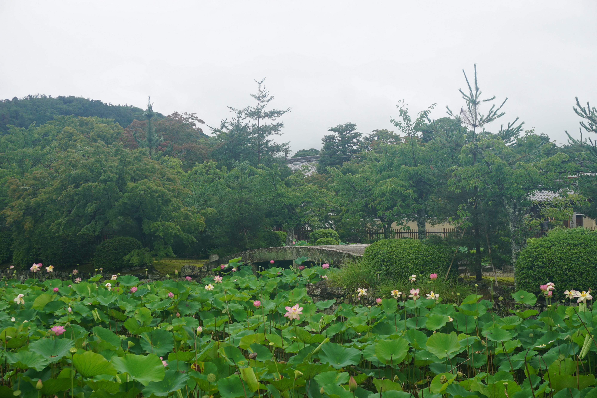

# 霓虹15日游游记 (四)

在因为突如其来的面（lv）试（you）耽误了将近两周之后，我的霓虹游记终于进入chapter 4啦，可喜可贺可喜可贺~然而看了看进度，我枯了。。才写了5天的行程，真不知道后面还要码多久的字。。不过不管怎么样，希望我能坚持下去直到写完——再怎么说，这是给未来的自己的一份礼物，还是要对自己负责哇。。

### 7月14日 京都: 岚山、北野天满宫、伏见稻荷大社 2019.9.10

结束了让人脚痛无比的12号的暴走之后，我很早就回到了宾馆，早早休息，而目的就在于为了今天——也是在京都旅行的最后一天——做准备。今天的首要行程——岚山，也是京都最负盛名的景点之一。据说只要超过9点，渡月桥和竹林小路就会全是人，既没有游览体验也没法拍照。所以，和去清水寺那天一样，我起了一个大早——不过没有清水寺那么早啦。。毕竟岚山那边没有那么早开门——随便吃了点早饭，就出发前往岚山了。

岚山号称“京都第一名胜”，虽然不是景色最美的红叶季，但也是不能错过的景点。同时，岚山也是二次元里出现率相当高的景点，所谓有修学旅行就有京都，有京都就有岚山。K-ON、春物都有去岚山，动漫里也都有还原度相当高的镜头。不过我的小卡片准备的太少了，岚山并没有被包含在内。。

从京都去岚山可以选择坐都营地铁、JR和公交，不过到达的位置稍有不同。我的计划是从渡月桥出发，游览天龙寺、竹林小道，最后坐岚山小火车，而公交车下来距离渡月桥最近，所以没有理由不选择坐公交。

公交岚山站就在桂川旁边，一下车就可以看到渡月桥。渡月桥的名字来源于于龟山上皇的一句“似满月过桥般”的诗作，而龟山上皇活跃于11世纪，虽然不知道是不是那时候就有此桥，但显然它的历史肯定是不短的。渡月桥几经毁坏又几度重建，现在的渡月桥建于1934年，远远看上去好像是木制结构，其实是钢筋混凝土仿制的，可通行汽车。

K-ON和春物里面都有出现这座桥，不过出现时候的氛围差距有点大。。emm这枚一对比还是K-ON还原度更高哇。

渡月桥的另一侧是岚山公园中之岛地区，背后则是岚山的主体。不过岚山周边的主要景点大多都不在那一侧，山麓这边基本给划成了度假休闲住宿的地方，周边只有一两座神社寺庙，以及山顶上的小动物园——就是轻音部看猴子的地方。因为才七点半，时间还早的很，我便想上到动物园那边看看，然而也正因为太早，动物园的上山道并没有开放。。。我只好在上山道前的神社稍微转了转，匆匆留下张照片便离开了。不过话说回来，按照春物的剧情，大老师他们修学旅行应该就住在这附近。。景区哎。。这里住一晚上好贵好贵的。。

从神社下来有点口渴了，我便从自动售货机买了瓶可乐，也正好提提神，早上毕竟还是起了个大早。当然买这瓶可乐还有一个原因则是这里卖的可乐是京都限定款（其实京都到处都有的卖啦。。）可口可乐公司貌似给霓虹许多城市都设计了地区限定装的可乐罐，不过我感觉京都的最有特色，后来还把它带回来了。话说会不会有人专门收集一整套霓虹地区限定款可乐罐呀？

从中之岛回来，接下来就是要去天龙寺了。说到天龙寺，我就想起今年下半年中美合拍……啊不是，我就想到了《天龙八部》里，鸠摩智独闯大理天龙寺抢六脉神剑剑谱的剧情，不过这里的天龙寺自然和六脉神剑没有关系。京都天龙寺也是有相当悠久的历史，也被列为霓虹国特别历史名胜。

从渡月桥走到天龙寺的路上看到一辆奇怪的小商务车，车上架着几个大喇叭，哇啦哇啦地开始广播霓虹语——喂，现在是早上七点半哎。。不吵的吗。。。原来是某参议员候选给自己拉票，我来霓虹的这段时间好像刚好赶上参议院选举。话说大清早哇啦哇啦地拉票真的不会吵到人休息吗。。这样真的不会起到反效果吗？

和东福寺一样，天龙寺本堂前也有一大片荷花池。好像寺庙前有一片有桥的荷花池是霓虹寺庙的传统？

不巧的是，天龙寺早上8点半才开门，我到的时候才8点10分，不过门口也已经有十几号人在等了，其中还有一组拖家带口的中国游客，带着老人和小姑凉——这样自由行不会很辛苦吗？大部分带着家人的还是图省事走旅行社的吧。。真的挺少见的。鉴于之前随求堂的经验，不到时间肯定是不会开门的，我便想先绕道去竹林小径看看。跟着地图上的路线走了走发现怎么都走不通，查了一下才知道从天龙寺去竹林小径的路是穿过天龙寺。。。从天龙寺另一个路口出去走几步就可以到竹林小径，而穿过竹林小径就可以到达岚山小火车嵯峨野岚山站。我只好灰溜溜地走回来等了。

天龙寺的游览分成两个室内和室外两个部分，门票可以分别买，不过大部分应该还是像我这样600块一起买了，毕竟在室内可以坐下来静静欣赏园林和枯山水。游览先从室内开始，几间房子内部都是传统的日式结构，地上铺着草席。入口处有一副奇怪的肖像，还有一尊小神像。一个霓虹小哥不知道是信徒还是有什么要紧的心愿，对着小神像恭恭敬敬地拜了半天。霓虹据说宗教信仰还挺普遍的，超过八成的人都信神道教（就是各种神社相关的教），不过霓虹的信仰挺随意的，有大量的人同时信仰不同的宗教，而宗教好像对日本人的生活也没有那么多的限制。。霓虹的宗教更像是一种生活习惯，有时候想想这样也挺好的，既有精神寄托，也不至于过于约束自己。

室内参拜可以游览库里、大方丈、小方丈，以及从小方丈外的走廊连接着的多宝殿。因为进室内参拜是脱鞋的，一般活动范围也就一两个厅堂，很少有像天龙寺这样能让游人走这么远的路。方丈里藏有云龙图（和之前的老虎图一样仿制的好像？真品貌似不在这里），以及释迦摩尼坐像。不过这些我不是很感兴趣，重点还是欣赏天龙寺的庭院。

小方丈里面很宽阔，是允许游人在其中坐下歇息，欣赏庭院的。我看到前面的霓虹游人正坐在地上歇息，我便也学着坐下，然而坐在脚上真的很不适应很难受。。。

天龙寺的曹源池庭院正对着大小方丈，坐在两座堂屋里都可以欣赏。天龙寺的庭院是由枯山水和真山水结合的，曹源池背后是青翠的岚山，相比之前看到各种庭院显得更加开阔。庭院在室内和室外都可以欣赏，坐在本堂的台阶上，面前的围栏下就可以看到室外的游人。不少人都坐在这里休息、赏景，转了一圈的我自然也不例外。水边的一些树的叶子已经开始泛红了，可以想象红叶季的时候这里应该是更加色彩斑斓。

后面的多宝殿说实话没有什么太值得一提的地方，倒是半路的走廊很有趣——也许是因为光脚（当然袜子还是穿着的）不穿鞋地走着感觉有点微妙。之前也提过，霓虹这些古迹很注意保持其中的植被、青苔什么的，走廊两旁自然也是绿意盎然。涓涓细流在院落中穿梭，仿佛和绿草青苔融为一体，不注意的话还有点难以分辨。

室外的游览路线是沿着室内参拜的几个厅堂的轮廓前进的，所以也有不少游人选择不进入室内。不过由于角度和高度不一样，观赏到的景色有些微妙的差别——这也应该和在室外和在室内的心境不同有关系。

天龙寺庭院里种植着一些植物花卉，我虽然错过了花季，但也能看到一些挺有意思的植物：桔梗花的骨朵，沾着雨水的果子，半白半绿的叶子（好像叫半夏生）……仔细观察还是能找到不少趣味的。

从多宝殿旁边转出来能看到一座观音像，不过吸引我的不是观音，而是下面造型奇特的雕塑——青蛙蛤蟆之类的是不是在霓虹佛教里面有特别的意义？

从天龙寺出来，稍走几步就可以看到竹林小径的入口了。竹林小径是《卧虎藏龙》的拍摄地之一、柯南剧场版唐红的恋歌的杀人现场，也是春物里大老师的自爆现场。。不过因为不是灯会时节，路旁并没有像春物里那样摆着落地灯，户部童鞋要是这时候来估计就不会有后面剧情里那些幺蛾子了。

我一大早来的一个原因就是希望来竹林小径的时候人少一点，不过因为路线的问题以及天龙寺八点钟才能开放，到达竹林小径的时候已经有不少人了。。不过好消息是，我订的岚山小火车是10点才发车，而现在才将将9点10分。嵯峨野岚山站距离这里也就是几分钟的步行路程，所以我有相当足够的时间在这里拍照。

因为已经有不少游人了，如果要想拍得照片里不全是人头难免要等待人流少一点得时间，所以我在很多时候都是站在路边举着相机傻站着，结果就是时不时会有人找我帮他拍照。。周围这么多人为什么都找我。。就因为我带着微单吗。。。不过反正我时间充裕，帮也就帮了。在我自己尝试了用自拍杆带的三脚架自拍发现效果不好之后，我想想也找人帮忙拍一下算了。正好三个霓虹妹子找我帮忙拍照，帮她们拍完之后我提出能不能也帮我拍一下，她们欣然同意了。然而……她们的拍照技术是在是不敢恭维。。。哎算了，反正留个照片证明到此一游就够了。

在竹林小径拍够了照片之后，接下来就是要去乘坐岚山小火车了。岚山小火车于其说是一个交通线，不如说是一个游览项目。虽然很多人说坐小火车很坑没意思，但我总觉得来一次岚山不坐一次小火车挺亏的。。小火车往返于嵯峨岚山站和龟冈站，而我要上车的小火车岚山站则是从嵯峨岚山出发的第二站，也是正式进入峡谷浏览前的一站。为了保险起见，我先拿d出车票和工作人员确认了是10点钟在这里上车，之后便在站前等待出发。车站很小，仅仅只有一个小小的候车厅，也没有现代化的检票设备，一个穿制服的工作人员站在进站口限制游人进出。我刚到的时候几乎没人，只有一对小情侣坐在里面，然而随着发车时间临近，人渐渐多了起来，还来了一个中国旅游团，带队的导游是个大高个，一口北方口音，在人群中显得格外显眼。说实话我真的不太喜欢在国外碰到中国旅游图，因为大概率会碰到低素质的人。。总让我感觉很难受。

时间接近10点，工作人员示意我们可以进站了。车站因为是建在山坡上，要下到站台还要走一段向下的楼梯。站台上用各种颜色的提示线表明了不同车厢的停靠位置，车号好像最多只到6号。等车的时候，那一队中国游客在站台上吵吵闹闹，还有几个站到黄线外面回头和人聊天，几乎无视了工作人员的提醒，知道工作人员走到他面前才服从指挥。说真的，国人的整体素质确实差了一点，老一代人也就这样了。虽然说想当年霓虹韩国发展的时候也经历过这样被老牌发达国家人批评素质差的事情，这样的情况也是发展的必然结果，但我们这代人以及未来的年轻人们还是要多多努力，希望能尽早转变这样的情况。

等不了片刻，小火车哐当哐当地从嵯峨岚山方向驶来了。我本以为大部分人还是应该从我在的这站上车，没想到车上的位置已经被坐了大半，不过还好预订小火车票订的都是指定席，所以位置还是不用愁的。我坐的靠窗位置周围坐着貌似是一家人，父母带着小孩。我占在靠窗的位置上，肯定还是会挡道这家人观景的，这让我稍稍有点不好意思。不过要我放弃好不容易订到的位子那肯定也是不行的啦，所以嘛说说而已啦。

小火车一路在山间穿行，途径保津峡站最终到达龟冈，不时钻过山洞，又不时沿着桂川河岸行驶。坐在其中可以欣赏沿途的峡谷和流水，还可以看到桂川里的游船和皮划艇——这个时候我又不得不感叹如果是红叶季或者樱花季来就更好了。。这时候真的就是一片绿。。不过小火车本身还是挺有趣的，不由得想到生活大爆炸里的Sheldon，他要是来这里肯定是死缠烂打也要坐这个火车的。

在龟冈站下车的时候我发现，人是真的多。。首先因为站台不大，人一多了车外的人流就会堵tie着门下不来车，我就被堵了一会儿。。然后在龟冈站里面等车的人真的相当得多。看来当初决定在关西机场把票订好还是相当明智的。

在龟冈站出口这边碰到了一个推车卖烤红薯烤玉米的大叔。。貌似不是霓虹本地人，面向看应该至少是偏东南亚或者西亚的棕色人种血统，穿得很“潮”——背心棒球帽大金链子，车上也贴着各种t贴纸啥的。因为匆忙我没有拍照片，不过依稀记得车上写着类似于“世界第一烤玉米”之类的标语。我：。。。。还有老哥买了烤玉米和他聊天说他玉米好吃的，这大叔也开心得不行和老哥聊了起来，反正挺搞笑得。

龟冈站外就是大片得水稻田，一直延伸到山脚下。这时间稻田里还有水，有不少没见过乡下景象的游人在这边照相、捞田螺，不过对于我来说这种景象见的不少。路边还有一家像小酒吧一样的店，名字叫“Tom Sawyer Rafting”，貌似和桂川漂流也有点关系。

龟冈站周围貌似就没有太多的景点了。一些小的神社啊寺庙啊散落在周围，可以租自行车在周围游览，不过一是我对这些景点没什么兴趣，二是我时间有限，三则是自行车实在是性价比有点低——自行车只能按小时租赁，而我希望是稍微转转然后就跑路，最好还能骑车回到岚山站去，然而岚山站貌似没有还车点。。。因此我就只好直接走到最近的马掘站坐电车跑路去下一个景点了。

从马掘前往我的下一个目的地——北野天满宫，要先坐JR山阴本线前往円町站，再下来转公交车。公交一日券自然是不coverJR电车的，所以只能刷西瓜卡。说实话每次只能刷西瓜卡的时候我都会稍微有点肉疼——坐几站电车就是几百日元的开销，霓虹的交通费真的挺贵的。。。

在円町站车站里面还有周围有看到不少霓虹中学生（分不清初中高中。。）。虽然正值暑假，但他们都穿着学生服，背着书包，还有的背着运动包还有弓箭之类的器材，看样子应该是忙于社团活动。我在霓虹看到的大多数学生制服说实话都要比在番剧中看到的朴素的多，男生的夏季制服大多就是魔禁里面教主的那一身纯白衬衫+黑色长裤，女生则是白色衬衫+百褶裙。不过再怎么说相比我们的运动服嘛。。。

从电车下来大概是11点一刻，虽然不晚，但考虑到今天一大早出门，确实已经到了饭点了。车站旁边就有一家吉野家，就像之前说的，于其纠结于吃什么不如就来一碗大碗牛肉盖饭，我也懒得再找馆子，就在吉野家吃吃算了。11点一刻毕竟还是比较早，吉野家里面空空荡荡，除了我之外只有一两个食客。看了看墙上的招贴画以及店里做广告的小电视，吉野家最近好像正在和one piece做联动，不过我也不算海贼粉也就无所谓了。

点单的时候我稍微改变了下主意——鲑鱼子盖饭这种奇妙的东西，一直以来也就是在番剧里看过（说的就是你，超能力女儿），感觉有必要尝试一发。盖饭上来的的时候我稍稍有点失望：原来鱼子盖饭里面的鱼子这么少啊。。虽然想想这也就是800日元的鱼子盖饭，也确实达不到番剧里面那样饭上盖满鱼子的程度，但还是有点心里落差的。不过稍微吃了两口我就释然了：并不是那么好吃。。。鱼子的确咬在嘴里挺Q弹的，咬爆鱼子让里面的汁液溢出的感觉确实挺不错，不过。。真的有点腥。。。满满的海鱼腥味，而我一直都挺讨厌这种腥味的。幸好我因为感觉鱼子可能会吃不饱又点了一份炸鸡块缓冲了一下味道，不然我可能吃到最后会有点吃不下去。。不过现在想想，要是再给我机会去体验一下鱼子盖饭我还是会再点的，毕竟这种东西不像牛肉盖饭，国内是真的不怎么吃的到。

之前提到的吉野家和one piece联动，来吉野家吃饭还送了我一张one piece的角色卡。貌似这种卡片也有罕贵度的差别，我抽到了火拳艾斯，不知道会不会还挺值钱的呢？

Ok吃完了并不算很好吃的鲑鱼籽盖饭，继续前往北野天满宫。北野天满宫是日本所有天满宫的总神社，而天满宫则是供奉“学问之神”的地方。所以在春物里，大老师一行为了给小町祈求入学考试顺利，修学旅行的时候特地去了一趟北野天满宫。KON里面也有轻音部与班上同学一起去北野天满宫的剧情，不过这部分我是在回来之后才想起来。。再加上春物番剧里面省略了去天满宫的剧情，把故事重心放在了大老师在竹林小径自爆上，所以这里我并没有准备画片。。

从入口出的石质鸟居到天满宫主殿要走过长长的神道，两旁时不时可以见到石灯和雕塑。神道尽头立着天满宫的门楼，我到的时候不知是在搞什么活动，还是因为祇园祭的缘故，周围放着两派挂满了彩带的竹子。北野天满宫作为神社我觉得建的还是挺好看的，没有平安神宫、八坂神社那么宏伟，但又雕栏画栋，色彩分明。我心说既然大老师一行人在这里参拜，那我也有必要参拜一下，然而一摸口袋零钱只剩下了1块、几枚10块和一枚我整个行程里很少见到的5块硬币。我因为纠结于参拜给钱能不能给多枚硬币稍微谷歌了一下，却意外发现了几个事实：一个是10块钱因为谐音在参拜的时候是不太好的硬币，读起来类似“远缘”，而5块则是最好的，因为谐音和“有缘”近似。我便想起了之前在几个神社投过10块钱，尤其是奈良得春日大社，投了好几个，所以我现在回国之后这次面试白给是不是也有这个原因在里面。。。这里我忍痛把5元硬币扔进了塞钱箱，说实话我还挺想把它带回去收藏什么的，毕竟见的不多。

从北野天满宫出来，下一站则是要乘车前往我在京都的最后一个重头戏——伏见稻荷大社了。因为伏见稻荷大社建在整个稻荷山上，据说游览整个山需要两个小时左右的时间，再考虑到我这个腿脚的情况，我特意预留了最后几乎是一整个下午给了伏见稻荷大社。

在北野天满宫门前等车的时候，我终于发现京都公交很多站台上的路线牌居然是动态的。。就像现在国内很多地方用一个小led屏幕来显示各个线路运行状况一样，京都公交用了一个挺有意思的方法来预告车辆的到达，具体情况见下图。

因为北野天满宫和岚山在京都的西北，而伏见稻荷大社在京都的南部，从天满宫到伏见区并没有直达的公交车，得先坐到京都站再转车去伏见稻荷，不过前后连上等车也就一个小时，并没有花太多的时间，我可以在稻荷山尽情地玩耍。

从车站下来从一家family mart的拐角处拐弯，走过JR线的铁道（旁边就是伏见稻荷站），再走一路小上坡，过一个红绿灯就可以看到伏见稻荷大社的石碑了。这中间我尝试走了一小段小路想看看会不会看到什么特别的，然而并没有，貌似原本有一家挺有意思的店，但并没开门。

大概是因为伏见稻荷大社是京都最为著名的免费景点，完全不需要交任何的费用，再加上貌似是祭奠的影响，这里的人真的是多。稻荷大社的石碑往后的街上主要还是一些小吃铺子和纪念品店，这一路还好一点，等到再过一个路口一个鸟居，路两边就全是小吃摊，这里聚集了大量的人在排队。。因为之前在八坂神社急着去吃午饭没有去尝试小吃摊上的烧烤什么的，再加上跑了这么远的路，这时候看到烤牛肉啊烤鱿鱼啊烤蟹肉棒啊什么的真的是有点顶不住了。但是稍微看了看价格，还是得悠着点。。最后我选择吃一份盐味的烤和牛串，也要500块了，考虑到分量实在是不算便宜。至于味道嘛。。肉质其实真的不错，但是这个口味稍微有点吐槽不能。。。。

稻荷大社顾名思义，是供奉稻荷大神的神社。稻荷大神为保佑五谷丰登、商业兴盛、家庭安全、诸愿望皆得实现之神，相当贴近生活，在霓虹也深受人们喜爱。全国据说有三万座稻荷神社，而其总本宫便是京都的伏见稻荷大社。相传稻荷神于和铜4年（公元711年）镇座于稻荷山，历史上神社也经历过焚毁与重建，而本社正殿（重建于1499年）仍然有500多年的历史。稻荷山高233米，山间遍布鸟居与大小神殿。时至今日稻荷山也成为“神明、自然与人类共存的神社森林”。

沿着街一路走到底，迎面而来的就是稻荷神社的楼门。相传楼门是丰臣秀吉与天正17年（1589年）所建，至今也有相当长的历史。楼门两侧各立着一座带着红色围脖的狐狸石雕，右边的狐狸嘴里叼的是宝珠，左边的则是叼著一把钥匙。相传稻荷神的使者就是白狐和狸猫，而众多稻荷神社都以狐狸的形象来作为自己的守护。

伏见稻荷大社神社本身其实并没有太多的特别之处，再加上人真的多的不行，我也是没有太多的兴趣在这里排队祈愿，便绕过主殿，往后山去了。而着上山的入口处，便是整个伏见稻荷大社最为著名的景点——千本鸟居。

鸟居是日本神社建筑物。主要用以区分神域与人类所居住的世俗界，算是一种结界，代表神域的入口，可以将它视为一种“门”。因为稻荷大神是掌管生意是否昌盛的神，因此有许多工商团体会来这里祈求保祐。若得以生意兴隆，便会来稻荷山建鸟居以还愿，久而久之，大大小小的鸟居遍布了稻荷山的山道，形成了所谓的“千本鸟居”。不过一般说的千本鸟居，貌似还会特别指从神社主殿向山上进发的这一段鸟居最为密集的地方。这里修建了相对小一号的鸟居，紧密地排成两排，仿佛两条温暖的隧道。日光穿过朱红色的鸟居的间隙，仿佛也被染上了红色。这么紧密而绵长的鸟居群还是相当好看的，不过可惜的是这儿人流也是最多，大家排成了长队，景色自然也要打上折扣。

从千本鸟居出来是奥社奉拜所，为可遥拜御山之地，稻荷山三山峰恰好位于此神殿的后方，不过真正比较有意思的是边上的重轻石。据说，在这对石灯笼前祈祷心愿成真，并举起石灯笼的空轮（顶部），如果此时感受到的重量比自己预想的轻，心愿就会成真；如果比预想的重，心愿就难以实现。我投了钱许愿试了一下，不得不说，预想一个很重的重量真的还是挺难的。。我感觉大部分人过来应该都会觉得比预想的重，因为对沉重的物品着实没有太完整的概念。至于我许的什么愿，说实话我已经记不清了。除了718之后许的一些愿望，基本就是身体健康，事业有成，以及期望自己能够转运。。。不知道是真的本命年运气都会差，还是所谓的“水逆”，还是霓虹神社啊寺庙里说的今年24岁的人是“本厄”，今年到现在碰到了大大小小的霉运真的是有够多的。。

过了奥社就可以开始登山了，然鹅明显可以感觉再往上走人流变得稀少了许多，大概不少人都觉得山上也就是鸟居啊神社啊什么的，懒得爬山也没劲爬山，于是过了千本鸟居就折返了。不过对我来说，爬山本身就是一件很有意思的事情，再加上途中还能看到不少景点，何乐而不为呢？唯一的问题是，这连续几天的暴走这个腿脚稍微有点受不了。。所以我选择使用龟速移动+侧身上下台阶减轻压力——虽然我的腿脚承受力有限，但我对我的体能还是很有自信滴，人家两个小时爬完是爬完，我三个小时爬完就不是爬完了？

在奥社稍作休整（上个厕所啥的），我便开始了登山的旅程。就像之前说的，稻荷山的登山道上到处都是鸟居，而且与千本鸟居处相对矮小的鸟居不同，稻荷山山道上的鸟居的规模更大。在夏季青绿色的稻荷山里，朱红色的鸟居便成了登山路上最靓丽的风景，也是最好的陪伴。鸟居大多是木制，偶尔也有一两座青石制的鸟居，看上去就上了年纪，有些鸟居上还挂着稻荷大神的牌匾。偶尔能看到鸟居的朱漆脱落、木制的支柱裂开甚至倾斜（当然这种周围都会有维护人员搭的支架来确保安全），这些都诉说着稻荷山漫长的供奉历史。

稻荷山作为一座有这漫长历史的宗教性质的山，自然不仅仅只有山脚下的稻荷大社一间神社。沿着山道一路向上，第一座碰到的便是熊鹰社。这里据说是有一汪碧绿的池塘，同时也能在这里购买鸟居供奉，不过我当时没有查太多资料，只以为这是个普通的神社，加上这里门前的山路很狭窄，而且位于登山路开始的阶段，人流相对来说还比较多，有不少闹腾的中国小孩在这儿上蹿下跳——一看就是国内旅行团带孩子来玩的，我不愿久留，就在社前的水池做了个洗手仪式就走了，也没有留照片。。算是这趟行程中间一个小小的遗憾吧，不过其实也无所谓啦，说明这处景点和我木有缘分~

从熊鹰社往上走的一段山路上我碰到了两个估计也是来自由行的ladies（虽然我感觉年纪应该比我大，可以叫阿姨了）。其中一个壮一点的，在和另外一个自夸自己怎么怎么能爬山，然后一个劲儿往上爬，过一会又能看到她在前面喘着气等另外一个。我因为爬的挺慢的，有一段一直和另外一个lady一起爬，所以看到了她好几次233。后来后面一个lady也超过了我，然而又爬了一段我又看到了她们，再往上爬就她们就不见了——感觉一路上有不少人哼唧哼唧急着往上爬，但是爬爬就觉得累了不想爬了或者时间不允许，就中途拐弯下山了（熊鹰社往前有个拐弯可以直接下山），我不免稍微有点小得意：尽管我爬的慢，但我能爬完哇！

从熊鹰社一路向上，可以来到一处岔路口。稻荷山上的山道从这里开始是一个环，从这里开始可以一路不走回头路。这里有一两家餐馆，可以在这儿吃饭，歇息。岔路口附近（主要是往山下的方向）视野也相对开阔，有一处平台还提供了座位供观赏、歇息。之前我在攻略里看到的能看京都落日的地方大概就指的是这里了。这里也是春物动画里面出现过的一处取景，大老师在这里远眺了市区，二小姐还坐在外面的座位上休息，想必这里还是挺有代表性的。

我去的时候其实是木有怎么看地图的，也就是上山时候瞄了一眼。从这里有三个岔路，一条上去是荒神峰和御幸奉拜所，得走回头路，景点也就是两个神社，我也就没上去；另外两条就是之前说的环路的两端，通往稻荷山三座山峰，沿途还有一些神社的景点。等后来下来躲雨的时候，听边上一个人问一个老爷爷（不知道是本地常来玩的游客还是山上的工作人员）路的时候，右手那条虽然沿途经过另外两座峰，但离一之峰更近，而左手直接通往一之峰，但是反而更远。不过我当时觉得，自然是按照一二三的顺序来玩，所以先上了一之峰。

通往一之峰的路上还能看到一些小的景点。地图上有一个御膳谷奉拜所，我好像并没有什么印象见过，倒是记得进山之后遇到一座不大的神社，供奉的神和视力有关，好像叫眼力社？因为是在一处山坳里，光线还挺暗，里面也点着长明灯——难道是想让参拜的人锻炼眼力？。听一个路过的男的（国人）说可以免费在这里求签，我便进去一试——神社进去左手有一个签筒，自己摇着抽签，根据抽出来的签号在面前的牌子上找解签。我运气不错，抽中了吉，不过解签只有密密麻麻刻在木牌上的霓虹语，连翻译老师都识别不了，只得作罢——不过和视力有关系抽中了吉，是不是说我至少后面不会因为天天盯着电脑工作而瞎掉哇www

我一路缓缓爬山，同时因为人渐渐稀少，得到了不少拍照的机会。有一处上山路是一个很长的台阶，我看着挺有感觉的，便掏出自拍杆来拍照。照倒是拍的不咋地，还被山里的蚊子包了个圆。。这雨季的山里真的不适合停下来站着不动。。幸好有了之前在东福寺的教训，我这次穿了长裤，也带了花露水，至少被叮了也能有措施止个痒啥的。。

在游览的途中，我还碰到了一群穿着貌似是弓道服的霓虹游人，年纪有年青有年老，目测从二十几岁到四五十甚至更老都有，瞄了一眼他们身上的logo应该是什么社团组织出来玩。因为是往相反方向走，打了个照面，我也不知道哪根筋搭错了来了一句“空妮几哇”，结果这群人里面好多人都在和我错肩而过的时候回我一句问候，弄得我挺不好意思的。。。

大概爬了一个多小时，我终于爬到了稻荷山最高的一座峰——一ノ峯（也就是一之峰），我一直觉得霓虹用了很多汉字其实挺有意思的。一之峰上是上社神迹，供奉了末广大神。大概是因为这里是两条路线汇聚处的景点，这里人还相对挺多的（虽然我觉得某种程度是因为这里台阶多好照相也好坐着休息，所以很多人滞留在了这里。。）神社不大，建筑多为石制，看上去有些年头了，不少游人都进神社参拜，然后在神社前的台阶上照相，印象很深的有一对穿着浴衣的情侣——因为爬山时候有好一段都是跟在他们后面的。。神社的对面好像是一个小小的茶室还是纪念品店啥的，不过我到的时候没有开，不知道是周日不开放，还是我到的时候（下午三点半这样）已经关门了。茶室门口立了一块碑，大大咧咧地刻着两个字“山顶”，我觉得有一种“到此一游”的感觉。。竟然让我有点想拍照纪念一下。不过蛋疼的是，一个老阿姨（估计40往上），一直在和“山顶”自拍，换来换去摆了好多姿势，都不满意，拍了可能有快十分钟，我在一旁看着尴尬的要死。。我心说说句不好听的你也不是啥美女哇。。有必要这么精益求精吗？拍写真呢？有区别吗。。。后来她消停了一下，看着要离开，我正准备拍，结果她又不满意，一扭头又回来继续了。。我真的是遭不住了，只好随意拍拍，顺便让她也入镜了wwww

到山顶这里的时候，天空开始淅淅沥沥地飘起一点小雨来，不过这个时候还不怎么影响。继续前行，现在从地图上看，从山顶往岔路口走，中间会经过二之峰、间峰、三之峰几处景点，应该是都建有神社，供奉不同的神明。不过一是后面几个神社规模都比不上一之峰，二是回程的路上因为开始有点下雨我便忙于拍鸟居，这几处神社都是匆匆掠过，只是依稀记得见过二之峰的牌子。因为之前的照片拍的实在是不怎么样，我这一路上便一直留心有没有周围人流很少或者台阶错落有致的地方，时不时停下来用手机三脚架取景。中间有尝试把三脚架放在低处、高处，放在台阶旁边偶尔出现的石柱上，还有尝试坐下来在台阶上拍照——因为下过雨石阶是真的脏，我只好用手垫在屁股底下，结果就是拍完了手全黑了没处擦。。

在某个上坡拐弯的地方我正忙着取景，来了一队白人游客，其中有个小姑娘貌似看我在这儿忙活半天很不解，她从我身边经过的时候我总感觉她很鄙视地撇了我一眼。。。行吧，我确实长得不咋地拍照技术也不咋地 。。

从一之峰下来，一路走，雨势渐渐变大了。等我走回岔路口的时候，已经至少是中雨的程度了。不少人都在这里的屋檐下躲雨。我看了看时间，4点半，想想反正回去也就半个小时，于其淋着雨是湿淋淋地下山，不如等一会儿——至少天气预报一直到今天上午都没报有雨的哇，这雨应该不至于下那么久吧，我这么想着，我一开始站在饭馆对面的鸟居和小亭子这边躲雨，后来发现刚好饭馆大概因为不是饭点，门口还有地方可以坐，我便和一帮人一起在那里坐下看雨。一回头发现，饭馆里面还有不少人，大部分都是之前看到的那帮弓道社团的人，好像是他们活动结束了在这里休息吃饭，基本把这边包场了。

本以为再怎么样等个十几分钟雨就小了吧，结果这雨还越下越大。屋檐上留下的雨水从水滴渐渐变成了水流，远处的京都市区上也渐渐笼罩上了雨水溅起的水雾，变得朦朦胧胧。我在这儿坐着干等实在是有些无聊，便看看雨景，又看看周围的游客。我坐的其实不是凳子，而是像窄床一样的长条，上面放着草席草垫以及小桌子。一开始坐在旁边的是一个白人老外，要了一听麒麟啤酒，喝了两口跑路了，后来来了两个华人小哥。两个坐在那儿聊得正欢，我就眼看着他们脚边有一只挺大的甲虫，慢慢地从石阶这边爬过来，然后爬上一个人的鞋子。我忍不住提醒了一下——其实我并不是怕甲虫伤了这人，而是我怕虫子，琢磨着是不是能帮我处理掉。。结果他跺跺脚掸了掸，甲虫就不知道掉哪去了，也没有乱飞，我这才长出一口气。

这雨一直下个不停，远景是不怎么看的到了，我尝试着用延迟曝光拍雨点也没拍出来，再呆下去也没啥意义了，我不得不十分不情愿地从包里掏出雨伞。下山路上人着实不少，走的比较慢，不过对我这样怕伤膝盖的来说是正合我意。路上有一个霓虹老大爷走在我前面，穿着那种防水的户外衣服，所以打伞打的很随意，然而他背后的包拉链没有拉紧，时不时有雨水滴进包里面，因为不会霓虹语稍微有点犹豫，但又有点看不过去，还是忍不住“哎多。。。斯密马赛。。”地戳了戳老大爷的肩膀，和他指指背后，又比划了一下包和拉拉链的动作。老大爷愣了一会儿，不过还是意识到了问题的所在，向我道谢。不得不说，手语果然还是世界通用的。。

下山一路上还是能碰到不少华人的，我这人嘴闲不住，看到那些看上去和善的、好说话的，总会忍不住插嘴搭话。走到山半腰一处店铺（已经关门了），大家都在这边稍微躲一下雨，身边站了一对国人情侣，我又忍不住和他们聊了一会儿，聊毕业多久啦，聊大家从哪里过来的哇，聊旅游路线怎么安排的哇，哇啦哇啦聊了半天。虽然景点碰到同胞的概率挺大的，但身在异国碰到同样说汉语的，总是有一种亲切感油然而生，会感觉距离一下子就拉近了。可能这就是一种文化的归属感吧。

下山的道路在鹰熊社前面还有一处岔路，然而我因为没有看地图，走到岔路口有点迷茫，不知道从哪里下去——主要是有点不想走回头路的强迫症。依稀听见有国人说话的声音，便想问问他们是从哪条路过来的。一看是两和我差不都大的妹子，她们和我指了指来的方向，然后反过来问我山上的情况，大概要走多久。我稍微打量了一下，这两位穿得花里胡哨的，其中还有一个穿着有点哥特风的连衣裙，底下还穿着双红色的皮鞋。。老姐你真的是来爬山的吗。。我看了看表，快五点了，便告诉她们山上玩完至少一两个小时，现在时间也不早了，你们还穿着皮鞋，还是要悠着点，可以爬到岔路口那边，至于后面三座山峰我心说你们估计也没这个能耐爬下来。。。她们也挺纠结，看来还是想往上走，纠结了一会儿还是决定先往上爬爬。

从岔路这边的下山道是直通山下神社正殿这里的，并不会经过千本鸟居和奥社。然而等我下了山来，突然意识到我只拍了千本鸟居的一侧，因为原本以为会走回头路再经过一次的。。不行！不然以后看照片岂不是不知道千本鸟居有两路了吗？我便毫不犹豫地又转过来往千本鸟居方向爬。。。emmm这个剧本好像在清水寺见过。。

走回到千本鸟居这里，虽然已经要五点半了，这里还是有相当多的人，不愧是最著名的景点。千本鸟居的两路是一路给人往上走一路往下的，本来这样应该还是会比较通畅的，但因为有众多想在鸟居入口拍照的人（比如我），这里还是排起了队。我费了老大的劲儿挤到入口处，发现怎么拍都是人人人人人人。。还有一位好高的白人大姐站在出口摆了老半天pose让别人帮她拍照。。我又不太好意思赖着不走取景妨碍到其他游人，只好凑合凑合拍拍留个纪念，所以这位大姐也入镜了==

到这里伏见稻荷大社的行程算是告一段落了。虽然写的稀碎，也体现不出精彩，但玩的真的是相当尽兴的，不枉我为这边特意留了一整个下午。接下来便是回程了。我本想还是坐之前的那条公交线回去，榨干我京都公交一日券最后的价值，但我冒着雨一路走到公交站等了一会才发现，这班车有的等呢。。估计是本来通往城郊的线路车次就少，再加上下雨以及傍晚车流量大，这车估计怎么说也要等个半个钟头。更不巧的是这是个小车站，站台木有挡雨棚。。。想想还别在这里淋雨了，市营电车伏见稻荷站就在旁边，还是坐电车回去吧。。多花点钱买个舒服。让我稍微有点意外的是，等电车的人并没有想象的那么多，我以为下这么大雨，又快到饭点了，应该会有很多人积压在车站，没想到和平时差不多，难道他们都还在山上没下来？？

市营电车可以一路坐到祇园四条站，我不知为啥这时候十分想吃洋快餐，刚好车站这边过了鸭川就有M记（上次从八坂神社出来吃的sukiya也是在这边），所以便第二次吃了霓虹的M记。人啊，明明知道洋快餐不健康，有时候为什么就是忍不住要去吃呢？

虽然天上依然下着蒙蒙细雨，但作为我在京都的最后一天，我实在是不太想把这个晚上完全浪费在宾馆里，再加上大概是因为爬山时候一直小心不伤到膝盖和脚，我到现在并没有前几天那样的疲惫，因而我决定出发步行前往传说中艺妓出没的花见小路看一看夜景。

 花见小路是日本最古老的花街，保留了江户时期的建筑风格，也是号称可以代表京都传统文化的地方。从我吃饭的M记走到花见小路，要沿着鸭川往北走好一段，离了鸭川岸边，路旁也偶尔能看到水。，窄窄的巷子，蜿蜒的河流，仿古的灯笼散发出柔和的黄色灯光，恍惚之间仿佛走在了江南水乡。

花见小路的主干比想象中的宽阔，两边的建筑多为茶舍，料理物之类，也不知是不是周末的原因，大多店面都关着门，因此也没有机会见到传说中的艺妓了。不过店门口都刮起了灯笼，再加上细雨带来的朦胧感，还是颇有一番意境的，只可惜我没有穿着和服，也没有撑着纸伞，更不会遇见一个丁香一般的姑娘。。。扯远了。路上还是有不少身着浴衣的游人的，大多都是情侣。当时我倒是没什么感受，现在写着游记，倒感觉有一丝酸意涌上心头。不过话说回来，也就只有玩这些有情调的景点时候我才会感到孤身一人有点撒比西，一个人旅行带了的好处可是要比坏处多得多——至少对我来说是的。

我一直很想拍一张穿着浴衣、撑着伞走在傍晚的古街上的照片，因而我在这里一个劲地想找机会拍照，但是偷拍别人我又有点不太好意思，毕竟对人不礼貌。结果就是，拍了半天没有拍出合适的。。。只好自己找找角度拍拍街景了。。这样看要是能带个妹子一起玩又多了一个好处，不过这依然比不上一个人旅游带来的自由与快乐。emm除非她也和我喜欢一样的番，以及受的住这样每天暴走。

因为这雨实在是看不到停的意思，虽然距离不算远，我还是决定坐公交车回去，也终于算是充分利用了公交车券。在前往公交车站的路上，我一边走着一边想着明天的行程安排，突然想到，并没有在京都买什么纪念品。想想番剧里面的修学旅行，貌似都会给家人带京都特产，什么生八桥啦， 菓子啦，宇治抹茶啦，我其实一开始是不想带什么特产回去的，但之前吃的那个抹茶蕨饼真的是好吃到我想带回去给别人尝尝的地步。本来是想在最后一天回酒店之后再出来买，然而酒店周围貌似并没有看到什么卖这个的店。正想着，突然看到左手边一家卖抹茶点心的点——虽然没有看到蕨饼，但毕竟是抹茶，趁着公交车还有一会儿才来，我便走进去逛了逛。店里的人气产品是抹茶夹心饼干，包装得挺不错，价格也在可以接受得范围内，虽然没有尝过味道，但这个卖相还行，又是抹茶甜点，也算是可以弥补没能买到抹茶蕨饼的遗憾了。我稍微询问了一下店员，果然是意料之中的不会英语。。只好用翻译老师来交谈了。我问了下赏味期限，好像还可以；储存好像也不用一定要放在冰箱——毕竟我还要拖着它们一个多星期，这些都是必要条件。这么问下来，似乎都没有什么问题。成了！那就买两盒带回家自己尝尝。

坐车返回，在回到酒店前还是得按惯例逛一下便利店，买一瓶蔬菜汁补充一下维生素，再看看有什么想尝试的食物饮料买来当夜宵。这次我选择了明治的酸奶——话说之前我一直不知道明治是一个霓虹牌子哎。。

到这里，我的京都之行算是划上句号了。说实话，我尽管尽力去玩了，每天都玩好几个景点，但我感觉，所玩的地方真的只是京都的冰山一角。我不得不佩服霓虹人对于传统文化、历史遗迹的保护，尽管也是木制建筑，每年的精心维护，受灾后的尽力修复都让这些古老建筑以尽可能和它最初一样的姿态保留了下来。在进行现代化的建设的同时，依然小心地不让现代化的元素破坏京都原有的历史氛围。比如，京都室内几乎没有高楼大厦，又比如，古迹周围的建筑风格都尽量保持着一致，再比如，街道两旁的装饰都带着传统的元素。京都真的是一个可以让人慢慢地逛很久的城市，希望有朝一日还能再来京都，花更久的时间，去品味更多的京都风情。

9月10号到10月13号，我的霓虹游记第四章终于算是写完了！不知道后面会不会有想起好玩的点回来补充。没想到断断续续写了一个多月。。经历了体检、中秋节、去苏州找大表哥玩、培训、报道、国庆节，我终于算是完整地上了第一周的班，并在这个休息日完成了这一章的初稿。关西篇也随着京都旅行的结束画下句号了，接下来即将开启更为精彩的关东之行。别的不说，我只希望今年结束之前能把这篇游记写的七七八八。。啊啊啊千万不要天天加班啊啊啊啊啊。。。。。。。。。。。。

